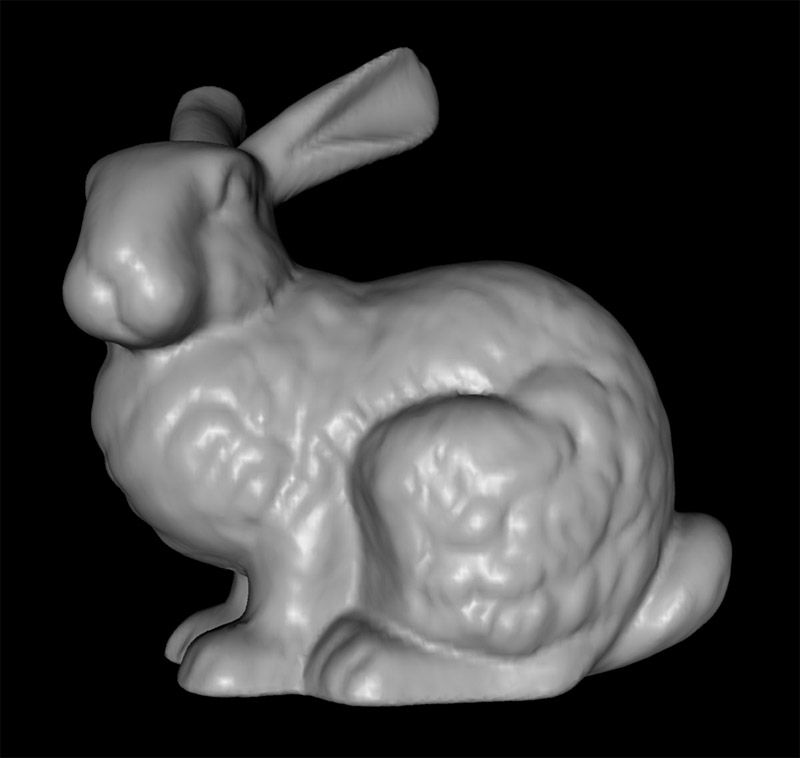

# Markdown Introduction
<!-- @import "[TOC]" {cmd="toc" depthFrom=2 depthTo=5 orderedList=false} -->

<!-- code_chunk_output -->

- [Basic content](#basic-content)
- [Table](#table)
- [Figure](#figure)
- [Formula](#formula)
- [Code](#code)

<!-- /code_chunk_output -->
## Basic content
Hello everyone!
**Hello everyone!**
==Hello everyone!==
_Are you okay?_
:dog::pig::frog::eyes::shit:
<font face="楷体" size=5 color=#FF0000 >微软雅黑字体</font>

[Markdown documentation](https://shd101wyy.github.io/markdown-preview-enhanced/#/zh-cn/)
[refer to code](#code)

## Table
|$\epsilon_{ijk}$|Condition|
|:----|:----|
|$\epsilon_{ijk}=0$|if any two of i,j,k are equal|
|$\epsilon_{ijk}=1$|for an even permutation (eg. 123,231,312)|
|$\epsilon_{ijk}=-1$|for an odd permutation (eg. 132,213,321)|

<table><tbody>
    <tr>
        <th>方法说明</th><th>颜色名称</th><th>颜色</th>
    </tr>
    <tr>
        <td><font color="Hotpink">此处实现方法利用 CSDN-markdown 内嵌 html 语言的优势</font></td>
        <td><font color="Hotpink">Hotpink</font></td>
        <td bgcolor="Hotpink">rgb(240, 248, 255)</td>
    </tr>
    <tr>
        <td><font color="Pink">借助 table, tr, td 等表格标签的 bgcolor 属性实现背景色设置</font></td>
        <td><font color="pink">AntiqueWhite</font></td>
        <td bgcolor="Pink">rgb(255, 192, 203)</td>
    </tr>
</table>

## Figure


<div align=center></div>


<center>
    
    <br>
    <div style="color:orange; border-bottom: 1px solid #d9d9d9;
    display: inline-block;
    color: #999;
    padding: 2px;">rabbit</div>
</center>

## Formula
$$
\begin{Bmatrix}
\sigma_{11}\\
\sigma_{22}\\
\sigma_{33}\\
\sigma_{12}\\
\sigma_{23}\\
\sigma_{13}\\
\end{Bmatrix}=
\begin{bmatrix}
K+\frac{4}{3}G & K-\frac{2}{3}G & K-\frac{2}{3}G & 0 & 0 & 0\\
K-\frac{2}{3}G & K+\frac{4}{3}G & K-\frac{2}{3}G & 0 & 0 & 0\\
K-\frac{2}{3}G & K-\frac{2}{3}G & K+\frac{4}{3}G & 0 & 0 & 0\\
0 & 0 & 0 & G & 0 & 0\\
0 & 0 & 0 & 0 & G & 0\\
0 & 0 & 0 & 0 & 0 & G\\
\end{bmatrix}
\begin{Bmatrix}
\varepsilon_{11}\\
\varepsilon_{22}\\
\varepsilon_{33}\\
2\varepsilon_{12}\\
2\varepsilon_{23}\\
2\varepsilon_{13}\\
\end{Bmatrix}
$$

$\alpha$ and \(\beta\) are special letters.

## Code

```py {cmd="C:\\Users\\LittleFish\\Anaconda3\\envs\\py37\\python.exe"}
# fractal.py
import taichi as ti
ti.init(arch=ti.cpu)

n=320
pixels = ti.var(dt=ti.f32, shape=(2*n, n))

@ti.func
def complex_sqr(z):
    return ti.Vector([z[0]**2 - z[1]**2, z[1] * z[0] *2])

@ti.kernel
def paint(t: ti.f32):
    for i,j in pixels:
        c = ti.Vector([-0.8, ti.cos(t) * 0.2])
        z = ti.Vector([i/n - 1, j/n - 0.5]) * 2
        iterations = 0
        while z.norm() < 20 and iterations < 50:
            z = complex_sqr(z) + c
            iterations += 1
        pixels[i, j] = 1 - iterations * 0.02

gui = ti.GUI("Julia Set", res=(n * 2, n))
for i in range(1000000):
    paint(i * 0.03)
    gui.set_image(pixels)
    gui.show()
```

```py{cmd="C:\\Users\\LittleFish\\Anaconda3\\envs\\py37\\python.exe"}
print("Hello world!!")
```