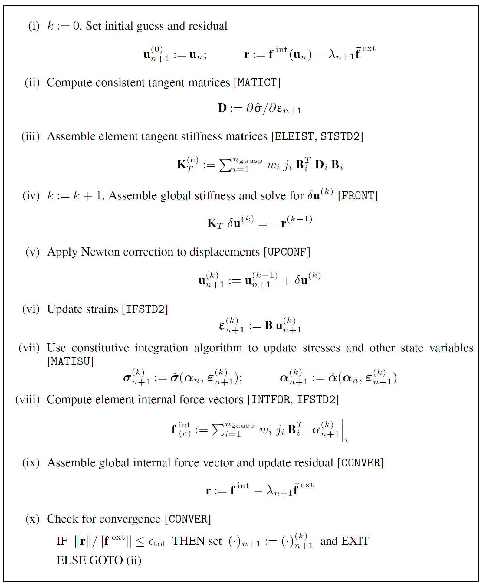

# Table of Contents
[TOC]
# Constitutive model
## Von Mises Model 
>Plane strain or Axisymmetric
#### PEEQ
$\bar \varepsilon ^p$ is the effective/accumulated/equivalent plastic strain(PEEQ). It is used as a **scalar** measure of the tensor plastic strain $\boldsymbol{\varepsilon}^p$.
$$
\bar\varepsilon^p \equiv \int_0^t\sqrt{\frac{2}{3}\dot{\boldsymbol{\varepsilon}^p}:\dot{\boldsymbol{\varepsilon}^p}}\,dt = \int_0^t\sqrt{\frac{2}{3}}\|\dot{\boldsymbol{\varepsilon}^p}\|\,dt
$$

$$
\dot{\bar\varepsilon^p} = \sqrt{\frac{2}{3}\dot{\boldsymbol{\varepsilon}^p}:\dot{\boldsymbol{\varepsilon}^p}} = \sqrt{\frac{2}{3}}\|\dot{\boldsymbol{\varepsilon}^p}\| = \dot\gamma
$$

In return mapping, we have
$$
\begin{aligned}
\boldsymbol{\varepsilon}^p_{n+1}=\boldsymbol{\varepsilon}^p_n+\Delta \gamma \sqrt{\frac{3}{2}}\frac{\boldsymbol{s}_{n+1}}{\|\boldsymbol{s}_{n+1}\|}
\end{aligned}
$$

which denotes the relationship between $\bar\varepsilon^p$ and $\boldsymbol{\varepsilon}^p$. 

#### Material parameters
Shear modulus:
$$
G = \frac{E}{2(1+\nu)}
$$

Bulk modulus:
$$
K = \frac{E}{3(1-2\nu)}
$$


#### Tensor operator
[Tensor double contraction]
`:` denotes double contraction of tensors (internal product of second-order tensors).
For 2 second-order tensors A and B:
$$
A:B = \rm{tr}(\it A\cdot \it B^T) = A_{ij}B_{ij}\,(scalar)
$$

For A with order m and B with order n (m>n), their double contraction is a tensor C with order (m-n):
> eg. 
> + for A with order 5 and B with order 2:
$$C_{ijk}=(A:B)_{ijk}=A_{ijkpq}B_{pq}$$
> + $\boldsymbol{s}:\boldsymbol{s}=\rm tr(\boldsymbol{s}\cdot\boldsymbol{s}^T)$
> if $\boldsymbol{s}$ is symmetric, then $\boldsymbol{s}:\boldsymbol{s}=\rm tr(\boldsymbol{s}\cdot\boldsymbol{s})=\rm tr(\boldsymbol{s}^2)=\|\boldsymbol{s}\|^2$

[Tensor product]
"$\otimes$" denotes tensor product of tensors.
For tensor A with order m and tensor B with order n, their tensor product is a tensor with order (m+n). Thus each item is:
$$
\begin{aligned}
(A\otimes B)_{i_1 i_2 \dots i_{m+n}} &= A_{i_1 i_2 \cdots i_m}\cdot B_{i_{m+1}\cdots i_{m+n}} \\
A \otimes B &\ne B \otimes A
\end{aligned}
$$

#### Second-order tensor analysis
Symmetric tensor: $\boldsymbol{T}=\boldsymbol{T}^T$
Skew symmetric tensor: $\boldsymbol{T}=-\boldsymbol{T}^T$
Any tensor can be decomposed as 
$$\boldsymbol{T}=\rm{sym}(\boldsymbol{T})+\rm{skew}(\boldsymbol{T})$$

The symmetric part: $\rm{sym}(\boldsymbol{T})\equiv\frac{1}{2}(\boldsymbol{T}+\boldsymbol{T}^T)$
The skew part: $\rm{skew}(\boldsymbol{T})\equiv\frac{1}{2}(\boldsymbol{T}-\boldsymbol{T}^T)$

#### Common tool tensors
$\boldsymbol{I}$ is a second-order identity tensor:
$$
I_{ij} = \boldsymbol{e}_i\cdot\boldsymbol{e}_j=\delta_{ij}
$$

$\boldsymbol{\rm I}$ is a 4th-order identity tensor:
$$
\rm {I}_{\it ijkl} = \delta_{\it ik}\delta_{\it jl} 
$$

$\boldsymbol{\rm{I}}_S$ is a 4th-order symmetric identity tensor: 
$$\boldsymbol{\rm{I}}_{ijkl}=\frac{1}{2}(\delta_{ik}\delta_{jl}+\delta_{il}\delta_{jk})$$

$\boldsymbol{\rm I}_d$ is a 4th-order  deviatoric projection tensor:
$$
\boldsymbol{\rm I}_d \equiv \boldsymbol{\rm I}_S - \frac{1}{3}\boldsymbol{I}\otimes\boldsymbol{I}
$$

#### Array notation of some tensors
[Second-order identity tensor]
For plane strain and axisymmetric problems
$$\boldsymbol{I}\to\mathbf i=[1,1,0,1]^T$$

[4th-order symmetric identity tensor]
For plane problems
$$
\mathbf{I}_S=
\begin{bmatrix}
1 & 0 & 0\\
0 & 1 & 0\\
0 & 0 & \frac{1}{2}
\end{bmatrix}
$$

For axisymmetric problems
$$
\mathbf{I}_S=
\begin{bmatrix}
1 & 0 & 0 & 0\\
& 1 & 0 & 0\\
\rm{sym} & & \frac{1}{2} & 0\\
& & &1
\end{bmatrix}
$$

For 3D cases
$$
\mathbf{I}_S=
\begin{bmatrix}
1 & 0 & 0 & 0 & 0 & 0\\
& 1 & 0 & 0 & 0 & 0\\
& & 1 & 0 & 0 & 0\\
\rm{sym} & & & \frac{1}{2} & 0 & 0\\
& & & & \frac{1}{2} & 0 \\
& & & & & \frac{1}{2}\\
\end{bmatrix}
$$

[4th-order isotropic elasticity tensor]
$$\mathbf{D}^e=2G\boldsymbol{\rm{I}}_S+A(K-\frac{2}{3}G)\mathbf{i}\mathbf{i}^T$$

where $\boldsymbol{\rm{I}}_S$ is the 2D array form.
In plane strain, axisymmetric and 3D analysises:$\quad A = 1$
In plane stress:$\quad A = \frac{2G}{K+\frac{4}{3}G}$

For 3D problems:
$$
\begin{Bmatrix}
\sigma_{11}\\
\sigma_{22}\\
\sigma_{33}\\
\sigma_{12}\\
\sigma_{23}\\
\sigma_{13}\\
\end{Bmatrix}=
\begin{bmatrix}
K+\frac{4}{3}G & K-\frac{2}{3}G & K-\frac{2}{3}G & 0 & 0 & 0\\
K-\frac{2}{3}G & K+\frac{4}{3}G & K-\frac{2}{3}G & 0 & 0 & 0\\
K-\frac{2}{3}G & K-\frac{2}{3}G & K+\frac{4}{3}G & 0 & 0 & 0\\
0 & 0 & 0 & G & 0 & 0\\
0 & 0 & 0 & 0 & G & 0\\
0 & 0 & 0 & 0 & 0 & G\\
\end{bmatrix}
\begin{Bmatrix}
\varepsilon_{11}\\
\varepsilon_{22}\\
\varepsilon_{33}\\
2\varepsilon_{12}\\
2\varepsilon_{23}\\
2\varepsilon_{13}\\
\end{Bmatrix}
$$

#### Split of tensors
The strain tensor can be written as:
$$
\boldsymbol{\varepsilon} = \boldsymbol{\varepsilon}_d + \boldsymbol{\varepsilon}_v
$$

volumetric strain tensor:
$$
\begin{aligned}
\boldsymbol{\varepsilon}_v&\equiv\frac{1}{3}\varepsilon_v\boldsymbol{I}\\
\boldsymbol{\varepsilon}_v&=\frac{1}{3}(\boldsymbol{I}\otimes\boldsymbol{I}):\boldsymbol{\varepsilon}
\end{aligned}
$$

volumetric strain:
$$
\varepsilon_v \equiv I_1(\boldsymbol{\varepsilon}) = \rm{tr}\boldsymbol{\varepsilon} = \rm{tr}\nabla^{\it s}\boldsymbol{u}=\rm{tr}\nabla\boldsymbol{u}
$$

deviatoric strain tensor:
$$
\begin{aligned}
\boldsymbol{\varepsilon}_d &= \boldsymbol{\varepsilon} - \boldsymbol{\varepsilon}_v\\
\boldsymbol{\varepsilon}_d &= [\boldsymbol{\rm I}_S-\frac{1}{3}\boldsymbol{I}\otimes\boldsymbol{I}]:\boldsymbol{\varepsilon}=\mathbf{I}_d : \boldsymbol{\varepsilon}
\end{aligned}
$$

where $\rm{tr}\boldsymbol{\varepsilon}_d=0$
The stress tensor can be written as
$$
\boldsymbol{\sigma}=\boldsymbol{s} + p\boldsymbol{I}
$$

hydrostatic stress/hydrostatic pressure/mean stress/mean normal pressure:
$$
p \equiv \frac{1}{3}\rm{tr}\boldsymbol{\sigma}
$$

deviatoric stress tensor/stress deviator:
$$
\boldsymbol{s}\equiv\boldsymbol{\sigma} - p\boldsymbol{I} = \boldsymbol{\rm I}_d:\boldsymbol{\sigma}
$$

$\boldsymbol{\rm I}_d$ is a 4th-order tensor named deviatoric projection tensor.
$$
\boldsymbol{\rm I}_d \equiv \boldsymbol{\rm I}_S - \frac{1}{3}\boldsymbol{I}\otimes\boldsymbol{I}
$$

$\boldsymbol{\rm{I}}_S$ is a 4th-order tensor named symmetric identity tensor: 
$$\boldsymbol{\rm{I}}_{ijkl}=\frac{1}{2}(\delta_{ik}\delta_{jl}+\delta_{il}\delta_{jk})$$

This deviatoric projection tensor can project a second-order symmetric tensor $\boldsymbol{S}$ into the deviatoric subspace, i.e. into the space of traceless tensors.
$$
\rm {dev}(\boldsymbol{S}) \equiv \boldsymbol{\rm I}_d : \boldsymbol{S}
$$

$p\boldsymbol{I}$ is called spherical stress tensor:
$$
p\boldsymbol{I}=\frac{1}{3}(\boldsymbol{I}\otimes\boldsymbol{I}):\boldsymbol{\sigma}
$$

#### Invariant (scalar)
[First principal invariant $I_1$]
$$
\begin{aligned}
&I_1(\boldsymbol{S})\equiv\rm{tr}\boldsymbol{S} = \it S_{ii}\\
&=s_{11}+s_{22}+s_{33}\\&= s_1 + s_2 + s_3
\end{aligned}
$$

[Second principal invariant $I_2$]
$$
\begin{aligned}
&I_2(\boldsymbol{S})\equiv\frac{1}{2}[(\rm{tr}\boldsymbol{S})^2-\rm{tr}(\boldsymbol{S}^2)]=\frac{1}{2}\it(S_{ii}S_{jj}-S_{ij}S_{ji})\\
&=s_{23}^2+s_{31}^2+s_{12}^2-s_{22}s_{33}-s_{33}s_{11}-s_{11}s_{22}\\
&= s_1s_2 + s_1s_3 + s_2s_3
\end{aligned}
$$

[Third principal invariant $I_3$]
$$
\begin{aligned}
&I_3(\boldsymbol{S})\equiv\det\boldsymbol{S}=\frac{1}{6}\epsilon_{ijk}\epsilon_{pqr}S_{ip}S_{jq}S_{kr}\\
&=2s_{23}s_{31}s_{12}+s_{11}s_{22}s_{33}-s_{11}s_{23}^2-s_{22}s_{31}^2-s_{33}s_{12}^2\\
&= s_1s_2s_3
\end{aligned}
$$

Here $\epsilon_{ijk}$ is the **permutation tensor**
$$
\epsilon_{ijk} = \frac{1}{2}(i-j)(j-k)(k-i)
$$

Thus
|$\epsilon_{ijk}$|Condition|
|:----|:----|
|$\epsilon_{ijk}=0$|if any two of i,j,k are equal|
|$\epsilon_{ijk}=1$|for an even permutation (eg. 123,231,312)|
|$\epsilon_{ijk}=-1$|for an odd permutation (eg. 132,213,321)|

Among them, $s_1,s_2,s_3$ are the eigen values of the given tensor.

[$J_2$ invariant of the stress deviator]
:exclamation:  
stress deviator $\boldsymbol{s}$ is symmetric $\Rightarrow$ $\boldsymbol{s}:\boldsymbol{s}=\rm{tr}(\boldsymbol{s}\cdot\boldsymbol{s}^T)=\rm{tr}(\boldsymbol{s}\cdot\boldsymbol{s})$
trace of this deviatoric stress tensor is 0$\Rightarrow \rm{tr}\boldsymbol{s}=0$ 
$$
J_2 \equiv -I_2(\boldsymbol{s}) = \frac{1}{2}\boldsymbol{s}:\boldsymbol{s} = \frac{1}{2}\rm{tr}[\boldsymbol{s}\cdot\boldsymbol{s}] = \frac{1}{2}\|\boldsymbol{s}\|^2
$$

[$J_3$ invariant of the stress deviator]
$$
J_3 \equiv I_3(\boldsymbol{s})\equiv \det s = \frac{1}{3}\rm{tr}(\boldsymbol{s})^3
$$

where ${\rm tr}(\boldsymbol{s})^3=\sum_i s_i^3\quad(i\in\{1,2,3\})$ and $s_1, s_2, s_3$ are the three eigenvalues of symmetric tensor $\boldsymbol{s}$.

#### Engineering strain/stress
Plane strain/stress:
$$
\begin{aligned}
    &\boldsymbol{\varepsilon}=[\varepsilon_{11}, \varepsilon_{22}, 2\varepsilon_{12}]^T\\
    &\boldsymbol{\sigma}=[\sigma_{11},\sigma_{22},\sigma_{12}]^T
\end{aligned}
$$

Axisymmetric:
$$
\begin{aligned}
    &\boldsymbol{\varepsilon}=[\varepsilon_{11}, \varepsilon_{22}, 2\varepsilon_{12},\varepsilon_{33}]^T\\
    &\boldsymbol{\sigma}=[\sigma_{11},\sigma_{22},\sigma_{12}, \sigma_{33}]^T
\end{aligned}
$$

3D analysis:
$$
\begin{aligned}
    &\boldsymbol{\varepsilon}=[\varepsilon_{11}, \varepsilon_{22}, \varepsilon_{33}, 2\varepsilon_{12}, 2\varepsilon_{23}, 2\varepsilon_{13}]^T\\
    &\boldsymbol{\sigma}=[\sigma_{11},\sigma_{22},\sigma_{33}, \sigma_{12}, \sigma_{23}, \sigma_{13}]^T
\end{aligned}
$$

#### Associate flow rule
Associative flow rule assumes plastic strain increment is normal to the yield at that point. Thus we can assume yield function $\Phi$ to be the same as the flow potential function $\Psi$.
$$\Phi \equiv \Psi$$

In associative models, the evolution equations are given by
$$\dot{\boldsymbol{\varepsilon}}^p=\dot{\gamma}\frac{\partial \Phi}{\partial \boldsymbol{\sigma}}=\dot{\gamma}\boldsymbol{N}$$

$\boldsymbol{N}$ is called plastic flow vector, $\dot \gamma$ is the plastic multiplier.


#### Infinitesimal Isotropic elasticity tensor (fourth-order tensor)
$$\mathbf{D}^e=2G\boldsymbol{\rm{I}}_S+A(K-\frac{2}{3}G)\boldsymbol{I}\otimes\boldsymbol{I}$$

where $G$ and $K$ are shear and bulk moduli respectively, $\boldsymbol{I}$ is the second-order identity and $\boldsymbol{\rm{I}}_S$ is the fourth-order symmetric identity tensor.
4th-order identity tensor $\boldsymbol{\rm I}$: $\boldsymbol{\rm I}_{ijkl}=\delta_{ik}\delta_{jl}$  
4th-order symmetric identity tensor $\boldsymbol{\rm{I}}_S$: $\boldsymbol{\rm{I}}_{ijkl}=\frac{1}{2}(\delta_{ik}\delta_{jl}+\delta_{il}\delta_{jk})$
In plane strain, axisymmetric and 3D analysises:$\quad A = 1$
In plane stress:$\quad A = \frac{2G}{K+\frac{4}{3}G}$


#### DDSDDE
DDSDDE in Abaqus: 
$$
\mathbf{D}=\frac{\partial \Delta\boldsymbol{\sigma}}{\partial \Delta\boldsymbol{\varepsilon}}
$$

In other books this is expressed as:
Consistant tangent modulus(change within each NR iteration!!):
$$
\mathbf{D}=\frac{\partial\boldsymbol{\sigma}_{n+1}}{\partial\boldsymbol{\varepsilon}_{n+1}}
$$

Continuum tangent modulus(Also change within each NR iteration):
$$
not known yet
$$

Continuum tangent operator has nothing to do with $\Delta\gamma$ thus is not suitable for return mapping method considering convergence rate.
Anyway, consistent tangent operator rather than continuum is recommended.

UMAT is to give out stress tensor(SUVM), consistent tangent operator (DDSDDE in abaqus)(CTVM) and updated state variables given current state variables, stress tensor, strain tensor and trial strain increment.

#### Full Newton-Raphson Scheme for FEM


In this scheme, $K_T$ is updated in each iteration during the increment.
A variant of this is the modified NR scheme where $K_T$ remains unchanged during each increment with the initial value.
In my previous multiscale framework, the strain increment $\delta \mathbf u$ is checked as the threshold, while in this scheme, the residual $\mathbf{r}$ is checked. This results in the difference that in this scheme the consistent tangent operator (k) is calculated based on the state of the previous iteration (k-1). In essence they are the same.

#### State Update for Von Mises Model (Fortran program SUVM)
Given state variables and trial strain, give out updated state variables and stress.
Input:
+ $\rm{ntype}:$ analysis type (2$\to$plane strain;3$\to$axisymmetric;others$\to$ not covered for SUVM)
+ $\rm{iprops}:$ array of integer materials properties (the only one used in SUVM is nhard: number of sampling points for the piecewise hardening curve)
+ $\rm{rprops}:$ array of real material properties. For SUVM, the needs are $[E,\nu,\bar\varepsilon^p_0,\sigma_{y0},\bar\varepsilon^p_1,\sigma_{y1},\cdots,\bar\varepsilon^p_{\rm{nhard}},\sigma_{y\,{\rm{nhard}}}]$
+ $\rm{rstava}:$ array of state variables other than stress components $[\boldsymbol{\varepsilon}^e*4, \bar\varepsilon^p*1]$, 4 elements for elastic strain, 1 for equivalent plastic strain. For SUVM input, only $\bar\varepsilon^p$ of the previous iteration is required.
+ $\rm{strat}:$ $\boldsymbol{\varepsilon}_{n+1}^{e\,\rm{trial}}$, array of the elastic trial strains in engineering form. $[\varepsilon_{11}, \varepsilon_{22}, 2\varepsilon_{12}, \varepsilon_{33}]$


Return:
+ $\Delta\gamma:$ plastic multiplier from return mapping (0 if purely elastic)
+ lalgva: array of logical algorithmic flags or variables. (For SUVM, this contains [ifplas(whether plastic corrector involved), sufail(True: the NR iteration of return mapping fails to converge and the state variables are not updated)])
+ $\rm{stres}:$ array of updated stress components $[\sigma_{11},\sigma_{22},\sigma_{12},\sigma_{33}]$
+ $\rm{rstava}:$ array of state variables other than stress components $[\boldsymbol{\varepsilon}^e*4, \bar\varepsilon^p*1]$, 4 elements for elastic strain, 1 for equivalent plastic strain. For SUVM output, all these elements are updated.

1. Check type
   If ntype $\neq$ 2 (plane strain) and ntype $\neq$ 3 (axisymmetric), return error.
2. Assign and assemble basic parameters
   $\Delta \gamma=0 \quad G = \frac{E}{2(1+\nu)} \quad K = \frac{E}{3(1-2\nu)}$
3. Elastic predictor
   $\boldsymbol{\varepsilon}_{n+1}^{e\,\rm{trial}} := \boldsymbol{\varepsilon}_n^e+\Delta\boldsymbol{\varepsilon}$ 
   >This step is implemented before calling SUVM and is stored in form $[\varepsilon_{11}, \varepsilon_{22}, 2\varepsilon_{12}, \varepsilon_{33}]$.

   $\bar{\varepsilon}_{n+1}^{p\,\rm{trial}}:=\bar{\varepsilon}_n^p$
   >Equivalent plastic strain (scalar) is directly obtained from state variables.

   $\varepsilon_{v\,n+1}^{e\,\rm{trial}}:=\rm{tr}(\boldsymbol{\varepsilon}_{n+1}^{e\,\rm{trial}})=\varepsilon_{11}+\varepsilon_{22}+\varepsilon_{33}$
   $\boldsymbol{\varepsilon}_{d\,n+1}^{e\,\rm{trial}}=\boldsymbol{\varepsilon}_{n+1}^{e\,\rm{trial}}-\frac{1}{3}\varepsilon_{v\,n+1}^{e\,\rm{trial}}\boldsymbol{I}$
   >Note: for strain in engineering form $\varepsilon_{d\,n+1\, 12}^{e\,\rm{trial}}=\frac{1}{2}\varepsilon_{n+1\,12}^{e\,\rm{trial}}$

   $p_{n+1}^{\rm{trial}}:=K\varepsilon_{v\,n+1}^{e\,\rm{trial}}\qquad \boldsymbol{s}_{n+1}^{\rm{trial}}:=2G\boldsymbol{\varepsilon}_{d\,n+1}^{e\,\rm{trial}}$
   $q_{n+1}^{\rm{trial}}:=\sqrt{3\boldsymbol{J}_2(\boldsymbol{s}_{n+1}^{\rm{trial}})} = \sqrt{\frac{3}{2}\boldsymbol{s}_{n+1}^{\rm{trial}}:\boldsymbol{s}_{n+1}^{\rm{trial}}}$ (Trial effective stress)
4. Check plastic admissibility
   >The yield function for Von Mises model ($J-2$ flow theory) is 
   $\Phi    (\boldsymbol{\sigma},\sigma_y)=\sqrt{3\boldsymbol{J}_2(\boldsymbol{s}(\boldsymbol{\sigma}))}-\sigma_y$
   where $\boldsymbol{J}_2(\boldsymbol{s}(\boldsymbol{\sigma}))=\frac{1}{2}\boldsymbol{s}(\boldsymbol{\sigma}):\boldsymbol{s}(\boldsymbol{\sigma})\quad\sigma_y=\sigma_y(\bar\varepsilon^p)$
   
   Calculate $\sigma_y(\bar{\varepsilon}_{n+1}^{p\,\rm{trial}})$
   > This yield stress is obtained from interpolation of the hardening curve based on current trial equivalent plastic strain.

   If $q_{n+1}^{\rm{trial}}-\sigma_y(\bar{\varepsilon}_{n+1}^{p\,\rm{trial}})\leq0$ 
   > In fact $\frac{q_{n+1}^{\rm{trial}}-\sigma_y(\bar{\varepsilon}_{n+1}^{p\,\rm{trial}})}{\sigma_y(\bar{\varepsilon}_{n+1}^{p\,\rm{trial}})}\leq 10^{-6}$ is checked in codes.

   Then purely elastic:
    $\boldsymbol{\varepsilon}_{n+1}^e := \boldsymbol{\varepsilon}_{n+1}^{e\,\rm{trial}}$
    $\bar{\varepsilon}_{n+1}^p:=\bar{\varepsilon}_{n+1}^{p\,\rm{trial}}=\bar{\varepsilon}_n^p (\rm{not\,changed})$
    $\boldsymbol{\sigma}_{n+1}:=\boldsymbol{s}_{n+1}^{\rm{trial}}+p_{n+1}^{\rm{trial}}\boldsymbol{I}$
    Goto 7.
   Else:
   Goto 5.
5. Return mapping
   Solve the equation about the yield function with respect to $\Delta\gamma$.
   $\tilde{\Phi}(\Delta\gamma)=q_{n+1}^{\rm{trial}}-3G\Delta\gamma-\sigma_y(\bar\varepsilon_n^p+\Delta\gamma)=0$
   > Newton-Raphson for solving $\Delta\gamma$:
   > 1. For initial iteration $k:=0$, 
   set $\Delta\gamma^(0):=0$ and $\tilde{\Phi}=q_{n+1}^{\rm{trial}}-\sigma_y(\bar\varepsilon_n^p)$ 
   > 2. Perform N-R iteration 
   $H:=\frac{\rm d\sigma_y}{\rm d\bar\varepsilon^p}|_{\bar\varepsilon_n^p+\Delta\gamma}$ (Hardening slope)
   $d := \frac{\rm d \tilde{\Phi}}{\rm d \Delta\gamma}=-3G-H$ (Residual derivative)
   $\Delta\gamma:=\Delta\gamma-\frac{\tilde{\Phi}}{d}$ (update $\Delta\gamma$)
   > 3. Check for convergence
   $\tilde{\Phi}(\Delta\gamma):=q_{n+1}^{\rm{trial}}-3G\Delta\gamma-\sigma_y(\bar\varepsilon_n^p+\Delta\gamma)$
   If $|\tilde{\Phi}|\leq\epsilon_{tol}$
   In fact $\frac{|\tilde\Phi|}{\sigma_y(\bar{\varepsilon}_n^p+\Delta\gamma)}\leq\epsilon_{tol}$ is checked in codes.
   Then Goto 6.
   Else Goto local 2.
   
6. Update state variables and stress
   $p_{n+1}:=p_{n+1}^{\rm{trial}};\quad \boldsymbol{s}_{n+1}:=(1-\frac{\Delta\gamma3G}{q_{n+1}^{\rm{trial}}})\boldsymbol{s}_{n+1}^{\rm{trial}}$
   $\boldsymbol{\sigma}_{n+1}:=\boldsymbol{s}_{n+1}+p_{n+1}\boldsymbol{I}$
   $\boldsymbol{\varepsilon}_{n+1}^e:=\frac{1}{2G}\boldsymbol{s}_{n+1}+\frac{1}{3}\varepsilon_{v\,n+1}^{e\,\rm{trial}}\boldsymbol{I}$
   $\bar{\varepsilon}_{n+1}^p:=\bar{\varepsilon}_n^p+\Delta\gamma$
7. Return other parameters
   $\Delta\gamma,\quad \rm ifplas,\quad sufail$

   


#### Consistent tangent operator for Von Mises Model (CTVM)
Given state variables, give out consistent tangent operator (DDSDDE).

Input:
+ $\Delta\gamma:$ plastic multiplier from SUVM
+ $\rm{epflag}:$ whether elastic or elastoplastic (from SUVM)
+ $\rm{ntype}:$ analysis type (plane strain(2) or axisymmetric(3))
+ $\rm{iprops}:$ array of integer material parameters (num of points of the hardening curve...)
+ $\rm{rprops}:$ array of real material parameters ($E$,$\nu$,$\bar\varepsilon^p_0,\sigma_{y0},\bar\varepsilon^p_1,\sigma_{y1}...$)
+ $\rm{rstava}:$ array of updated state parameters ($\boldsymbol{\varepsilon}^e*4,\bar\varepsilon^p*1$) from SUVM
+ $\rm{stres}:$ array of updated stress tensor $\boldsymbol{\sigma}_{n+1}^{k-1}$ from SUVM

Return:
$\mathbf{D}^e \quad\rm{or}\quad \mathbf{D}^{ep}$

1. Initialization
4th-order symmetric identity tensor:
$$
\mathbf{I}_S=
\begin{bmatrix}
1 & 0 & 0 & 0\\
& 1 & 0 & 0\\
\rm{sym} & & \frac{1}{2} & 0\\
& & &1
\end{bmatrix}
$$
2nd-order identity tensor:
$$\boldsymbol{I}\to\mathbf i=[1,1,0,1]^T$$

2. Check ntype
   if $\rm{ntype} \neq 2$ and $\rm{ntype} \neq 3$, return Error.
3. Get and assemble material properties and projection tensor
Shear modulus:
$$
G = \frac{E}{2(1+\nu)}
$$
Bulk modulus:
$$
K = \frac{E}{3(1-2\nu)}
$$
Deviatoric projection tensor:
$$
\begin{aligned}
\boldsymbol{\rm I}_d &\equiv \boldsymbol{\rm I}_S - \frac{1}{3}\boldsymbol{I}\otimes\boldsymbol{I}\\
&= \boldsymbol{\rm I}_S - \frac{1}{3} \mathbf{i}\cdot\mathbf{i}^T
\end{aligned}
$$

4. If epflag = True, goto 5(elsatoplastic); else goto 6(elastic).
5. Compute elastoplastic consistent tangent operator
   $$
   \begin{aligned}
    \mathbf D^{ep} =& \mathbf{D}^e-\frac{\Delta\gamma6G^2}{q_{n+1}^{\rm trial}}\boldsymbol{\rm I}_d+6G^2(\frac{\Delta\gamma}{q_{n+1}^{\rm trial}}-\frac{1}{3G+H})\bar\boldsymbol{N}_{n+1}\otimes\bar\boldsymbol{N}_{n+1}\\
    =&2G(1-\frac{\Delta\gamma3G}{q_{n+1}^{\rm trial}})\boldsymbol{\rm I}_d+K\boldsymbol{I}\otimes\boldsymbol{I}\\
    & +6G^2(\frac{\Delta\gamma}{q_{n+1}^{\rm trial}}-\frac{1}{3G+H})\bar\boldsymbol{N}_{n+1}\otimes\bar\boldsymbol{N}_{n+1}
   \end{aligned}
   $$

   The unknowns here are $q^{n+1}_{\rm trial}$ and $\bar\boldsymbol{N}_{n+1}$.
   Since we have
   $$
   \begin{aligned}
    q_{n+1}^{\rm trial}&\equiv\sqrt{3J_2(\boldsymbol{s}_{n+1}^{\rm trial})}=\sqrt{\frac{3}{2}}\|\boldsymbol{s}_{n+1}^{\rm trial}\|\\
    \bar \boldsymbol{N}_{n+1} &= \frac{\boldsymbol{s}_{n+1}^{\rm trial}}{\|\boldsymbol{s}_{n+1}^{\rm trial}\|}=\frac{\boldsymbol{s}_{n+1}}{\|\boldsymbol{s}_{n+1}\|}
   \end{aligned}
   $$

   And also we have these knowns
   + Hydrostatic pressure
    $p = \frac{1}{3}\sigma_{ii}$
   + Deviatoric stress components $\boldsymbol{s}_{n+1}=[s_{11},s_{22},s_{12},s_{33}]$
    $s_i = \sigma_i-p \quad (i=1,2,4)$
    $s_i = \sigma_i \quad (i=3)$

   Thus the only gap is the relationship between $\boldsymbol{s}_{n+1}$ and $\boldsymbol{s}_{n+1}^{\rm trial}$.
   $$
   \begin{aligned}
    \boldsymbol{s}_{n+1} &= (1-\frac{3\Delta\gamma G}{q_{n+1}^{\rm trial}})\boldsymbol{s}_{n+1}^{\rm trial}\\
    &=(1-\sqrt{\frac{3}{2}}\frac{\Delta\gamma 2G}{\|\boldsymbol{s}_{n+1}^{\rm trial}\|})\boldsymbol{s}_{n+1}^{\rm trial}\\
    \Rightarrow \|\boldsymbol{s}_{n+1}^{\rm trial}\| &= \|\boldsymbol{s}_{n+1}\|+\sqrt{6}\Delta\gamma G
   \end{aligned}
   $$

   Therefore, $q_{n+1}^{\rm trial}$ can be expressed as
   $$
   \begin{aligned}
    q_{n+1}^{\rm trial}&=\sqrt{\frac{3}{2}}\|\boldsymbol{s}_{n+1}^{\rm trial}\|=\sqrt{\frac{3}{2}}\|\boldsymbol{s}_{n+1}\|+3\Delta\gamma G
   \end{aligned}
   $$

6. Compute elastic tangent operator
   $$\mathbf{D}^e=2G\boldsymbol{\rm{I}}_S+A(K-\frac{2}{3}G)\boldsymbol{I}\otimes\boldsymbol{I}$$
   In plane strain, axisymmetric and 3D analysises:$\quad A = 1$
   Thus 
   $$
   \begin{aligned}
   \mathbf{D}^e&=2G\boldsymbol{\rm{I}}_S+(K-\frac{2}{3}G)\boldsymbol{I}\otimes\boldsymbol{I}\\
   &=2G(\boldsymbol{\rm I}_S-\frac{1}{3}\boldsymbol{I}\otimes\boldsymbol{I}) + K*\boldsymbol{I}\otimes\boldsymbol{I}\\
   &= 2G\boldsymbol{\rm I}_d + K*\boldsymbol{I}\otimes\boldsymbol{I}
   \end{aligned}
   $$

---
## Plane Stress Plasticity
#### Why plane stress is special?
The generic algorithmic formulas for **3-dimensional** cases are based on the fact that stress is unknown and is updated based on strain.
**Plane strain/axisymmetric** conditions can be seem as degeneration of 3D cases where some components of strain are prescribed and the stress are updated in the same way based on input strain.
While for **plane stress** problems, stress components rather than strain are prescribed. Thus the normal `strain => stress` flow cannot be obtained and the 3D numerical integration algorithms should be modified.

#### Plane stress linear elasticity
For common 3D cases:
$$
\begin{Bmatrix}
\sigma_{11}\\
\sigma_{22}\\
\sigma_{33}\\
\sigma_{12}\\
\sigma_{23}\\
\sigma_{13}\\
\end{Bmatrix}=
\begin{bmatrix}
K+\frac{4}{3}G & K-\frac{2}{3}G & K-\frac{2}{3}G & 0 & 0 & 0\\
K-\frac{2}{3}G & K+\frac{4}{3}G & K-\frac{2}{3}G & 0 & 0 & 0\\
K-\frac{2}{3}G & K-\frac{2}{3}G & K+\frac{4}{3}G & 0 & 0 & 0\\
0 & 0 & 0 & G & 0 & 0\\
0 & 0 & 0 & 0 & G & 0\\
0 & 0 & 0 & 0 & 0 & G\\
\end{bmatrix}
\begin{Bmatrix}
\varepsilon_{11}\\
\varepsilon_{22}\\
\varepsilon_{33}\\
2\varepsilon_{12}\\
2\varepsilon_{23}\\
2\varepsilon_{13}\\
\end{Bmatrix}
$$

$$\rm Based\,on\,constraints \quad\sigma_{33}=\sigma_{23}=\sigma_{13}=0$$

$$\Downarrow$$

$$
\begin{aligned}
  \varepsilon_{13}=0,& \quad \varepsilon_{23}=0\\
  \varepsilon_{33}=-\frac{3K-2G}{3K+4G}(\varepsilon_{11}+&\varepsilon_{22})=-\frac{\nu}{1-\nu}(\varepsilon_{11}+\varepsilon_{22})
\end{aligned}
$$

$$\Downarrow$$

Plane stress cases (Only pay attention to in-plane components):
$$
\begin{Bmatrix}
  \sigma_{11}\\
  \sigma_{22}\\
  \sigma_{12}\\
\end{Bmatrix}=\frac{E}{1-\nu^2}
\begin{bmatrix}
  1 & \nu & 0\\
  \nu & 1 & 0\\
  0 & 0 & \frac{1-\nu}{2}\\
\end{bmatrix}
\begin{Bmatrix}
  \varepsilon_{11}\\
  \varepsilon_{22}\\
  2\varepsilon_{12}\\
\end{Bmatrix}
$$

Or equivalently

$$
\begin{Bmatrix}
  \sigma_{11}\\
  \sigma_{22}\\
  \sigma_{12}\\
\end{Bmatrix}=2G
\begin{bmatrix}
  1+\alpha & \alpha & 0\\
  \alpha & 1+\alpha & 0\\
  0 & 0 & \frac{1}{2}\\
\end{bmatrix}
\begin{Bmatrix}
  \varepsilon_{11}\\
  \varepsilon_{22}\\
  2\varepsilon_{12}\\
\end{Bmatrix}
$$

where $\alpha=\frac{3K-2G}{3K+4G}$
The tangent operator here is **equivalent** to the one mentioned in previous section:
$$\mathbf{D}^e=2G\boldsymbol{\rm{I}}_S+A(K-\frac{2}{3}G)\mathbf{i}\mathbf{i}^T$$

where for plane stress condition,
$A = \frac{2G}{K+\frac{4}{3}G}\quad\mathbf{I}_S=\begin{bmatrix}1 & 0 & 0\\& 1 & 0\\\rm{sym} & & \frac{1}{2}\end{bmatrix} \quad \mathbf{i}=[1,1,0]^T$

#### Plane stress constraints
For plane stress cases, the plane stress constraints are always considered while deriving formulas.
+ Basics
  The linear elastic tangent operator and the relationship between $\varepsilon_{33}$ and $\varepsilon_{11}+\varepsilon_{22}$. (Refer to [Plane stress linear elasticity](#plane-stress-linear-elasticity))
+ In **matrix** form:
  $$
  \boldsymbol{\sigma}=
  \begin{bmatrix}
    \sigma_{11}&\sigma_{12}&0\\
    \sigma_{21}&\sigma_{22}&0\\
    0&0&0\\
  \end{bmatrix}
  $$

  $$
  \boldsymbol{s}=
  \begin{bmatrix}
    s_{11}&s_{12}&0\\
    s_{21}&s_{22}&0\\
    0&0&s_{33}\\
  \end{bmatrix}=
  \begin{bmatrix}
    \frac{2}{3}\sigma_{11}-\frac{1}{3}\sigma_{22}&\sigma_{12}&0\\
    \sigma_{21}&\frac{2}{3}\sigma_{22}-\frac{1}{3}\sigma_{11}&0\\
    0&0&-\frac{1}{3}(\sigma_{11}+\sigma_{22})\\
  \end{bmatrix}
  $$

  &nbsp;
  In **array** form:
  $\boldsymbol{\sigma}=[\sigma_{11},\sigma_{22},\sigma_{12}]^T,\quad\boldsymbol{s}=[s_{11},s_{22},s_{12}]^T$.
  And we have $\boldsymbol{s}=\mathbf{P}\boldsymbol{\sigma}$.
  where $\mathbf{P}=\frac{1}{3}\begin{bmatrix}2&-1&0\\-1&2&0\\0&0&6\\\end{bmatrix}$.
  From this equation we can get
  $\begin{cases}s_{11}=\frac{2}{3}\sigma_{11}-\frac{1}{3}\sigma_{22}\\
  s_{22}=\frac{2}{3}\sigma_{22}-\frac{1}{3}\sigma_{11}\\
  s_{12}=2\sigma_{12}\\\end{cases}$
  &nbsp;
  > **Note:** In matrix form, $s_{12}=\sigma_{12}$. In array form, $s_{12}=2\sigma_{12}$.
  They are different!!
  Matrix form is the exact general form for deriving formulas while array form is simply an approach of storing data whose formulas should be derived specifically. The formulas for matrix form can not automatically apply to array form in most cases!! 
  **eg.** 
  $$\begin{aligned}
  &\|\boldsymbol{s}\|=\sqrt{\boldsymbol{s}:\boldsymbol{s}}\\
  &=\sqrt{s_{11}^2+s_{22}^2+2s_{12}^2+s_{33}^2}\qquad(\rm Matrix\,form)\\
  &=\sqrt{\sigma_{\alpha\beta}\sigma_{\alpha\beta}-\frac{1}{3}(\sigma_{\alpha\alpha})^2}\qquad \alpha,\beta \in \{1,2\}\quad(\rm Matrix\,form)\\
  &=\sqrt{\frac{2}{3}(\sigma_{11}^2+\sigma_{22}^2-\sigma_{11}\sigma_{22})+2\sigma_{12}^2}\quad(\rm Matrix\,form)\\
  &=\sqrt{\boldsymbol{\sigma}^T\mathbf{P}\boldsymbol{\sigma}}\qquad(\rm Array\,form)\\
  &\neq\sqrt{s_{11}^2+s_{22}^2+s_{12}^2}\qquad(\rm Array\,form)\\
  \end{aligned}$$
  


#### Three methods
##### Plane stress constraint at the Gauss point level
##### Plane stress constraint at the structural level
##### Plane stress-projected plasticity models
This method only applies to sufficiently simple models which allow closed-form relationship between in-plane and out-of-plane variables to be derived from the plane stress constraint (such as the linear elastic model),
$$\quad\sigma_{13}=\sigma_{23}=\sigma_{33}=0$$

For other complex models, the other two methods are recommended.
###### Plane stress-projected Von Mises model
The general 3D von Mises model with isotropic strain hardening:
$$
\begin{aligned}
  &\dot{\boldsymbol{\varepsilon}}=\dot{\boldsymbol{\varepsilon}}^e+\dot{\boldsymbol{\varepsilon}}^p\\
  &\boldsymbol{\sigma}=\boldsymbol{D}^e:\boldsymbol{\varepsilon}^e\\
  &\Phi = \sqrt{3J_2(\boldsymbol{s})}-\sigma_y(\bar{\varepsilon}^p)\\
  &\dot{\boldsymbol{\varepsilon}}=\dot{\gamma}\frac{\partial\boldsymbol{\Phi}}{\partial\boldsymbol{\sigma}}=\dot{\gamma}\sqrt{\frac{3}{2}}\frac{\boldsymbol{s}}{\|\boldsymbol{s}\|}\\
  &\dot{\bar{\varepsilon}}^p=\dot{\gamma}\\
  &\dot{\gamma}\ge0,\quad\Phi\leq0,\quad\dot{\gamma}\Phi=0.
\end{aligned}
$$ 

###### Elastic predictor

###### Plastic corrector

The derivative of $\Phi$ with respect to $\Delta\gamma$ is difficult to obtain.
> *Orthogonal matrix $A$（正交矩阵）*:
$AA^T=E$
The column/row vectors of $A$ are orthogonal to each other and are all unit vectors. And we have $A^T=A^{-1}$.
This matrix can be obtained from the eigenvectors as basis.
*Similarity matrix（相似矩阵）*:
$n阶方阵A相似于B定义：存在可逆矩阵P,使得P^{-1}AP=B$
$P成为相似变换矩阵$
*Diagonal representation（矩阵对角化）*:
$n阶方阵A可对角化\Leftrightarrow A有n个线性无关特征向量\Leftrightarrow A相似于对角矩阵\Lambda, P^{-1}AP=\Lambda$
$此处相似变换矩阵P各列对应A的特征向量，\Lambda对角线元素为对应特征值,$
$若P为正交矩阵，有P^TAP=\Lambda$

###### SUVMPS(State update procedur for the von Mises model in plane stress)
Pure input:
+ $\rm{ntype}:$ analysis type (1$\to$plane stress;2$\to$plane strain;3$\to$axisymmetric)
+ $\rm{iprops}:$ array of integer materials properties (the only one used in SUVM is nhard: number of sampling points for the piecewise hardening curve)
+ $\rm{rprops}:$ array of real material properties. For SUVMPS, the needs are $[E,\nu,\bar\varepsilon^p_0,\sigma_{y0},\bar\varepsilon^p_1,\sigma_{y1},\cdots,\bar\varepsilon^p_{\rm{nhard}},\sigma_{y\,{\rm{nhard}}}]$

+ $\rm{strat}:$ $\boldsymbol{\varepsilon}_{n+1}^{e\,\rm{trial}}$, array of the elastic trial strains in engineering form. $[\varepsilon_{11}, \varepsilon_{22}, 2\varepsilon_{12}, \varepsilon_{33}]$

Input and updated:
+ $\rm{rstava}:$ array of state variables other than stress components $[\varepsilon_{11}^e,\varepsilon_{22}^e,2\varepsilon_{12}^e,\varepsilon_{33}^e,\bar\varepsilon^p]$, 4 elements for elastic strain in engineering form, 1 for equivalent plastic strain. For SUVMPS input, only $\bar\varepsilon^p$ of the previous iteration is required. These elements should be updated through this program.

Pure output:
+ $\Delta\gamma:$ plastic multiplier from return mapping (0 if purely elastic)
+ lalgva: array of logical algorithmic flags or variables. (For SUVMPS, this contains [ifplas(whether plastic corrector involved), sufail(True: the NR iteration of return mapping fails to converge and the state variables are not updated)])
+ $\rm{stres}:$ array of updated stress components $[\sigma_{11},\sigma_{22},\sigma_{12}]$

*Matrix notation*
In the program, all the matrices are in array form.
<font color="red">Array and matrix forms are different. Formulas under matrix form cannot directly apply to array form.</font> [Refer](#plane-stress-constraints)
$$
\begin{aligned}
&\boldsymbol{\sigma}=[\sigma_{11},\sigma_{22},\sigma_{12}]^T,\quad\boldsymbol{s}=[s_{11},s_{22},s_{12}]^T\\
&\boldsymbol{\varepsilon}=[\varepsilon_{11},\varepsilon_{22},2\varepsilon_{12}]^T,\quad \boldsymbol{\varepsilon}^e=[\varepsilon_{11}^e,\varepsilon_{22}^e,2\varepsilon_{12}^e]^T\\
&\boldsymbol{\varepsilon}=[\varepsilon_{11}^p,\varepsilon_{22}^p,2\varepsilon_{12}^p]^T
\end{aligned}
$$

1. Check type
   If ntype $\neq$ 1 (plane stress), return error.
2. Assign and assemble basic parameters
   $\Delta \gamma=0 \quad G = \frac{E}{2(1+\nu)} \quad K = \frac{E}{3(1-2\nu)}$
3. Elastic predictor
   $\boldsymbol{\varepsilon}_{n+1}^{e\,\rm{trial}} := \boldsymbol{\varepsilon}_n^e+\Delta\boldsymbol{\varepsilon}$ 
   >This step is implemented before calling SUVMPS and is stored in form $[\varepsilon_{11}, \varepsilon_{22}, 2\varepsilon_{12}]$.

   $\bar{\varepsilon}_{n+1}^{p\,\rm{trial}}:=\bar{\varepsilon}_n^p$
   >Equivalent plastic strain (scalar) is directly obtained from state variables.
   
   To obtain $\boldsymbol{\sigma}_{n+1}^{\rm trial}$:
   + One way:
   $\boldsymbol{\sigma}_{n+1}^{\rm trial}:=\mathbf{D}^e\boldsymbol{\varepsilon}_{n+1}^{e \,\rm trial}\qquad \rm (Elastic\,law)$
   where $\mathbf{D}^e\equiv\frac{E}{1-\nu^2}\begin{bmatrix}
   1&\nu&0\\\nu&1&0\\0&0&\frac{1-\nu}{2}\\\end{bmatrix}\equiv2G
   \begin{bmatrix}1+\alpha & \alpha & 0\\\alpha & 1+\alpha & 0\\
   0 & 0 & \frac{1}{2}\\\end{bmatrix}$
   and $\alpha=\frac{3K-2G}{3K+4G}$.
   + Another way (implemented in codes):
   $\varepsilon_{v\,n+1}^{e\,\rm{trial}}:=\rm{tr}(\boldsymbol{\varepsilon}_{n+1}^{e\,\rm{trial}})=\varepsilon_{11}+\varepsilon_{22}+\varepsilon_{33}$
   $=\varepsilon_{11}+\varepsilon_{22}+(-\frac{3K-2G}{3K+4G}(\varepsilon_{11}+\varepsilon_{22}))=\frac{6G}{3K+4G}(\varepsilon_{11}+\varepsilon_{22})$
   $\boldsymbol{\varepsilon}_{d\,n+1}^{e\,\rm{trial}}=\boldsymbol{\varepsilon}_{n+1}^{e\,\rm{trial}}-\frac{1}{3}\varepsilon_{v\,n+1}^{e\,\rm{trial}}\boldsymbol{I}$
   [Note: for strain in engineering form $\varepsilon_{d\,n+1\, 12}^{e\,\rm{trial}}=\frac{1}{2}\varepsilon_{n+1\,12}^{e\,\rm{trial}}$]
   $p_{n+1}^{\rm{trial}}:=K\varepsilon_{v\,n+1}^{e\,\rm{trial}}\qquad \boldsymbol{s}_{n+1}^{\rm{trial}}:=2G\boldsymbol{\varepsilon}_{d\,n+1}^{e\,\rm{trial}}$
   Therefore,
   $\boldsymbol{\sigma}_{n+1}^{\rm trial}=\boldsymbol{s}_{n+1}^{\rm{trial}}+p_{n+1}^{\rm{trial}}\boldsymbol{I}$
   
4. Check plastic admissibility
   >The yield function for von Mises model is 
   $\Phi    (\boldsymbol{\sigma},\sigma_y)=\sqrt{3\boldsymbol{J}_2(\boldsymbol{s}(\boldsymbol{\sigma}))}-\sigma_y$
   where $\boldsymbol{J}_2(\boldsymbol{s}(\boldsymbol{\sigma}))=\frac{1}{2}\boldsymbol{s}(\boldsymbol{\sigma}):\boldsymbol{s}(\boldsymbol{\sigma})\quad\sigma_y=\sigma_y(\bar\varepsilon^p)$

   In plane stress, this can be written as:
   $\Phi^{\rm trial}=\frac{1}{2}\xi^{\rm trial}-\frac{1}{3}\sigma_y^2(\bar{\varepsilon}_{n+1}^{p\,\rm trial})$
   where $\xi^{\rm trial}:=\frac{1}{6}a_1+\frac{1}{2}a_2+2a_3$
   and $a_1:=(\sigma_{11}^{\rm trial}+\sigma_{22}^{\rm trial})^2;\,a_2:=(\sigma_{22}^{\rm trial}-\sigma_{11}^{\rm trial})^2;a_3:=(\sigma_{12}^{\rm trial})^2$.

   $\sigma_y(\bar{\varepsilon}_{n+1}^{p\,\rm{trial}})$ is obtained from interpolation of the hardening curve based on current trial equivalent plastic strain $\bar{\varepsilon}_{n+1}^{p\,\rm trial}$.
   &nbsp;
   If $\Phi^{\rm trial}\leq0$
   > In fact $\frac{\Phi^{\rm trial}}{\sigma_y(\bar{\varepsilon}_{n+1}^{p\,\rm{trial}})}\leq 10^{-8}$ is checked in codes.

   Then purely elastic:
    $\boldsymbol{\varepsilon}_{n+1}^e := \boldsymbol{\varepsilon}_{n+1}^{e\,\rm{trial}}$
    $\bar{\varepsilon}_{n+1}^p:=\bar{\varepsilon}_{n+1}^{p\,\rm{trial}}=\bar{\varepsilon}_n^p (\rm{not\,changed})$
    $\boldsymbol{\sigma}_{n+1}:=\boldsymbol{s}_{n+1}^{\rm{trial}}+p_{n+1}^{\rm{trial}}\boldsymbol{I}=\boldsymbol{\sigma}_{n+1}^{\rm trial}$
    Goto 7.
   Else:
   Goto 5.
5. Return mapping
   Solve the equation about the yield function with respect to $\Delta\gamma$.
   $\tilde{\Phi}(\Delta\gamma)\equiv\frac{1}{2}\xi(\Delta\gamma)-\frac{1}{3}\sigma_y^2(\bar{\varepsilon}_n^p+\Delta\gamma\sqrt{\frac{2}{3}\xi(\Delta\gamma)})=0$
   > Newton-Raphson for solving $\Delta\gamma$:
   > 1. For initial iteration $k:=0$, 
   set $\Delta\gamma:=0$ and $\tilde{\Phi}=\Phi^{\rm trial}$,$\xi=\xi^{\rm trial}$
   > 2. Perform N-R iteration 
   $$
   \begin{aligned}
   &H:=\frac{\rm d\sigma_y}{\rm d\bar\varepsilon^p}|_{\bar\varepsilon_n^p+\Delta\gamma} \qquad\rm(hardening\,slope)\\
   &\xi':=-\frac{(\sigma_{11}^{\rm trial}+\sigma_{22}^{\rm trial})^2}{9[1+\frac{E\Delta\gamma}{3(1-\nu)}]^3}\frac{E}{1-\nu}-2G\frac{(\sigma_{22}^{\rm trial}-\sigma_{11}^{\rm trial})^2+4(\sigma_{12}^{\rm trial})^2}{(1+2G\Delta\gamma)^3}\\
   &\bar H:=2[\sigma_y(\bar{\varepsilon}_n^p+\Delta\gamma\sqrt{\frac{2}{3}\xi})]H\sqrt{\frac{2}{3}}(\sqrt{\xi}+\frac{\Delta\gamma\xi'}{2\sqrt{\xi}})\\
   &\tilde{\Phi}':=\frac{1}{2}\xi'-\frac{1}{3}\bar{H}\qquad(\rm residual\,derivative)\\
   &\Delta\gamma:=\Delta\gamma-\frac{\tilde{\Phi}}{\tilde{\Phi}'}\qquad (\rm new\,guess\,for\,\Delta\gamma)\\
   \end{aligned}
   $$
   > 3. Check for convergence
   $\xi:=\frac{(\sigma_{11}^{\rm trial}+\sigma_{22}^{\rm trial})^2}{6[1+\frac{E\Delta\gamma}{3(1-\nu)}]^2}+\frac{\frac{1}{2}(\sigma_{22}^{\rm trial}-\sigma_{11}^{\rm trial})^2+2(\sigma_{12}^{\rm trial})^2}{(1+2G\Delta\gamma)^2}$
   $\tilde{\Phi}=\frac{1}{2}\xi-\frac{1}{3}\sigma_y^2(\bar{\varepsilon}_n^p+\Delta\gamma\sqrt{\frac{2}{3}\xi})$
   &nbsp;
   If $|\tilde{\Phi}|\leq\epsilon_{tol}$  (In fact $|\frac{\tilde\Phi}{\sigma_y(\bar{\varepsilon}_n^p+\Delta\gamma)}|\leq\epsilon_{tol}$ is checked in codes.)
   Then Goto 6.
   Else Goto local 2.
   
6. Update state variables and stress
   $\bar{\varepsilon}_{n+1}^p:=\bar{\varepsilon}_n^p+\Delta\gamma\sqrt{\frac{2}{3}\xi(\Delta\gamma)}$
   $\boldsymbol{\sigma}_{n+1}:=\mathbf{A}(\Delta\gamma)\boldsymbol{\sigma}_{n+1}^{\rm trial}$
   > where $\mathbf{A}(\Delta\gamma)=\begin{bmatrix}
   \frac{1}{2}(A_{11}^*+A_{22}^*)&\frac{1}{2}(A_{11}^*-A_{22}^*)&0\\
   \frac{1}{2}(A_{11}^*-A_{22}^*)&\frac{1}{2}(A_{11}^*+A_{22}^*)&0\\
   0&0&A_{33}^*\end{bmatrix}$
   with $A_{11}^*=\frac{3(1-\nu)}{3(1-\nu)+E\Delta\gamma},\quad A_{22}^*=\frac{1}{1+2G\Delta\gamma},\quad A_{33}^*=A_{22}^*$

   For $\boldsymbol{\varepsilon}_{n+1}^e$, there are two approaches:
   + $\boldsymbol{\varepsilon}_{n+1}^e=[\mathbf{D}^e]^{-1}\boldsymbol{\sigma}_{n+1}$
   + (Implemented in codes)
   $p_{n+1}=\frac{1}{3}(\sigma_{11}+\sigma_{22})=K\varepsilon_{v\,n+1}^e\Rightarrow\varepsilon_{v\,n+1}^e$
   $\boldsymbol{s}_{n+1}=2G\boldsymbol{\varepsilon}_{d\,n+1}^e\Rightarrow\boldsymbol{\varepsilon}_{d\,n+1}^e$
   where $
   \begin{cases}
     s_{n+1\,11}=\sigma_{11}-\frac{1}{3}(\sigma_{11}+\sigma_{22})=\frac{2}{3}\sigma_{11}-\frac{1}{3}\sigma_{22}\\
     s_{n+1\,22}=\sigma_{22}-\frac{1}{3}(\sigma_{11}+\sigma_{22})=\frac{2}{3}\sigma_{22}-\frac{1}{3}\sigma_{11}\\
     s_{n+1\,12}=\sigma_{12}\\
   \end{cases}
   $
   Here $\boldsymbol{s}$ is in matrix form and the formulas can be applied.
   Thus $\boldsymbol{\varepsilon}_{n+1}$ can be obtained.
   $$
   \begin{cases}
     \varepsilon_{n+1\,11}^e=(\frac{2}{3}\sigma_{11}-\frac{1}{3}\sigma_{22})\frac{1}{2G}+\frac{1}{3}\varepsilon_{v\,n+1}^e\\
     \varepsilon_{n+1\,22}^e=(\frac{2}{3}\sigma_{22}-\frac{1}{3}\sigma_{11})\frac{1}{2G}+\frac{1}{3}\varepsilon_{v\,n+1}^e\\
     \varepsilon_{n+1\,12}^e=\frac{\sigma_{12}}{2G}*2\qquad(\rm Engineering\,form)\\
     \varepsilon_{n+1\,33}^e=-\frac{\nu}{1-\nu}(\varepsilon_{n+1\,11}^e+\varepsilon_{n+1\,22}^e)\quad(\rm Constraint)\\
   \end{cases}
   $$

7. Return other parameters
   $\Delta\gamma,\quad \rm ifplas,\quad sufail$


###### Elastoplastic consistent tangent operator
$$
\mathbf{D}^{ep}\equiv\frac{\rm d\boldsymbol{\sigma}_{n+1}}{\rm d\boldsymbol{\varepsilon}_{n+1}}=\frac{\rm d\boldsymbol{\sigma}_{n+1}}{\rm d\boldsymbol{\varepsilon}_{n+1}^{\rm trial}}
$$


###### CTVMPS(Consistent tangent operator for the von Mises model in plane stress)
Pure input:
+ $\Delta\gamma:$ plastic multiplier from SUVMPS (0 for purely elastic)
+ $\rm{stres}:$ array of updated stress tensor $\boldsymbol{\sigma}_{n+1}=[\sigma_{11},\sigma_{22},\sigma_{12}]$ from SUVMPS
+ $\rm{rstava}:$ array of updated state parameters $[\varepsilon_{11}^e,\varepsilon_{22}^e,2\varepsilon_{12}^e,\varepsilon_{33}^e,\bar\varepsilon^p]$ (4+1) from SUVMPS. Only $\bar\varepsilon^p_{n+1}$ is used in CTVMPS.
+ $\rm{iprops}:$ array of integer material parameters (num of points of the hardening curve...)
+ $\rm{rprops}:$ array of real material parameters ($E$,$\nu$,$\bar\varepsilon^p_0,\sigma_{y0},\bar\varepsilon^p_1,\sigma_{y1}...$)
+ $\rm{epflag}:$ whether elastic or elastoplastic (from SUVMPS)
+ $\rm{ntype}:$ analysis type (plane stress(1); plane strain(2); axisymmetric(3))

Pure output:
+ $\mathbf{D}^e \quad\rm{or}\quad \mathbf{D}^{ep}$


1. Initialization
4th-order symmetric identity tensor:
$$
\mathbf{I}_S=
\begin{bmatrix}
1 & 0 & 0 & 0\\
& 1 & 0 & 0\\
\rm{sym} & & \frac{1}{2} & 0\\
& & &1
\end{bmatrix}
$$
2nd-order identity tensor:
$$\boldsymbol{I}\to\mathbf i=[1,1,0,1]^T$$

2. Check ntype
   if $\rm{ntype} \neq 1$, return Error.
3. Get and assemble material properties
Shear modulus:
$$
G = \frac{E}{2(1+\nu)}
$$
Bulk modulus:
$$
K = \frac{E}{3(1-2\nu)}
$$

4. If epflag = True, goto 5(elsatoplastic); else goto 6(elastic).
5. Compute elastoplastic consistent tangent operator
   + Compute $\xi$ 
   $\begin{aligned}
   \xi&:=\boldsymbol{\sigma}_{n+1}^T\mathbf{P}\boldsymbol{\sigma}_{n+1}\\
   &=[\sigma_{11},\sigma_{22},\sigma_{12}]\cdot\frac{1}{3}\begin{bmatrix}2&-1&0\\-1&2&0\\0&0&6\\\end{bmatrix}\cdot\begin{bmatrix}\sigma_{11}\\\sigma_{22}\\\sigma_{12}\\\end{bmatrix}\\
   &=\frac{2}{3}(\sigma_{11}^2+\sigma_{22}^2-\sigma_{11}\sigma_{22})+2\sigma_{12}^2
   \end{aligned}$
   + Compute $H$
   $H:=\frac{\rm d \sigma_y}{\rm d \bar{\varepsilon}^p}|_{\bar{\varepsilon}_{n+1}^p}$    (Hardening slope from the hardening curve)
   + Compute matrix $\mathbf{E}$
   $
   \begin{aligned}
   \mathbf{E}:=&[\mathbf{C}+\Delta\gamma\mathbf{P}]^{-1}\\
   =&\begin{bmatrix}
   \frac{1}{2}(E_{11}^*+E_{22}^*)&\frac{1}{2}(E_{11}^*-E_{22}^*)&0\\
   \frac{1}{2}(E_{11}^*-E_{22}^*)&\frac{1}{2}(E_{11}^*+E_{22}^*)&0\\
   0&0&E_{33}^*\\
   \end{bmatrix}
   \end{aligned}
   $
   with $E_{11}^*=\frac{3E}{3(1-\nu)+E\Delta\gamma},E_{22}^*=\frac{2G}{1+2G\Delta\gamma},E_{33}^*=\frac{E_{22}^*}{2}$
   + Compute matrix $\mathbf{EP}$
   $$
   \begin{aligned}
   \mathbf{EP}
   =&\begin{bmatrix}
   \frac{1}{2}(E_{11}^*+E_{22}^*)&\frac{1}{2}(E_{11}^*-E_{22}^*)&0\\
   \frac{1}{2}(E_{11}^*-E_{22}^*)&\frac{1}{2}(E_{11}^*+E_{22}^*)&0\\
   0&0&E_{33}^*\\
   \end{bmatrix}\cdot
   \frac{1}{3}\begin{bmatrix}2&-1&0\\-1&2&0\\0&0&6\\\end{bmatrix}\\
   =&\begin{bmatrix}
   \frac{1}{6}E_{11}^*+\frac{1}{2}E_{22}^*&\frac{1}{6}E_{11}^*-\frac{1}{2}E_{22}^*&0\\\frac{1}{6}E_{11}^*-\frac{1}{2}E_{22}^*&\frac{1}{6}E_{11}^*+\frac{1}{2}E_{22}^*&0\\0&0&E_{22}^*\\
   \end{bmatrix}\\
   =&
   \begin{bmatrix}
   \frac{2}{3}E_{11}-\frac{1}{3}E_{12}&\frac{2}{3}E_{12}-\frac{1}{3}E_{11}&0\\
   \frac{2}{3}E_{12}-\frac{1}{3}E_{22}&\frac{2}{3}E_{22}-\frac{1}{3}E_{12}&0\\
   0&0&2E_{33}\\
   \end{bmatrix}
   \end{aligned}
   $$
   + Compute vector $\mathbf{n}$
   $$
   \begin{aligned}
   \mathbf{n}:=&\mathbf{EP}\sigma_{n+1}\\
   =&\begin{bmatrix}
   \frac{1}{6}E_{11}^*+\frac{1}{2}E_{22}^*&\frac{1}{6}E_{11}^*-\frac{1}{2}E_{22}^*&0\\\frac{1}{6}E_{11}^*-\frac{1}{2}E_{22}^*&\frac{1}{6}E_{11}^*+\frac{1}{2}E_{22}^*&0\\0&0&E_{22}^*\\
   \end{bmatrix}\cdot
   \begin{bmatrix}
   \sigma_{11}\\
   \sigma_{22}\\
   \sigma_{12}\\
   \end{bmatrix}\\
   =&\begin{bmatrix}
   (EP)_{11}\sigma_{11}+(EP)_{12}\sigma_{22}\\
   (EP)_{21}\sigma_{11}+(EP)_{22}\sigma_{22}\\
   (EP)_{33}\sigma_{12}\\
   \end{bmatrix}
   \end{aligned}
   $$
   + Compute scalar $\alpha$
   $$
   \begin{aligned}
   \alpha:=&\frac{1}{\boldsymbol{\sigma}_{n+1}^T\mathbf{Pn}+\frac{2\xi H}{3-2H\Delta\gamma}}\\
   =&\frac{1}{[\sigma_{11},\sigma_{22},\sigma_{12}]\cdot\frac{1}{3}\begin{bmatrix}2&-1&0\\-1&2&0\\0&0&6\\\end{bmatrix}\cdot\begin{bmatrix}
   n_1\\
   n_2\\
   n_3\\
   \end{bmatrix}+\frac{2\xi H}{3-2H\Delta\gamma}}\\
   =&\frac{1}{[\frac{\sigma_{11}}{3}(2n_1-n_2)+\frac{\sigma_{22}}{3}(2n_2-n_1)+2\sigma_{12}n_3]+\frac{2\xi H}{3-2H\Delta\gamma}}
   \end{aligned}
   $$
   + Assemble elastoplastic tangent:
   $$
   \begin{aligned}
   \mathbf{D}^{ep}:=&\mathbf{E}-\alpha\mathbf{n}\otimes\mathbf{n}\\
   =&\begin{bmatrix}
   E_{11}&E_{12}&0\\E_{12}&E_{22}&0\\0&0&E_{33}\\
   \end{bmatrix}-\alpha\begin{bmatrix}
   n_1\\n_2\\n_3\\
   \end{bmatrix}
   \begin{bmatrix}n_1&n_2&n_3\end{bmatrix}\\
   =&\begin{bmatrix}
   E_{11}-\alpha n_1^2&E_{12}-\alpha n_1 n_2&-\alpha n_1 n_3\\
   E_{12}-\alpha n_1 n_2&E_{22}-\alpha n_2^2&-\alpha n_2 n_3\\
   -\alpha n_1 n_3&-\alpha n_2 n_3&E_{33}-\alpha n_3^2\\
   \end{bmatrix}
   \end{aligned}
   $$

6. Compute elastic tangent operator
   $$\mathbf{D}^e=2G\boldsymbol{\rm{I}}_S+A(K-\frac{2}{3}G)\boldsymbol{I}\otimes\boldsymbol{I}$$
   In plane strain, axisymmetric and 3D analysises:$\quad A = 1$
   In plane stress analysis:$\quad A = \frac{2G}{K+\frac{4}{3}G}$
   And also $\mathbf{I}_S=\begin{bmatrix}1 & 0 & 0\\& 1 & 0\\\rm{sym} & & \frac{1}{2}\end{bmatrix} \quad \mathbf{i}=[1,1,0]^T$
   Thus 
   $$
   \begin{aligned}
   \mathbf{D}^e&=2G\boldsymbol{\rm{I}}_S+(\frac{2G}{K+\frac{4}{3}G})(K-\frac{2}{3}G)\boldsymbol{I}\otimes\boldsymbol{I}\\
   &=2G\boldsymbol{\rm{I}}_S+(\frac{2G}{K+\frac{4}{3}G})(K-\frac{2}{3}G)\mathbf{i}\mathbf{i}^T
   \end{aligned}
   $$

## Gurson plastic model
### Newton method
#### Solve nonlinear equation
$$\begin{aligned}
  &f(x)=0\\
  &\Rightarrow f(x_k)+f'(x_k)(x_{k+1}-x_k)=0 \quad\rm{(taylor\,expansion)}\\
  &\Rightarrow x_{k+1}=x_k-\frac{f(x_k)}{f'(x_k)}\quad\rm{(update\,rule)}\\
\end{aligned}$$

#### Solve nonlinear equations
To solve this equation system
$$\begin{cases}
  f_1(x_1,\dots,x_n)=0,\\
  \dots\\
  f_n(x_1,\dots,x_n)=0\\
\end{cases}$$

Define $\mathbf{x}=(x_1,\dots,x_n)^T\in \mathbf{R}^n$,$\mathbf{F}=(f_1,\dots,f_n)^T$, and the above one can be rewritten as
$$\begin{aligned}
  &\mathbf{F}(\mathbf{x})=\mathbf{0}\\
  &\Rightarrow \mathbf{F}(\mathbf{x}^{(k)})+\mathbf{F}'(\mathbf{x}^{(k)})(\mathbf{x}^{(k+1)}-\mathbf{x}^{(k)})=\mathbf{0}\\
  &\Rightarrow \mathbf{F}'(\mathbf{x}^{(k)})(\mathbf{x}^{(k+1)}-\mathbf{x}^{(k)})=-\mathbf{F}(\mathbf{x}^{(k)})\\
  &\Rightarrow \mathbf{x}^{(k+1)}=\mathbf{x}^{(k)}-\mathbf{F}'(\mathbf{x}^{(k)})^{-1}\mathbf{F}(\mathbf{x}^{(k)})
\end{aligned}$$

where Jacobian matrix
$$\mathbf{F}'(\mathbf{x}^{(k)})=\begin{bmatrix}
  \frac{\partial f_1(\mathbf{x})}{\partial x_1} & \frac{\partial f_1(\mathbf{x})}{\partial x_2} & \dots & \frac{\partial f_1(\mathbf{x})}{\partial x_n}\\
  \frac{\partial f_2(\mathbf{x})}{\partial x_1} & \frac{\partial f_2(\mathbf{x})}{\partial x_2} & \dots & \frac{\partial f_2(\mathbf{x})}{\partial x_n}\\
  \vdots & \vdots &  & \vdots\\
  \frac{\partial f_n(\mathbf{x})}{\partial x_1} & \frac{\partial f_n(\mathbf{x})}{\partial x_2} & \dots & \frac{\partial f_n(\mathbf{x})}{\partial x_n}\\
\end{bmatrix}$$

Usually linear system $\mathbf{F}'(\mathbf{x}^{(k)})(\mathbf{x}^{(k+1)}-\mathbf{x}^{(k)})=-\mathbf{F}(\mathbf{x}^{(k)})$ is solved and $\Delta\mathbf{x}$ is obtained and used to update $\mathbf{x}$.

### Basic equations for plastic model
+ 应变张量弹塑性分解
+ 弹性准则
+ 塑性流动准则与硬化准则
  + 塑性流动准则
    决定屈服后的方向，分为关联流动(associated flow rule，即势函数与屈服函数相同)与非关联流动(unassociated flow rule)。
  + 硬化准则
    内变量的演化方程
+ 屈服方程
+ 加卸载条件

### Computation program
#### Inputs and outputs
+ Pure input:
  + material parameters: 
    PROPS(NPROPS) = $[E,\mu,q_1,q_2,q_3,f_0,\sigma_{y0},\bar{\varepsilon}^p_0,\sigma_{y1},\bar{\varepsilon}^p_1,\dots]$
  + strain $\boldsymbol{\varepsilon}$: STRAN(NTENS) = $[\varepsilon_{11}, \varepsilon_{22}, \varepsilon_{33}, 2\varepsilon_{12}, 2\varepsilon_{23}, 2\varepsilon_{13}]$
  + $\Delta\boldsymbol{\varepsilon}$: DSTRAN(NTENS) = $[\Delta\varepsilon_{11}, \Delta\varepsilon_{22}, \Delta\varepsilon_{33}, \Delta2\varepsilon_{12}, \Delta2\varepsilon_{23}, \Delta2\varepsilon_{13}]$
+ Input and updated:  
  + stress: STRESS(NTENS) = $[\sigma_{11},\sigma_{22},\sigma_{33}, \sigma_{12}, \sigma_{23}, \sigma_{13}]$
  + state variables: STATEV(NSTATV) = $[\varepsilon^e*6, \varepsilon^p*6, \bar{\varepsilon}^p,f]$
+ Pure output:
  Consistant tangent moduli $\boldsymbol{D}^e$ or $\boldsymbol{D}^{ep}$: DDSDDE(NTENS,NTENS)
> For 3D cases in Abaqus, NTENS(6) = NDI(3) + NSHR(3).
> State variable porosity $f$ should be initialized with a commonly nonzero value $f_0$ during the iterations of the first increment.

#### Computation flow
1. Initialization
2. Elastic predictor
3. Check plastic admissibility
   Mises stress $q$:
   $$\begin{aligned}
     q&=\sqrt{\frac{3}{2}\boldsymbol{s}:\boldsymbol{s}}=\sqrt{3J_2(\boldsymbol{s})}\\
     &=\sqrt{((\sigma_{11}-\sigma_{22})^2+(\sigma_{22}-\sigma_{33})^2+(\sigma_{11}-\sigma_{33})^2+3*(\sigma_{12}^2+\sigma_{21}^2+\sigma_{23}^2+\sigma_{32}^2+\sigma_{13}^2+\sigma_{31}^2))/2}\\
   \end{aligned}$$

   $$p=-\frac{1}{3}\boldsymbol{\sigma}:\mathbf{I}=-\frac{1}{3}tr(\boldsymbol{\sigma})$$

   $$\boldsymbol{s}=\boldsymbol{\sigma}-\frac{1}{3}tr(\boldsymbol{\sigma})\mathbf{I}=\boldsymbol{\sigma}+p\mathbf{I}$$
4. Return mapping
5. Update state variables and stress
6. Compute tangent operator
   $$\mathbf{D}^e=2G\boldsymbol{\rm{I}}_S+A(K-\frac{2}{3}G)\boldsymbol{I}\otimes\boldsymbol{I}$$

   For details, refer to [elsatic stiffness](#infinitesimal-isotropic-elasticity-tensor-fourth-order-tensor).


---
# Abaqus Subroutine
## User subroutine interface
``` fortran
SUBROUTINE UMAT(STRESS,STATEV,DDSDDE,SSE,SPD,SCD,
     1 RPL,DDSDDT,DRPLDE,DRPLDT,
     2 STRAN,DSTRAN,TIME,DTIME,TEMP,DTEMP,PREDEF,DPRED,CMNAME,
     3 NDI,NSHR,NTENS,NSTATV,PROPS,NPROPS,COORDS,DROT,PNEWDT,
     4 CELENT,DFGRD0,DFGRD1,NOEL,NPT,LAYER,KSPT,JSTEP,KINC)
C
      INCLUDE 'ABA_PARAM.INC'
C
      CHARACTER*80 CMNAME
      DIMENSION STRESS(NTENS),STATEV(NSTATV),
     1 DDSDDE(NTENS,NTENS),DDSDDT(NTENS),DRPLDE(NTENS),
     2 STRAN(NTENS),DSTRAN(NTENS),TIME(2),PREDEF(1),DPRED(1),
     3 PROPS(NPROPS),COORDS(3),DROT(3,3),DFGRD0(3,3),DFGRD1(3,3),
     4 JSTEP(4)
```
## Variables to be defined (Inputs and outputs)
#### In all situations
+ DDSDDE(NTENS,NTENS)
  Jacobian matrix of the constitutive model to be calculated by UMAT.
  $$\mathbf{D}=\frac{\partial\Delta\boldsymbol{\sigma}}{\partial\Delta\boldsymbol{\varepsilon}}$$

  **Output.**
+ STRESS(NTENS)
  Array of the stress tensor.
  **Passed in and updated.**
+ STATEV(NSTAVA)
  Array containing the solution-dependent state variables.
  The size of it is specified in *DEPVAR in Abaqus.
  **Passed in and updated.**
+ SSE, SPD, SCD
  Specific elastic strain energy(SSE), specific plastic dissipation(SPD), specific creep dissipation(SCD). 
  **Passed in and updated.**
#### Only in a fully coupled thermal-stress or a coupled thermal-electrical-structural analysis
+ RPL
  Volumetric heat generation per unit time at the end of the increment caused by mechanical working of the material.
  **Output**
+ DDSDDT(NTENS)
  Variation of the stress increments with respect to temperature
  **Output**
+ DRPLDE(NTENS)
  Variation of RPL with respect to strain increments.
  **Output**
+ DRPLDT
  Variation of RPL with respect to temperature
  **Output**
#### Only in a geostatic stress procedure or a coupled pore fluid diffusion/stress analysis for pore pressure cohesive elements
+ RPL
  RPL is used to indicate whether or not a cohesive element is open to the tangential flow of pore fluid. Set RPL equal to 0 if there is no tangential flow; otherwise, assign a nonzero value to RPL if an element is open. Once opened, a cohesive element will remain open to the fluid flow.
#### Variables that can be updated
+ PNEWDT
  Ratio of suggested new time increment to the time increment being used.
#### Variables passed in for information
All the variables are passed in if not specifically pointed out.
+ STRAN(NTENS)
  Array of total strains at the beginning of the increment.
  For cases with thermal expansion, this strain is the one with thermal strains subtracted.
+ DSTRAN(NTENS)
  Array of strain increments.
  For cases with thermal expansion, this is the one with thermal strain increment subtracted.
+ TIME(1)
  Value of time step at the beginning of the current increment.
+ TIME(2)
  Value of total time at the beginning of the current increment.
+ DTIME
  Time increment.
+ TEMP
  Temperature at the start of the increment.
+ DTEMP
  Increment of temperature.
+ PREDEF
  Array of interpolated values of predefined field variables based on values read at the nodes at this point at the start of this increment.
+ DPRED
  Array of increments of predefined field variables.
+ CMNAME
  User-defined material name. Do not start with "ABQ_".
+ NDI
  Number of direct stress components at this point.
+ NSHR
  Number of engineering shear stress components at this point.
+ NTENS
  Size of the stress or strain component array(NDI + NSHR).
+ NSTATV
  Number of solution-dependent state variables associated with this material.(*DEPVAR)
+ NPROPS
  Number of material constants associated with this user material.
+ PROPS(NPROPS)
  Array of material constants associated with this user material.(Defined in material constants in Abaqus/CAE)
+ COORDS
  Array of the coordinates of this point. (For cases with geometric nonlinearity, it contains the current coordinates otherwise the original ones.)
+ DROT(3,3)
  Rotation increment matrix.
  This matrix represents the increment of rigid body rotation of the basis system in which the components of stress (STRESS) and strain (STRAN) are stored. It is provided so that vector- or tensor-valued state variables can be rotated appropriately in this subroutine: stress and strain components are already rotated by this amount <font color='red'>before</font> UMAT is called. This matrix is passed in as a unit matrix for small-displacement analysis and for large-displacement analysis if the basis system for the material point rotates with the material (as in a shell element or when a local orientation is used).
+ CELENT
  Characteristic element length.
  This is the typical length of a line across an element for a first-order element; it is half of the same typical length for a second-order element. For beams and trusses it is a characteristic length along the element axis. For membranes and shells it is a characteristic length in the reference surface. For axisymmetric elements it is a characteristic length in the  plane only. For cohesive elements it is equal to the constitutive thickness.
+ DFGRD0(3,3)
  Array containing the deformation gradient at the beginning of the increment. 
  If a local orientation is defined at the material point, the deformation gradient components are expressed in the local coordinate system defined by the orientation at the beginning of the increment. 
+ DFGRD1(3,3)
  Array containing the deformation gradient at the end of the increment. 
  If a local orientation is defined at the material point, the deformation gradient components are expressed in the local coordinate system defined by the orientation. This array is set to the identity matrix if nonlinear geometric effects are not included in the step definition associated with this increment.
  **Output**
+ NOEL
  Element number.
+ NPT
  Integration point number.
+ LAYER
  Layer number.(for composite shells and layered solids.)
+ KSPT
  Section point number within the current layer.
+ JSTEP(1)
  Step number.
+ JSTEP(2)
  Procedure type key.
+ JSTEP(3)
  Flag of geometric nonlinearity. 
  If NLGEOM = YES: =1, else: =0
+ KINC
  Increment number.


---
# Mathematica
$f[x\_]:=x[[2,1]]+x[[2,2]]$用来定义函数；f[x]用来获得返回值,常用于自变量为张量的情况。
$f=x^3-2*y$用来定义函数；$f/.\{x->2,y->3\}$用来赋值并获得返回值，常用于自变量为标量情况。

---
# Fortran
+ Fortran子程序或函数都是传址调用。
+ 必须先写声明语句DIMENSION等再写其他语句。
+ DO循环语句，推荐使用EXIT而不使用GOTO退出循环。
  ```fortran
      DO 10 K=1,5
        IF(K.EQ.5) THEN
          GOTO 10
        ENDIF
  10  CONTINUE
  (跳出循环后K=6，会再次+1！！！)

      DO 10 K=1,5
        IF(K.EQ.5) THEN
          EXIT
        ENDIF
  10  CONTINUE
  (跳出循环后K=5)

  DO K=1,5
        IF(K.EQ.5) THEN
          EXIT
        ENDIF
  END DO
  (END DO 可以替换 CONTINUE)
  ```
+ 数组赋值一般采取a(1,1)=0这种傻瓜式一一赋值，也可以用`DATA A /1,2,3/`对已定义大小一维或多维数组进行初始化(列优先)。
+ 数组做函数参数，仅传递首位地址，需要在函数内通过重新dimension获取所有元素，因而需要同时传递数组的size作为参数；传出数组时也只能传出首位，目前多采用传入一个已定义大小数组用于输出数组。
+ Fortran在编译时已经注释掉的语句也会编译，其语法正确性也会影响编译结果。
+ 矩阵运算(如matmul())得到的结果只能赋值给一个已通过DIMENSION声明大小的数组而不能是任意一个新变量，同理数组运算或赋值得到的结果只能赋给一个已定义大小的数组。
+ 直接打印输出数组时对于二维遵循列优先原则，对于四阶张量则不同，输出顺序为(1,1,1,1),(1,2,1,1),(1,3,1,1),(2,1,1,1)...不推荐整体打印。实际上程序将四阶张量转换为了二阶张量然后按列优先的方法进行输展示。

<table><tbody>
    <tr>
        <th>方法说明</th><th>颜色名称</th><th>颜色</th>
    </tr>
    <tr>
        <td><font color="Hotpink">此处实现方法利用 CSDN-markdown 内嵌 html 语言的优势</font></td>
        <td><font color="Hotpink">Hotpink</font></td>
        <td bgcolor="Hotpink">rgb(240, 248, 255)</td>
    </tr>
    <tr>
        <td><font color="Pink">借助 table, tr, td 等表格标签的 bgcolor 属性实现背景色设置</font></td>
        <td><font color="pink">AntiqueWhite</font></td>
        <td bgcolor="Pink">rgb(255, 192, 203)</td>
    </tr>
</table>

:frog:
:pig:
:new_moon_with_face:
:frowning:
:joy:
:open_mouth:
:sweat:
:smirk:
:flushed:
:shit:

