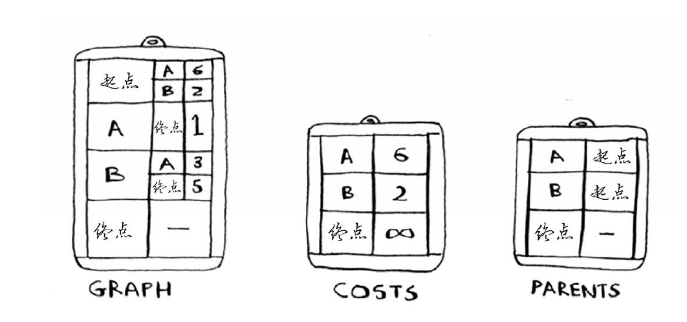

# 递归
递归性能可能不如循环但是更简洁更容易理解；
递归会导致内存堆积，可使用尾递归节省内存；
递归包含两个条件：基线条件（何时退出）+递归条件（何时递归）；

# 排序
### 选择排序
$O(n^2)$
### 快速排序(quicksort)
$O(n\log n)$
```py
def quicksort(x):
    if len(x) < 2:
        return x
    else:
        mid = x[0]
        left = [y for y in x[1:] if y <= mid]
        right = [y for y in x[1:] if y > mid]
        return quicksort(left) + [mid] + quicksort(right)
```
# 栈
栈有两种操作：压入+弹出；
所有函数调用均进入调用栈(call stack)；

```py
def help():
    pass
```

# 广度优先搜索(breadth-first search)
主要用于解决非加权图（unweighted graph）最短路径搜索问题
（适于使用队列进行存储，FIFO，同级搜索优先）
```py
from collections import deque
def search(name):
    namelist = deque()
    namelist += graph[name]
    nameChecked = []
    while namelist:
        person = namelist.popleft()
        if person not in nameChecked:
            if isSeller(person):
                return True
            else:
                namelist += graph[person]
                nameChecked.append(person)
    return False
```

# 迪克斯特拉算法(Dijkstra)
适用范围：
不含负权边的加权有向无环图的最短路径，对于含有负权边的加权图可以使用贝尔曼-福德算法(Bellman-Ford)。

> 负权边会导致当前最便宜的节点可能存在更便宜的路径

步骤：
+ 找到最“便宜”的节点
+ 更新该节点的邻居开销并更新其父节点
+ 重复该过程至每个节点均进行该操作
+ 计算最终路径

实现：


# 贪婪算法
不完美但有用的简单算法 （完美往往是优秀的敌人）
核心思想： 每一步均只考虑当前最大收益的选择


```py
# {name: set([items])}
all = {"1": {"a", "b", "c"},
       "2": {"b", "d", "f", "e"},
       "3": {"b"}}
def greedy(all):
    target = []
    covered = set()
    num = 1
    while num:
        temp = ""
        for item, content in all.items():
            if item not in target:
                if temp:
                    num = len(all[temp])
                else:
                    num = 0
                if len((content | covered) - covered) > num:
                    temp = item
        if temp:
            target.append(temp)
            covered = covered | all[temp]
        
    return target

print(greedy(all))
```
NP完全问题（简称NPC问题，Non-deterministic complete problem）
对于该类问题，几乎无法找到快速解法，可采用类似于贪婪算法这样的近似算法进行局部最优求解。

# 动态规划
将大问题分解为**互相独立**的子问题逐步求解，基于之前结果计算当前方案。


```py
import numpy as np
pocket = {"water": (3, 10),
          "book": (1, 3),
          "food": (2, 9),
          "jacket": (2, 5),
          "camera": (1, 6)}
namemap = ["water", "book", "food", "jacket", "camera"]
capacity = 6
# the possible capacity ranges from 0 to 6
clen = capacity + 1
# only 2 rows are needed
values = np.zeros((2, clen))
names1 = [[]]*clen
names2 = [[]]*clen
for name in namemap:
    for i in range(1, clen):
        v1 = values[0, i]
        c0, v0 = pocket[name]
        names = [name]
        if c0 > i:
            v0 = 0
            c0 = 0
            names = []
        v2 = v0 + values[0, i-c0]
        if v1 > v2:
            names2[i] = names1[i]
            values[1, i] = v1
        else:
            names2[i] = names + names1[i-c0]
            values[1, i] = v2

    names1 = names2
    names2 = [[]]*clen
    values[0] = values[1]
    values[1] = np.zeros(clen)

print("Highest value: {}".format(values[0, -1]))
print("Corresponding items: {}".format(names1[-1]))
```


