# Computer graphics (GAMES 101)
## Transformation
### Affine transformation (仿射变换)
Scale matrix
$$
\left[\begin{matrix} x^{'} \\ y^{'} \end{matrix}\right]=
\begin{bmatrix} s_x & 0 \\ 0 & s_y \end{bmatrix}
\begin{bmatrix} x \\ y \end{bmatrix}
$$

Reflection matrix
$$
\begin{bmatrix} x^{'} \\ y^{'} \end{bmatrix}=
\begin{bmatrix} -1 & 0 \\ 0 & -1 \end{bmatrix}
\begin{bmatrix} x \\ y \end{bmatrix}
$$

Shear matrix
$$
\begin{bmatrix} x^{'} \\ y^{'} \end{bmatrix}=
\begin{bmatrix} 1 & a \\ 0 & 1 \end{bmatrix}
\begin{bmatrix} x \\ y \end{bmatrix}
$$

Rotation matrix (default counterclockwise)
$$
\begin{bmatrix} x^{'} \\ y^{'} \end{bmatrix}=
\begin{bmatrix} \cos\theta & -\sin\theta \\ \sin\theta & \cos\theta \end{bmatrix}
\begin{bmatrix} x \\ y \end{bmatrix}
$$

**Linear transforms (combine above)**
$$
\begin{bmatrix} x^{'} \\ y^{'} \end{bmatrix}=
\begin{bmatrix} a & b \\ c & d \end{bmatrix}
\begin{bmatrix} x \\ y \end{bmatrix}
$$

What about translation?  
**Affine transformation (仿射变换: linear map + translation)**
$$
\begin{bmatrix} x^{'} \\ y^{'} \end{bmatrix}=
\begin{bmatrix} a & b \\ c & d \end{bmatrix}
\begin{bmatrix} x \\ y \end{bmatrix}+
\begin{bmatrix} t_x \\ t_y \end{bmatrix}
$$
This cannot be representated in matrix form!
Thus we have homogeneous coordinates to unify all of them.

### Homogeneous coordinates (齐次坐标)
Add w-coordinate besides x and y.
2D point = $(x,y,1)^T$
2D vector = $(x,y,0)^T$

Additionally, we define:
$$
\left(\begin{matrix}
    x \\ y \\ w
\end{matrix}\right)\text{is the 2D point}
\left(\begin{matrix}
    \frac{x}{w} \\ \frac{y}{w} \\ 1
\end{matrix}\right), w \neq 0
$$
These definitions are consistent with the following:
* vector + vector = vector (0 + 0 = 0)
* point - point = vector (1 - 1 = 0)
* point + vector = point (1 + 0 = 1)
* point + point = point (1 + 1 = 2 => 2/2 = 1)

Compared with affine transformation, with homogeneous coordinates we now have:
$$
\left(\begin{matrix}
    x^{'}\\y^{'}\\1
\end{matrix}\right)=
\left(\begin{matrix}
    a & b & t_x \\ c & d & t_y \\ 0 & 0 & 1
\end{matrix}\right) \cdot
\left(\begin{matrix}
    x\\y\\1
\end{matrix}\right)
$$
Scale matrix
$$
\mathbf{S}(s_x, s_y) = 
\left(\begin{matrix} s_x & 0 & 0 \\ 0 & s_y & 0 \\ 0 & 0 & 1 \end{matrix}\right)
$$
Rotation matrix 
$$
\mathbf{R}(\alpha) = 
\left(\begin{matrix} \cos\alpha & -\sin\alpha & 0 \\ \sin\alpha & \cos\alpha & 0 \\ 0 & 0 & 1 \end{matrix}\right)
$$
Translation matrix
$$
\mathbf{T}(t_x, t_y) = 
\left(\begin{matrix} 1 & 0 & t_x \\ 0 & 1 & t_y \\ 0 & 0 & 1 \end{matrix}\right)
$$

### Composing/Decomposing transformation
Transform ordering matters!
Matrix multiplication is not commutative.
$$
R_{45} \cdot T_{(1,0)} \neq T_{(1,0)} \cdot R_{45}
$$
Rotation after translation is different from translation after rotation.
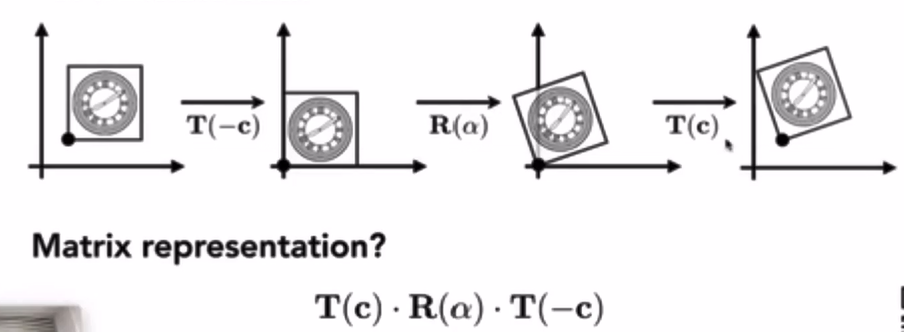
For this example, we want to rotate this shape around the corner. We can first translate it to the origin, rotate it and the translate it back. (Decomposing)
**Note:** The origin is the reference point of the rotation matrix.

### 3D transformations
3D point = $(x,y,z,1)^T$
3D vector = $(x,y,z,0)^T$
In general, $(x,y,z,w)(w\neq0)$ is the 3D point => $(x/w,y/w,z/w)$
Affine transformation:
$$
\left(\begin{matrix}x^{'} \\ y^{'} \\ z^{'} \\ 1 
\end{matrix}\right)=
\left(\begin{matrix}
a & b & c & t_x \\ d & e & f & t_y \\ g &
h & i & t_z \\ 0 & 0 & 0 & 1
\end{matrix} \right) \cdot 
\left(\begin{matrix}x \\ y \\ z \\ 1 
\end{matrix}\right)
$$

Scale
$$
\mathbf{S}(s_x, s_y, s_z) = 
\left(\begin{matrix} s_x & 0 & 0 & 0\\ 0 & s_y & 0 & 0\\ 0 & 0 & s_z & 0\\ 0 & 0 & 0 & 1\end{matrix}\right)
$$
Translation
$$
\mathbf{T}(t_x, t_y, t_z) = 
\left(\begin{matrix} 1 & 0 & 0 & t_x\\ 0 & 1 & 0 & t_y\\ 0 & 0 & 1 & t_z\\ 0 & 0 & 0 & 1\end{matrix}\right)
$$
Rotation around x-, y-, z-axis
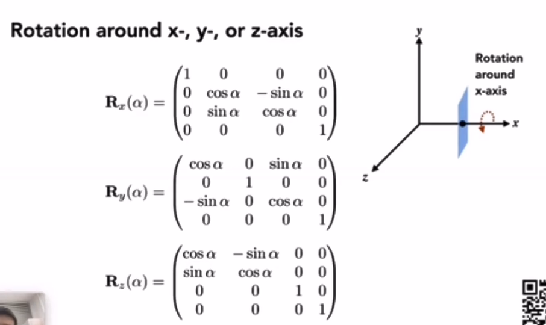
**Note:** $\mathbf{R_y(\alpha)}$ is different!

Rotation around axis $\mathbf{n}$ by angle $\alpha$
**Rodrigues' Rotation Formula**
$$
\mathbf{R}(\mathbf{n},\alpha)=\cos(\alpha)\mathbf{I}+(1-\cos(\alpha))\mathbf{n}\mathbf{n}^T+\sin(\alpha)
\begin{pmatrix}
0 & -n_z & n_y\\ n_z & 0 & -n_x\\ -n_y & n_x & 0   
\end{pmatrix}
$$
This formula only applies for an axis with the origin as the starting point of the axis $\mathbf{n}$, for other axes we can translate, rotate and the translate.
  
四元数(quaternions)？？？主要用于旋转插值的处理，未详细展开
$Q=a + b \rm i + c \rm j + d \rm k$
i,j,k为三个虚部，分别表示x轴正向到y轴正向，z轴正向到x轴正向，y轴正向到z轴正向的旋转

## Transformation Cont.
For rotation matrix
$$
R_\theta = \left(\begin{matrix}\cos\theta & -\sin\theta \\ \sin\theta & \cos\theta \end{matrix}\right)
$$
$$
R_{-\theta} = \left(\begin{matrix}\cos\theta & \sin\theta \\ -\sin\theta & \cos\theta \end{matrix}\right) = R^T_\theta
$$
Thus we have 
$$
\begin{aligned}
    &R_{-\theta} \cdot R_\theta = I \Rightarrow R_{-\theta} = R^{-1}_\theta \\ &\Rightarrow R^T_\theta=R^{-1}_\theta
\end{aligned}
$$
Rotation matrix is a orthogonal matrix!

### Viewing transformation
Consider how to take a photo
+ Find a good place and arrange people (**Model** transformation)
+ Find a good angle for the camera (**View** transformation)
+ Cheese! (**Projection** transformation)

Thus we have **MVP** transformation!
Model + View = Model/View = View/Camera transformation
And the total viewing tranformation thus contains:
+ View/Camera transformation
+ Projection transformation
  + Orthographic projection(正交投影)
  + Perspective projection(透视投影)

#### View/Camera transformation

Procedures:
1. Define the camera
   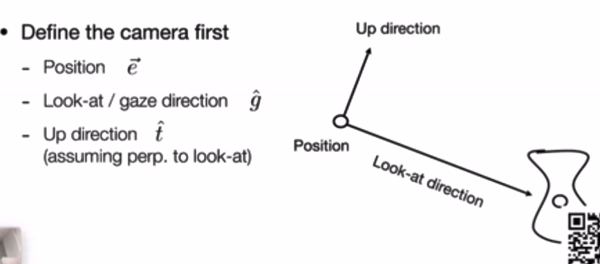
   -Position $\vec{e}$
   -Look-at/gaze direction $\hat g$
   -Up direction $\hat t$

   This defines a coordinate.

2. Transform the camera by $M_{view}$
   Key observation:
   The photo will be the same if the camera and all objects move together.
   Thus we have
   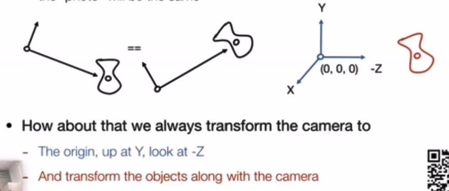
   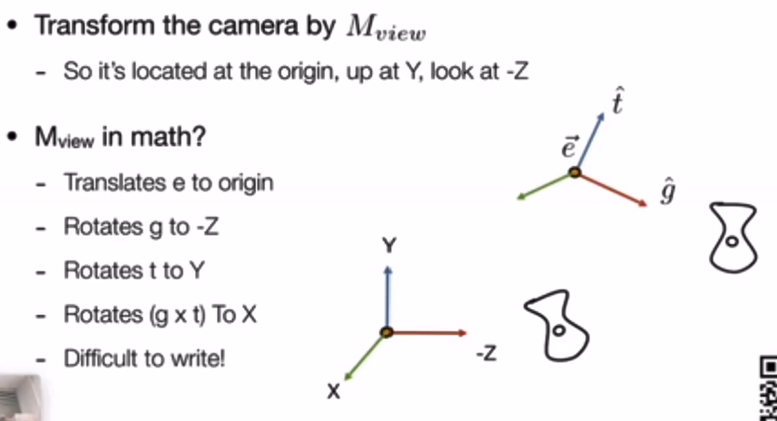
   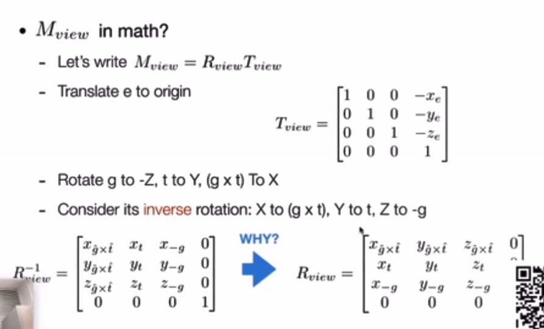
   Here we consider the inverse rotation $R^{-1}_{view}$ rather than the rotation itself.
   eg. rotation from X axis->$(1,0,0,0)^T$ to $(\hat g \times \hat t)$ axis->$(x_{\hat g\times\hat t},y_{\hat g\times\hat t},z_{\hat g\times\hat t},0)^T$, we have
   $(x_{\hat g\times\hat t},y_{\hat g\times\hat t},z_{\hat g\times\hat t},0)^T = R^{-1}_{view} \cdot (1,0,0,0)^T$,
   this satisfies the rotation law thus this is indeed the rotation matrix.

   As we have already proved, the rotaion matrix is an orthogonal matrix. 
   $R^{-1}_{view} = R^T_{view}$
   Thus $R_{view}$ can be easily obtained.
   妙哉！！

#### Projection transformation
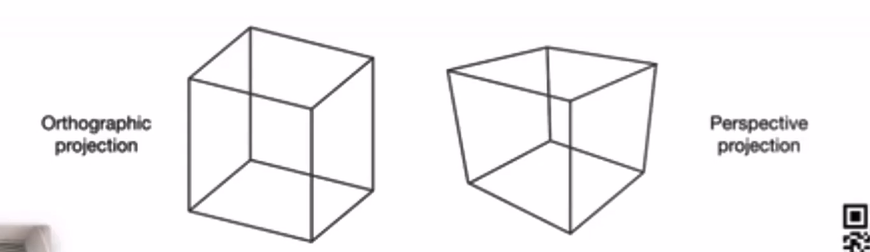
##### Othographic projection
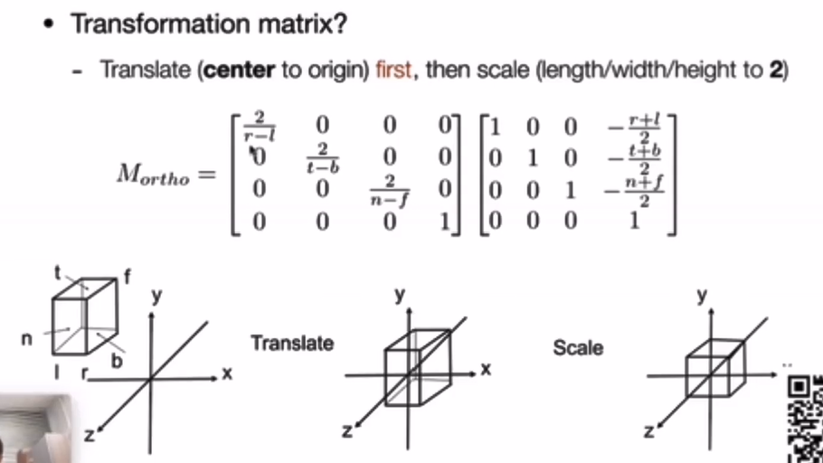
Transform a selected cuboid to the canonical one from [-1,-1,-1] to [1,1,1].
Here we use right hand coords, but in openGL it uses left hand coordis.
##### Perspective projection
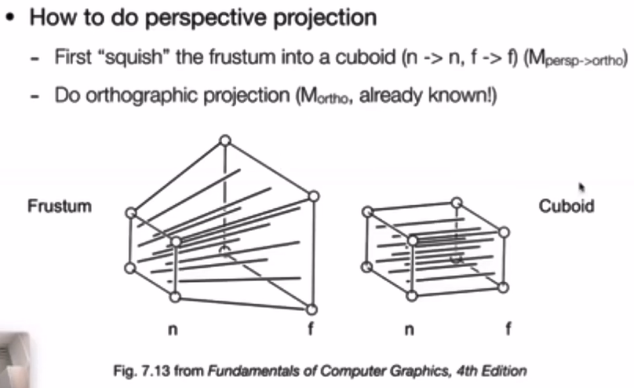
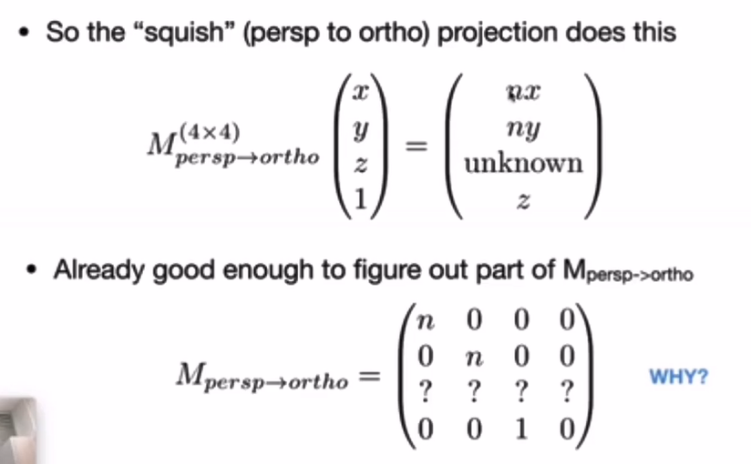
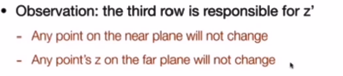
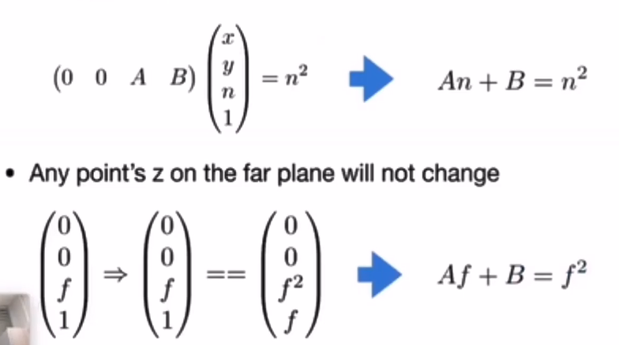
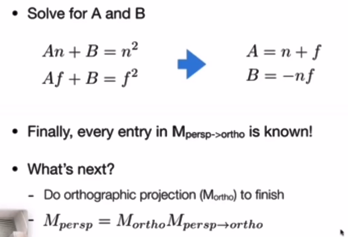

Still not clear.
What are n and f exactly?
Ans: n is the distance between origin and the near surface and f is that between origin and far surface.
What is on earth perspective projection?
Why transform to a canonical cuboid in the end???

What is the change of the point inside the frustum in z direction? nearer or farther??

