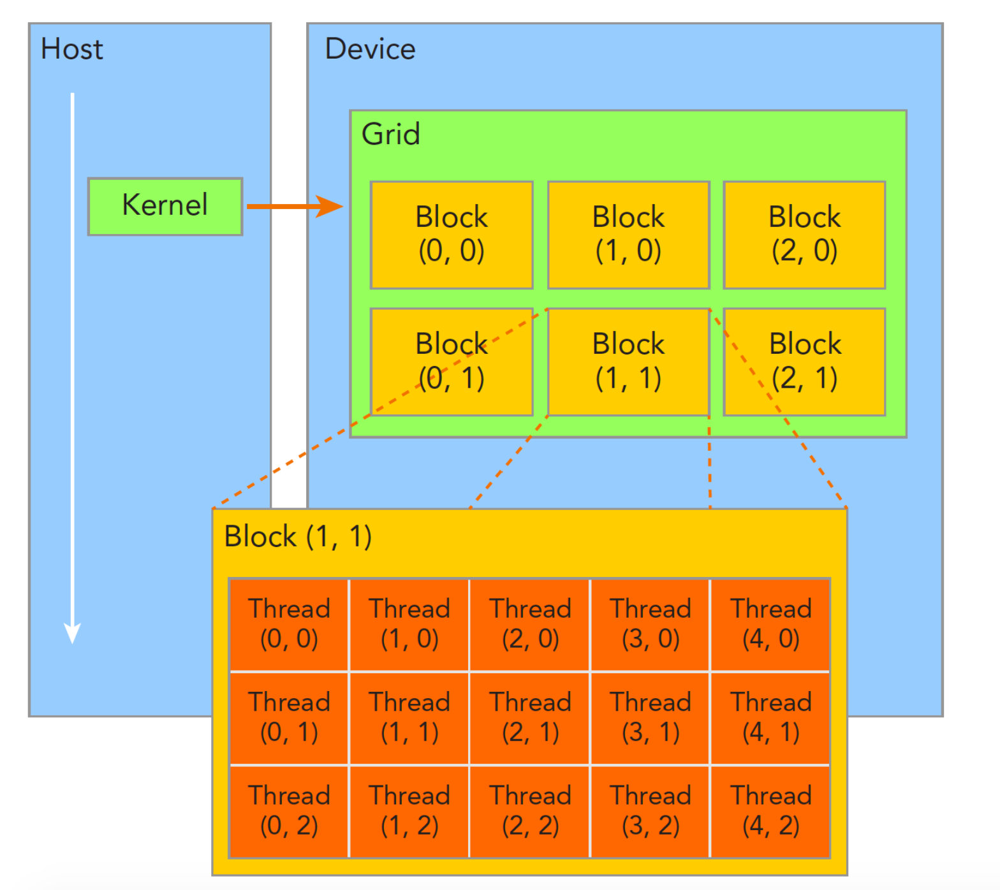
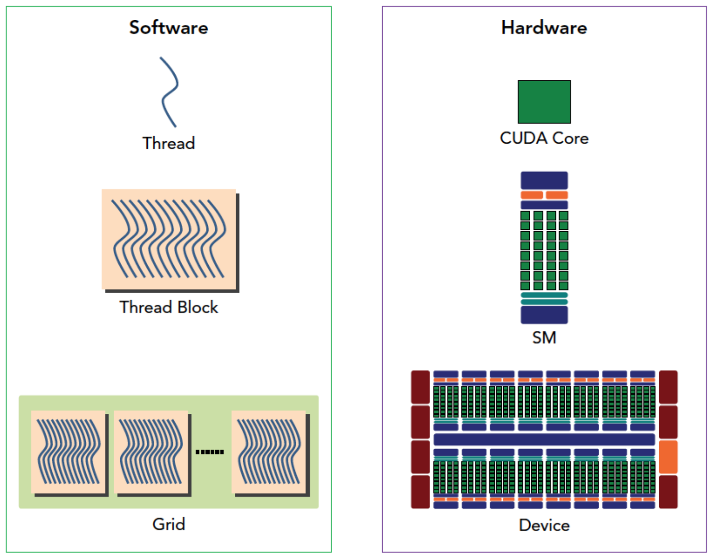
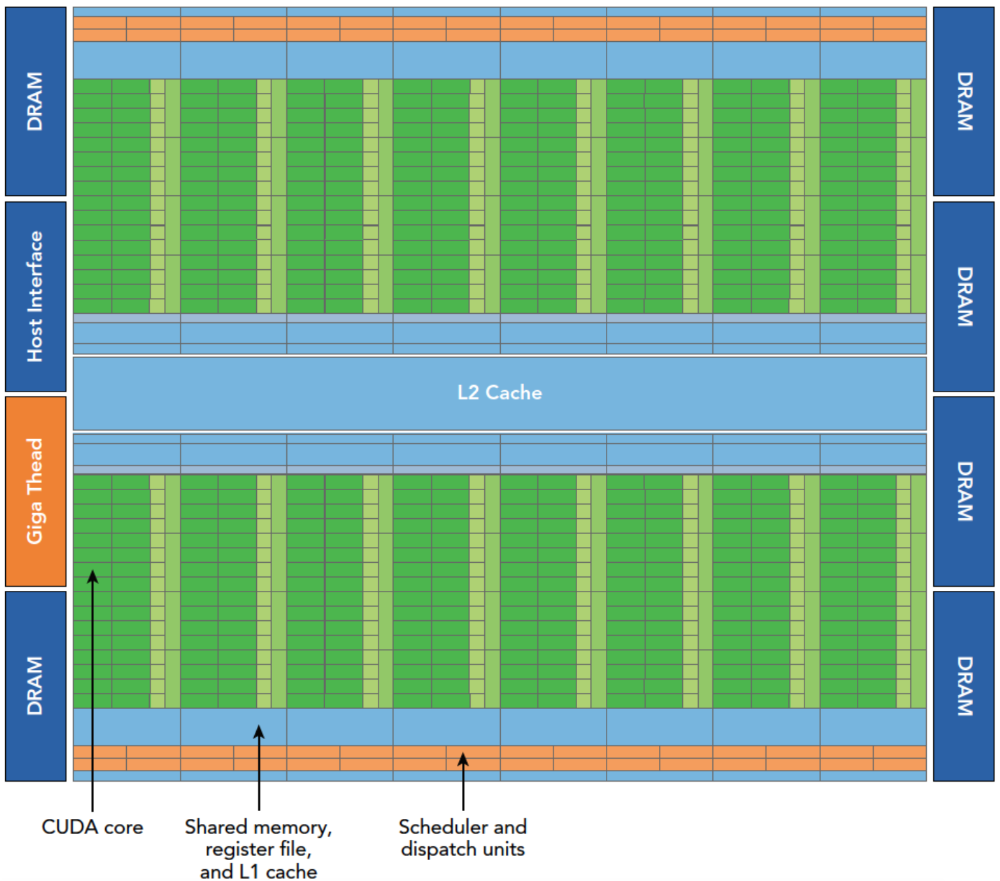
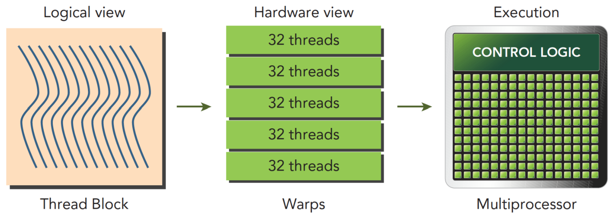
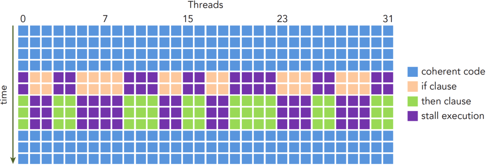

# CUDA NOTES

## CUDA Language
\_\_global\_\_: 主机(host,CPU)调用，设备(device,GPU)执行;
\_\_device\_\_: 设备调用，设备执行；
\_\_host\_\_: 主机调用，主机执行；

cuda内存管理：
cudaMalloc();
cudaMemcpy();
cudaMemset();
cudaFree();

## Architecture
### CUDA architecture (software)
CUDA线程管理层级：
Grid $\rightarrow$ Block $\rightarrow$ Thread
gridDim.x/y/z: 当前线程所在grid所包含的block在三个方向的数量；
blcokDim.x/y/z: 当前线程所在block所包含的thread在三个方向的数量；
blcokIdx.x/y/z: 当前线程所在block的index;
threadIdx.x/y/z: 当前线程在所在blcok内部的相对index;

kernel_name<<<blocknum,threadnum>>>(argument list)

### Mapping between GPU hardware and CUDA software

Hardware GPU:
+ Streaming processor(SP): 
  SP为流处理器，也被称为CUDA core，单个SP对应单个线程thread，为GPU计算的基本单位。
+ Streaming multiprocessors(SM):
  SM为流式多处理器，由多个SP以及共享内存、寄存器等组成，为基本的完整计算单元，GPU架构即围绕SM的扩展阵列搭建，通过复制SM实现GPU硬件并行。
  单个SM可以支持执行多个block，分配到SM的block只能在该SM上执行而不能重分配到其他SM。一个SM上同一个block内部的thread进行线程级别并行，在同一线程内，指令利用指令级并行将单个线程处理成流水线。从而单个SM可以支持数以百计的thread并发运行。

Software CUDA:
+ Thread
+ Block
+ Grid
+ Warp: 
  线程束，一般设备的线程束数量为32(硬件设计决定)，每个block中的线程分为若干线程束执行，因而block大小应为线程束数量的整数倍，否则会存在线程束中的线程浪费（warp中的空线程不执行有意义计算但仍然消耗资源）。
  warp是GPU调度和运行的基本单元，同一个warp中的所有thread均执行相同的指令。单一SM可以分配多个block，并行多个线程，但从机器角度这些thread并不会同时执行，一个warp需要占用一整个SM运行，在某一时刻SM上只执行一个warp，多个warps轮流进入SM进行计算，由SM上的硬件warp scheduler进行调度。

> Question:
> 如果每个SM同一时刻只能执行一个warp，那么一个SM包含成百上千个cuda core有什么意义？不是很浪费吗？

### SIMT vs SIMD
SIMT和SIMD为不同的并行结构。
+ SIMD(single instruction multiple data)
  CPU为SIMD架构，即相同指令广播给多个执行单元，每个单元必须执行该指令。
+ SIMT(single instruction multiple thread)
  GPU为SIMT架构，比SIMD更灵活但效率稍低。同样将相同指令广播给多个执行单元，但每个单元(thread)可选择执行与不执行，相对而言各个thread有一定独立性。
  > SIMT包含以下SIMD不具有的特性：
  >+ 每个线程有自己的指令地址计数器
  >+ 每个线程有自己的寄存器状态
  >+ 每个线程有自己的独立执行路径

### Fermi architecture

Fermi架构是第一个面向通用计算的完整GPU架构，之后的架构均在此基础上发展。

## Warp execution
### 线程束(warp)和线程块(block)
block为逻辑概念，用于编程。
warp偏硬件概念，是SM中基本的执行单元。
多个block会分配到一个SM上，其中单一block会根据warp大小（一般为32）再分为多个warp，一个warp在SM上根据SIMT执行计算。

---
block划分的warp数量应向上取整，即线程束为不可分最小分配单位，允许存在空线程但会消耗资源所以最好block为warpsize的整数倍。
$$\rm WarpsPerBlock=ceil\left(\frac{ThreadsPerBlock}{WarpSize(default:32)}\right)$$

---
block,thread可以为一维、二维、三维,仅为了便于编程处理不同维度数据，硬件层面仅存在一维概念。
核函数中各个线程的全局id计算如下：
+ block(1D) & thread(1D):
  tid = threadIdx.x + blockIdx.x * blockDim.x
+ block(2D) & thread(2D)
  ix = threadIdx.x + blockIdx.x * blockDim.x
  iy = threadIdx.y + blockIdx.y * blockDim.y
  tid = iy * blockDim.x * gridDim.x + ix
+ ...
实际情况中可能存在无效线程，此时kernel function需要传入数据的具体维度，应具体情况具体分析。

### 线程束分化
同一个线程束(warp)中的线程执行不同的指令，称为线程束分化。
SIMT要求同一warp执行相同指令，而存在判断语句时会存在不同分支，二者不矛盾的关键在于所有分支顺序执行，不满足条件的thread在其他满足条件的thread执行该分支时处于等待状态，如图所示。

线程束分化主要由逻辑判断的引入导致，会严重影响执行效率，故核函数中应尽量减少判断分支。在分支不可避免时解决方案为**避免同一个线程束内的线程分化**。
以32为基本单位将相同分支的线程组成同一线程束可以有效提升性能，但是往往会打乱数据顺序需要重新整理。实际上对于一般的分化编译器可以进行默认优化进行规避，但对于稍复杂情况需要特别设计。

