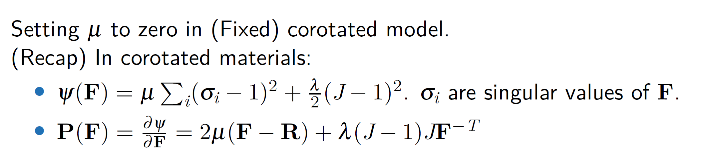

# Material Point Method
<!-- @import "[TOC]" {cmd="toc" depthFrom=2 depthTo=5 orderedList=false} -->

<!-- code_chunk_output -->

- [Material Point Method](#material-point-method)
    - [Particle-in-cell (PIC/APIC/FLIP)](#particle-in-cell-picapicflip)
      - [Interpolation function (kernel)](#interpolation-function-kernel)
    - [Material Point Method (MPM)](#material-point-method-mpm)
      - [Classical MPM](#classical-mpm)
        - [Deformation gradient](#deformation-gradient)
        - [Push forward and pull back (lagrangian and eulerian function)](#push-forward-and-pull-back-lagrangian-and-eulerian-function)
        - [Constitutive model](#constitutive-model)
        - [Governing equations](#governing-equations)
        - [Material particles](#material-particles)
          - [Interpolation function](#interpolation-function)
          - [Lagrangian/Eulerian mass](#lagrangianeulerian-mass)
          - [Lagrangian/Eulerian momentum](#lagrangianeulerian-momentum)
        - [Discretization](#discretization)
          - [Discrete time](#discrete-time)
          - [Discrete space](#discrete-space)
          - [Estimating volume](#estimating-volume)
          - [Deformation gradient evolution](#deformation-gradient-evolution)
          - [Forces as energy gradient](#forces-as-energy-gradient)
        - [Explicit time integration scheme](#explicit-time-integration-scheme)
        - [Implicit time integration](#implicit-time-integration)
        - [Collison objects](#collison-objects)
        - [Lagrangian forces](#lagrangian-forces)
      - [MLS-MPM (Moving Least Squares MPM)](#mls-mpm-moving-least-squares-mpm)
        - [:ghost: PIC](#ghost-pic)
        - [:ghost: APIC](#ghost-apic)
        - [:ghost: MLS-MPM](#ghost-mls-mpm)
      - [Constitutive Models](#constitutive-models)
        - [Elastic solids](#elastic-solids)
        - [Weakly compressible fluids](#weakly-compressible-fluids)
        - [Elastoplastic solids](#elastoplastic-solids)
        - [Singular value decomposition (SVD)](#singular-value-decomposition-svd)
      - [Lagrangian forces in MPM](#lagrangian-forces-in-mpm)
      - [Introducing Taichi "field"](#introducing-taichi-field)
      - [MPM Extension](#mpm-extension)
      - [Moving least squares method (MLS)](#moving-least-squares-method-mls)
        - [Least squares (LS)](#least-squares-ls)
        - [Weighted least squares (WLS)](#weighted-least-squares-wls)
        - [Moving least squares (MLS)](#moving-least-squares-mls)
      - [CPIC (Compatible PIC)](#cpic-compatible-pic)
      - [MPM-DEM Coupling](#mpm-dem-coupling)

<!-- /code_chunk_output -->

A fluid solver usually has 2 components:
- Advection (evolving the fields)
- Projection (enforcing incompressibility)

Eulerian grid is good at projection. (the grids are fixed and is suitable for searching for neighbors)
Lagrangian particles are good at advection. (just move the particles)

Combine them together where lagrangian particles store most of the information while eulerian grids are auxiliary.

### Particle-in-cell (PIC/APIC/FLIP)
Use particles to carry information while grid as the framework.

P2G (particle to grid): transfer info from particles to grids using kernel functions (scatter).

G2P (grid to particle): transfer info from grid to particle (gather). [Angular momentum is not conserved.]

The particles interact with each other through grids.

$p$ refers to particle and $i$ refers to grid.

:dog: Energy dissipation (numerical diffusion) is obvious.
DOF is lost during G2P??.
DOFs of particles are lost in P2G=>G2P since typically the number of particles is much more than that of grids. In G2P, particle velocities are totally overwritten from grids thus some information of particles is lost. In FLIP, the particle velocities are incremented rather than overwritten.

2 solutions:
- Transfer more information (rotation...): APIC,PolyPIC
**APIC**[affine particle in cell] + bilibili video
**highly recommended for homework**
**PolyPIC**[polynomial particle in cell]
- Transfer the delta: FLIP
**FLIP**[fluid implicit particles]
gather $\Delta$ of the physical quantities rather than themselves.
PIC: $v_p^{t+1}=gather(v_i^{t+1})$
FLIP: $v_p^{t+1}=v_p^t+gather(v_i^{t+1}-v_i^{t})$
PIC is dissipative while FLIP is too noisy.
Combine!! $\Rightarrow$ FLIP0.99=FLIP * 0.99+PIC * 0.01

To know more about **APIC** and its difference with **PIC** and **FLIP**, refer to *An angular momentum conserving affine-particle-in-cell method (2017JCP)*.
**PIC** loses information during the mapping cycle P2G/G2P thus energy dissipation occurs.
**FLIP** transfers incremental information during cycle and preserves each particle's original information to some extent however too much noise occurs.
**APIC** transfers more information like velocity gradient matrix thus the energy dissipation can be avoided to some extent.

PIC is almost never used in graphics.
APIC is suggested to start with.

Refer to [pic_vs_apic codes](MPM_images/pic_vs_apic.py) to learn about the difference between PIC and APIC.

#### Interpolation function (kernel)
There are mainly 3 kinds of interpolation function used in PIC/APIC/MPM.

For both PIC and APIC, information transfer occurs between each particle ($p$) and its surrounding 4(linear)/9(quadratic)/16(cubic) grid points ($i$). In the figures below, each red particle inside intersects with the surrounding blue grid points through the **kernel function**, which is defined on grid points.
**Linear**

**Quadratic**

**Cubic**

During P2G and G2P cycle, the velocity is kind of smoothed and energy dissipation occurs.

APIC conserves angular momentum!
**Angular momentum conservation (角动量守恒)**
Angular momentum (角动量): $m\mathbf{r}\times \mathbf{v}$
Moment (力矩): $\mathbf{r}\times\mathbf{F}$
其中$\mathbf{r}$为位置矢量。
角动量守恒条件：合力矩为0
根本在于$\mathbf{F}=m\mathbf{a} \Rightarrow \mathbf{r}\times\mathbf{F}=m\mathbf{r}\times\mathbf{a}$
如果合力矩为0，则速度保持不变，角动量恒定

动量守恒，角动量守恒都源于牛顿第二定律。

合力矩和角动量的关系可以类比合力与动量的关系。

### Material Point Method (MPM)
No elements in MPM.
MPM particles => FEM quadrature points (Gaussian points)
MPM equations are derived using weak formulation.

#### Classical MPM
Refer to [2016 MPM course](https://www.seas.upenn.edu/~cffjiang/research/mpmcourse/mpmcourse.pdf) for details.

##### Deformation gradient
$\mathbf{X}$: undeformed space.
$\mathbf{x}$: deformed space.
$\phi(\mathbf{X},t)$: deformation map.
Their relationship is denoted with
$$\mathbf{x}=\phi(\mathbf{X},t)$$

For translation: $\mathbf{x}=\mathbf{X}+vt\mathbf{n}$
where $\mathbf{n}$ is the moving direction.
For rotation: $\mathbf{x}=\mathbf{R}\mathbf{X}+\mathbf{b}$
where $\mathbf{R}$ is the rotation matrix.(For 2D cases, $\mathbf{R}=\begin{bmatrix}
  \cos\theta & -\sin\theta\\ \sin\theta & \cos\theta
\end{bmatrix}$)

Deformation gradient:
$$\mathbf{F}=\frac{\partial\phi(\mathbf{X},t)}{\partial\mathbf{X}}=\frac{\partial\mathbf{x}(\mathbf{X},t)}{\partial\mathbf{X}}$$

$$F_{ij}=\frac{\partial\phi_i}{\partial X_j}=\frac{\partial x_i}{\partial X_j},\quad i,j=1,\dots,d$$

For rigid translation: $\mathbf{F}=\mathbf{I}_{d\times d}$.
For rigid rotation: $\mathbf{F}=\mathbf{R}$.

The determinant of $\mathbf{F}$:
$$J=\det(\mathbf{F})$$

This characterizes the infinitesimal volume change and represents the **ratio** of the infinitesimal volume of material in configuration $\Omega^t$ to the original volume in $\Omega^0$.

+ $J=1$ means no volume change during the transformation. For rigid motions (rotations and translations), $J=1$.
+ $J>1$ means volume increase.
+ $J<1$ means volume decrease.
+ $J=0$ means volume becomes 0. In the real world this is impossible while numerically it is possible, eg. the material is so compressed that it becomes a plane or a line or a single volumeless point.
+ $J<0$ means the material is inverted. For a 2D triangle, this means one vertex passes through its opposing edge, resulting in negative area.

##### Push forward and pull back (lagrangian and eulerian function)
==Definition：==
Push forward $\Rightarrow$ Eulerian (function of $\mathbf{x}$)
$$v(\mathbf{x},t)=V(\phi^{-1}(\mathbf{x},t),t)$$

where $v$ is the push forward of $V$.
Pull back $\Rightarrow$ Lagrangian (function of $\mathbf{X}$)
$$V(\mathbf{X},t)=v(\phi(\mathbf{X},t),t)$$

where $V$ is the pull back of $v$.

==Material derivative:==
For a general Eulerian function $f(\cdot,t)$,
$$\frac{D}{Dt}f(\mathbf{x},t)=\frac{\partial f(\mathbf{x},t)}{\partial t}+\frac{\partial f(\mathbf{x},t)}{\partial x_j}v_j(\mathbf{x},t)$$

where Eulerian $\frac{D}{Dt}f(\mathbf{x},t)$ is the push forward of $\frac{\partial F}{\partial t}$ and $F$ is a Lagrangian function.

==Volume and area change:==
Volume:
$$v=JdV$$

where $J=\det(\mathbf{F})$, $v\Rightarrow x$(Eulerian), $V\Rightarrow X$(Lagrangian).
Based on this we have
$$\int_{B^t}g(\mathbf{x})d\mathbf{x}=\int_{B^0}G(\mathbf{X})J(\mathbf{X},t)d\mathbf{X}$$

where $g$ is the push forward of $G$.

Area:
$$d\mathbf{s}=\mathbf{F}^{-T}Jd\mathbf{S}\quad or\quad \mathbf{n}ds=\mathbf{F}^{-T}J\mathbf{N}dS$$

where $s$ and $S$ are tiny areas.
Based on this we have
$$\int_{\partial B^t}h(\mathbf{x},t)\cdot\mathbf{n}(\mathbf{x})ds(\mathbf{x})=\int_{\partial B^0}H(\mathbf{X})\cdot\mathbf{F}^{-T}(\mathbf{X},t)N(\mathbf{X})J(\mathbf{X},t)dS(\mathbf{X})$$

##### Constitutive model
For **hyperelastic** material:
PK1 stress (First Piola-Kirchoff stress) $\mathbf{P}$ can be derived from 
$$\mathbf{P}=\frac{\partial\psi(\mathbf{F})}{\partial\mathbf{F}}$$

where $\psi$ is the elastic energy density function (scalar function) and $\mathbf{F}$ is the deformation gradient.
With index notation,
$$P_{ij}=\frac{\partial\psi}{\partial{F_{ij}}}$$

The Cauchy stress can be obtained from
$$\mathbf{\sigma}=\frac{1}{J}\mathbf{P}\mathbf{F}^T=\frac{1}{\det(\mathbf{F})}\frac{\partial\psi}{\partial\mathbf{F}}\mathbf{F}^T$$

2 common hyperelastic materials: Neo-Hookean and Fixed Corotated.
Refer to [elastic solids](#elastic-solids).

##### Governing equations
Conservation of mass + Conservation of momentum

> Determinant differentiation rule:
> For an invertible matrix $\mathbf{A}$,
> $$\frac{\partial\det(\mathbf{A})}{\partial \mathbf{A}}=\det(\mathbf{A}) \mathbf{A}^{-T}$$
> This leads to the commonly used rule:
> $$\frac{\partial\det(\mathbf{F})}{\partial \mathbf{F}}=\det(\mathbf{F}) \mathbf{F}^{-T}$$

==Weak form of force balance==
Mainly based on conservation of momentum.
(Actually momentum theorem rather than conservation).
$$m\Delta\mathbf{v}=\mathbf{F}\Delta t\Leftrightarrow \frac{m\Delta\mathbf{v}}{\Delta t}=\mathbf{F}$$
Lagrangian view:
$$\int_{\Omega^0}Q_i(\mathbf{X},t)R(\mathbf{X},0)A_i(\mathbf{X},t)d\mathbf{X}=\int_{\partial\Omega^0}Q_iT_ids(\mathbf{X})-\int_{\Omega^0}Q_{i,j}P_{ij}d\mathbf{X}$$

Eulerian view:
$$\int_{\Omega^t}q_i(\mathbf{x},t)\rho(\mathbf{x},t)a_i(\mathbf{x},t)d\mathbf{x}=\int_{\partial\Omega^t}q_it_ids(\mathbf{x})-\int_{\Omega^t}q_{i,k}\sigma_{ik}d\mathbf{x}$$

Here $i,j,k$ are component index for dimensions, $t_i$ is the $i$ component of boundary force $\mathbf{t}$. 
LHS (left-hand side) is some kind of momentum change rate over time while RHS is some kind of net force ignoring the external force.

##### Material particles
Momentum and mass are transfered between grid and particle through interpolation function.
Index notation:
Particle $\qquad\Leftrightarrow\qquad$ $p$
Grid $\qquad\Leftrightarrow\qquad$ $i$

###### Interpolation function
The interpolation function is defined over the Eulerian grid rather than on the material particles like the kernel of SPH particles.
$$w_{ip}=N_\mathbf{i}(\mathbf{x}_p)=N(\frac{1}{h}(x_p-x_i))N(\frac{1}{h}(y_p-y_i))N(\frac{1}{h}(z_p-z_i))$$

$$\nabla w_{ip}=\nabla N_{\mathbf{i}}(\mathbf{x}_p)=
\begin{pmatrix}
  \frac{1}{h}N'(\frac{1}{h}(x_p-x_i))N(\frac{1}{h}(y_p-y_i))N(\frac{1}{h}(z_p-z_i))\\
  N(\frac{1}{h}(x_p-x_i))\frac{1}{h}N'(\frac{1}{h}(y_p-y_i))N(\frac{1}{h}(z_p-z_i))\\
  N(\frac{1}{h}(x_p-x_i))N(\frac{1}{h}(y_p-y_i))\frac{1}{h}N'(\frac{1}{h}(z_p-z_i))\\
\end{pmatrix}$$

Refer to [interpolation function](#interpolation-function-kernel) for plots of linear/quadratic/cubic functions.

###### Lagrangian/Eulerian mass
P2G mass transfer:
$$m_i=\sum_p m_p N_i(\mathbf{x}_p)$$

This ensures the conservation of mass through the partition of unity assumption on interpolation function $\sum_i N_i(\mathbf{x}_p)=1$:
$$\sum_i m_i = \sum_i\sum_p m_p N_i(\mathbf{x}_p) = \sum_p m_p \sum_i N_i(\mathbf{x}_p) = \sum_p m_p$$

No G2P mass transfer since the particle mass never changes.
###### Lagrangian/Eulerian momentum
P2G momentum transfer:
$$\begin{aligned}
  (m\mathbf{v})_i &= \sum_p m_p \mathbf{v}_p N_i(\mathbf{x}_p)\\
  \mathbf{v}_i &= \frac{(m\mathbf{v})_i}{m_i}
\end{aligned}$$

Since $\sum_i m\mathbf{v}_i = \sum_i(m\mathbf{v})_i=\sum_p\sum_i m_p \mathbf{v}_p N_i(\mathbf{x}_p)=\sum_p m_p \mathbf{v}_p$, momentum is conserved in P2G transfer.

G2P velocity transfer:
Since particle mass keeps unchanged, only velocity is transfered in G2P rather than momentum.
$$\mathbf{v}_p = \sum_i\mathbf{v}_iN_i(\mathbf{x}_p)$$

Since $\sum_p m_p\mathbf{v}_p=\sum_p m_p\sum_i\mathbf{v}_iN_i(\mathbf{x}_p) = \sum_i\mathbf{v}_i\sum_pm_pN_i(\mathbf{x}_p)=\sum_i m_i \mathbf{v}_i$, momentum is conserved in G2P transfer.
> Note:pig:: Unlike mass, total momentum keeps changing in the system. This is achieved in Grid operations through introducing impulse. Details will be given later.

##### Discretization
In this part, $i,j,k$ denote grid nodes, $\alpha,\beta,\gamma$ denote dimensional components. 
For instance, $q_{i\alpha}$ means the $\alpha$ component of the vector quantity $\mathbf{q}$ that is stored at node $i$.
###### Discrete time
By introducing $a_{\alpha}(\mathbf{x},t^n)=\frac{1}{\Delta t}(v_\alpha^{n+1}(\mathbf{x})-v_\alpha^n(\mathbf{x}))$ into the [weak form governing equation](#governing-equations), we have
$$\begin{aligned}
  &\frac{1}{\Delta t}\int_{\Omega^{t^n}} q_\alpha(\mathbf{x},t^n)\rho(\mathbf{x},t^n)(v_\alpha^{n+1}(\mathbf{x})-v_\alpha^n(\mathbf{x}))d\mathbf{x}\\&=\int_{\partial\Omega^{t^n}}q_\alpha(\mathbf{x},t^n)t_\alpha(\mathbf{x},t^n)ds(\mathbf{x})-\int_{\Omega^{t^n}}q_{\alpha,\beta}(\mathbf{x},t^n)\sigma_{\alpha\beta}(\mathbf{x},t^n)d\mathbf{x}
\end{aligned}$$

###### Discrete space
Further discretize the [weak form force balance equation](#discrete-time) over space, we have 
$$\frac{((mv)_{i\alpha}^{n+1}-(mv)_{i\alpha}^{n})}{\Delta t}=\int_{\partial\Omega^{t^n}}N_i(\mathbf{x})t_\alpha(\mathbf{x},t^n)ds(\mathbf{x})-\int_{\Omega^{t^n}}N_{i,\beta}(\mathbf{x})\sigma_{\alpha\beta}(\mathbf{x},t^n)d\mathbf{x}$$

Assuming we have an estimate of the Cauchy stress $\mathbf{\sigma}_p^n=\mathbf{\sigma}(\mathbf{x}_p^n,t^n)$ at each Lagrangian particle $\mathbf{x}_p^n$, force on the Eulerian grid node $i$ can be written as
$$\int_{\Omega^{t^n}}N_{i,\beta}(\mathbf{x})\sigma_{\alpha\beta}(\mathbf{x},t^n)d\mathbf{x}\approx\sum_p\sigma_{p\,\alpha\beta}^nN_{i,\beta}(\mathbf{x}_p^n)V_p^n$$

where $V_p^n$ is the volume particle $p$ occupied at time $t^n$.

###### Estimating volume
There are mainly 2 methods to estimate.
+ Estimation based on grid density
  $$\begin{aligned}
    &m_p\approx R(\mathbf{X}_p,0)V_p^0\approx \rho(\mathbf{x}_p^n,t^n)V_p^n\\
    &\rho(\mathbf{x}_p^n,t^n)\approx\sum_i\rho_i^nN_i(\mathbf{x}_p^n)\\
    &\rho_i^n=\frac{m_i^n}{\Delta x^d}\\
  \end{aligned}
  $$

  where $\Delta x$ is the size of each Eulerian grid and $d$ is the dimension. 
  Since grid density is easy to compute, the volume can be estimated
  $$V_p^n\approx\frac{m_p}{\rho(\mathbf{x}_p^n,t^n)}\approx\frac{m_p}{\sum_i\frac{m_i^n}{\Delta x^d}N_i(\mathbf{x}_p^n)}=\frac{m_p\Delta x^d}{\sum_i m_i^n N_i(\mathbf{x}_p^n)}$$

+ Estimation based on deformation gradient
  Typically we have
  $$V_p^n \approx J_p^n V_p^0$$

  where $J_p^n = \det(\mathbf{F}_p^n)$.

Baed on the second method and substituting Cauchy stress $\boldsymbol{\sigma}$ with $\frac{1}{J}\mathbf{P}\mathbf{F}^T$, the [force on the Eulerian grid node $i$](#discrete-space) can be further rewritten as
$$\sum_p\sigma_{p\,\alpha\beta}^n N_{i,\beta}(\mathbf{x}_p^n)V_p^n=\sum_p\frac{1}{J_p^n}P_{p\,\alpha\gamma}^n F_{p\,\beta\gamma}^n N_{i,\beta}(\mathbf{x}_p^n)V_p^0J_p^n=\sum_p P_{p\,\alpha\gamma}^n F_{p\,\beta\gamma}^n N_{i,\beta}(\mathbf{x}_p^n)V_p^0$$

Now the discretized weak form force balance equation can be written as
$$\frac{((mv)_{i\alpha}^{n+1}-(mv)_{i\alpha}^{n})}{\Delta t}=\int_{\partial\Omega^{t^n}}N_i(\mathbf{x})t_\alpha(\mathbf{x},t^n)ds(\mathbf{x})-\sum_p P_{p\,\alpha\gamma}^n F_{p\,\beta\gamma}^n N_{i,\beta}(\mathbf{x}_p^n)V_p^0$$

> Note: Different constitutive models are introduced to the scheme by expressing the PK1 stress $\mathbf{P}$ in different ways. 
> In computer graphics, **hyperelastic** material is preferred since it has a well defined potential energy $\psi$ and the PK1 stress can be easily computed as $\mathbf{P}=\frac{\partial\psi}{\partial\mathbf{F}}$.

###### Deformation gradient evolution
$$\begin{aligned}
  &\frac{\partial}{\partial t}\mathbf{F}(\mathbf{X}_p,t^{n+1})\approx\frac{\mathbf{F}_p^{n+1}-\mathbf{F}_p^n}{\Delta t}\\
  &\mathbf{F}_p^{n+1}=\mathbf{F}_p^n+\Delta t \frac{\partial}{\partial t}\mathbf{F}(\mathbf{X}_p,t^{n+1})
\end{aligned}$$

where $\mathbf{F}(\mathbf{X}_p,t^{n+1})$ is simplified as $\mathbf{F}_p^{n+1}$.
Also we have
$$\begin{aligned}
  &\frac{\partial}{\partial t}\mathbf{F}(\mathbf{X},t^{n+1})=\frac{\partial\mathbf{V}}{\partial\mathbf{X}}(\mathbf{X},t^{n+1})=\frac{\partial \mathbf{v}^{n+1}(\mathbf{x})}{\partial\mathbf{x}}\mathbf{F}(\mathbf{X},t^n)\\
  &\mathbf{v}^{n+1}(\mathbf{x})=\sum_i \mathbf{v}_i^{n+1}N_i(\mathbf{x})\\
  &\frac{\partial \mathbf{v}^{n+1}(\mathbf{x})}{\partial\mathbf{x}}=\sum_i \mathbf{v}_i^{n+1}(\frac{\partial N_i(\mathbf{x})}{\partial\mathbf{x}})^T
\end{aligned}$$

Combining them together we have
$$\mathbf{F}_p^{n+1}=(\mathbf{I}+\Delta t\sum_i \mathbf{v}_i^{n+1}(\frac{\partial N_i(\mathbf{x}_p^n)}{\partial\mathbf{x}})^T)\mathbf{F}_p^n$$

Based on this, $\mathbf{F}_p^{n+1}$ can be obtained given $\mathbf{v}_i^{n+1}$ and $\mathbf{F}_p^n$ at each particle.

###### Forces as energy gradient
[Force on the Eulerian grid node](#estimating-volume) (derived from weak form governing equation) can also be derived from energy gradient for hyperelastic material.

##### Explicit time integration scheme
+ Particle to grid (P2G)
  + $(m\mathbf{v})_i^{n+1}=\sum_pw_{ip}(m_p\mathbf{v}_p^n+\mathbf{B}_p(\mathbf{D}_p)^{-1}(\mathbf{x}_i-\mathbf{x}_p))$ (**Grid momentum**)
    > This is from APIC.
    > $$\begin{aligned}\mathbf{C}_p &= \mathbf{B}_p (\mathbf{D}_p)^{-1}\\\mathbf{D}_p &= \sum_i w_{ip} (\mathbf{x}_i-\mathbf{x}_p)(\mathbf{x}_i-\mathbf{x}_p)^T\\ \mathbf{B}_p &= \sum_i w_{ip} \mathbf{v}_i (\mathbf{x}_i-\mathbf{x}_p)^T  \end{aligned}$$
    >
    > For quadratic kernel, $\mathbf{D}_p=\frac{\Delta x^2}{4}\mathbf{I}$ and $\mathbf{C}_p=\frac{4}{{\Delta x}^2}\sum_i w_{ip} \mathbf{v}_i (\mathbf{x}_i-\mathbf{x}_p)^T$;
    > For cubic kernel, $\mathbf{D}_p=\frac{\Delta x^2}{3}\mathbf{I}$ and $\mathbf{C}_p=\frac{3}{{\Delta x}^2}\sum_i w_{ip} \mathbf{v}_i (\mathbf{x}_i-\mathbf{x}_p)^T$;
    > For linear kernel, $\mathbf{C}_p=\sum_i\mathbf{v}_i(\frac{\partial N_i}{\partial\mathbf{x}}(\mathbf{x}_p))^T=\sum_i\mathbf{v}_i(\nabla w_{ip})^T$
  + $m_i^{n+1}=\sum_p m_p w_{ip}$ (**Grid mass**)
+ Grid operations
  + $\hat\mathbf{v}_i^{n+1}=\frac{(m\mathbf{v})_i^{n+1}}{m_i}$ (**Grid velocity**)
  + Only label the grid nodes with nonzero masses as solver unknowns. (**Identify grid DOF**)
  + $\mathbf{f}_i^n=-\sum_p \mathbf{P}_p^n {\mathbf{F}_p^n}^T \nabla w_{ip}^n V_p^0$ or $\mathbf{f}_i^n=-\sum_p\boldsymbol{\sigma}_p^n \nabla w_{ip}^n V_p^n$ (**Compute grid forces**)
    > The 2 formulas can be transferred via $\boldsymbol{\sigma}=\frac{1}{J}\mathbf{P}\mathbf{F}^T$ and $V_p^n=JV_p^0$.
    > For hyperelastic material, $\mathbf{P}$ is easily obtained by $\mathbf{P}=\frac{\partial\psi_p}{\partial\mathbf{F}_p}$ thus the 1st formula is used.
  + $\mathbf{v}_i^{n+1}=\hat\mathbf{v}_i^{n+1}+\Delta t\frac{\mathbf{f}    _i^n}{m_i}$ (**Grid velocity update**)
    > Boundary conditions and collision objects are also taken into account in this part.
+ Grid to particle (G2P)
  + $\mathbf{F}_p^{n+1}=(\mathbf{I}+\Delta t\sum_i \mathbf{v}_i^{n+1}(\nabla w_{ip}^n)^T)\mathbf{F}_p^n$ (**Particle deformation gradient update**)
    > Gradient of interpolation function is needed here. $\nabla w_{ip} = \frac{\partial N_i(\mathbf{x}_p)}{\partial\mathbf{x}}$ is a $d$ dimensional vector.
  + $\mathbf{D}_p = \sum_i w_{ip} (\mathbf{x}_i-\mathbf{x}_p)(\mathbf{x}_i-\mathbf{x}_p)^T$ and $\mathbf{B}_p = \sum_i w_{ip} \mathbf{v}_i (\mathbf{x}_i-\mathbf{x}_p)^T$
    > Actually this is $\mathbf{C}_p = \mathbf{B}_p (\mathbf{D}_p)^{-1}$ update.
  + $\mathbf{v}_p^{n+1}=\sum_i w_{ip}\mathbf{v}_i^{n+1}$ (**Particle velocity update**)
  + $\mathbf{x}_p^{n+1}=\mathbf{x}_p^n+\Delta t \mathbf{v}_p^{n+1}$ (**Particle advection**)

##### Implicit time integration
The main difference from explicit scheme lies in the **grid velocity update** step.
+ In explicit:
  $\mathbf{v}_i^{n+1}=\hat\mathbf{v}_i^{n+1}+\Delta t\frac{\mathbf{f} _i(\mathbf{x}_i^n)}{m_i}$
+ In implicit:
  $\mathbf{v}_i^{n+1}=\hat\mathbf{v}_i^{n+1}+\Delta t\frac{\mathbf{f}  _i(\mathbf{x}_i^{n+1})}{m_i}$
  > Force is implicitly dependent on grid motion thus the grid velocity cannot be updated directly (backward Euler system).

  With the aid of the equation of motion 
  $$\mathbf{h}(\mathbf{v}^{n+1})=\mathbf{M}\mathbf{v}^{n+1}-\mathbf{M}\mathbf{v}^n-\Delta t\mathbf{f}_i(\mathbf{x}^n+\Delta t\mathbf{v}^{n+1})=\mathbf{0}$$
  
  the updated grid velocity can be computed with Newton-Raphson iteration method
  $$\mathbf{v}^{(i+1)}=\mathbf{v}^{(i)}-(\frac{\partial\mathbf{h}}{\partial\mathbf{v}}(\mathbf{v}^{(i)}))^{-1}\mathbf{h}(\mathbf{v}^{(i)})$$
  > where $(i)$ denotes the $i$ th iteration step rather than grid node. At each step, $\mathbf{F}_p$ should also be updated. Usually only one iteration step is taken.

Solving this eqation with NR method is equivalent to minimizing the following objective function:
$$E(\mathbf{v}_i)=\sum_i\frac{1}{2}m_i\|\mathbf{v}_i-\mathbf{v}_i^n\|^2+e(\mathbf{x}_i^n+\Delta t \mathbf{v}_i)$$

Transfering the problem to an optimization problem enables a **larger time step**. This can occur only when the forces can be derived from a potential energy function and the details are omitted here.  

##### Collison objects
The collison is enforced on grid node velocity immediately after forces are applied to grid velocities.
collison detection + relative velocity computation

##### Lagrangian forces
$$\mathbf{f}=-\frac{\partial U}{\partial \mathbf{x}}$$

where $U$ is the total energy.

#### MLS-MPM (Moving Least Squares MPM)
Refer to [MLS-MPM](https://www.seas.upenn.edu/~cffjiang/research/mlsmpm/hu2018mlsmpm.pdf) for details.
Using MLS shape function in MPM
Easier to implement than traditional MPM since velocity gradient is approximated with affine matrix.
Based on APIC.
> ti example mpm88/99/128

$i$ => grid node, $p$ => particle

##### :ghost: PIC
+ Particle to grid (P2G)
  + $(m\mathbf{v})_i^{n+1}=\sum_p w_{ip} m_p \mathbf{v}_p^n$
  + $m_i^{n+1}=\sum_p m_p w_{ip}$
+ Grid operations
  + $\mathbf{v}_i^{n+1}=\frac{(m\mathbf{v})_i^{n+1}}{m_i^{n+1}}$
+ Grid to particle (G2P)
  + $\mathbf{v}_p^{n+1}=\sum_i w_{ip}\mathbf{v}_i^{n+1}$
  + $\mathbf{x}_p^{n+1}=\mathbf{x}_p^n+\Delta t \mathbf{v}_p^{n+1}$

##### :ghost: APIC

The main difference lies in the fact that in G2P, more information (velocity gradient matrix $\boldsymbol{C}_p$) is transfered.
==Particle velocity gradient $C_p$:== the formula of it here is based on **quadratic** B-Spline kernel function. For Cubic or other kernels, the expression is different.
> **How to derive $\mathbf{C}_p$??**
$$
\begin{aligned}
  \mathbf{C}_p &= \mathbf{B}_p (\mathbf{D}_p)^{-1}\\
  \mathbf{D}_p &= \sum_i \omega_{ip} (\mathbf{x}_i-\mathbf{x}_p)(\mathbf{x}_i-\mathbf{x}_p)^T\\
  \mathbf{B}_p &= \sum_i \omega_{ip} \mathbf{v}_i (\mathbf{x}_i-\mathbf{x}_p)^T
\end{aligned}
$$
>
> Among these equations, $i$ represents grid node and $p$ represents particle. For **quadratic** kernel funciton(interpolation stencil), $\mathbf{D}_p=\frac{\Delta x^2}{4}\mathbf{I}$ and for **cubic**, $\mathbf{D}_p=\frac{\Delta x^2}{3}\mathbf{I}$ where $\Delta x$ is the size of the grid. The detailed derivation is omitted here.

==Incompressible:== 常密度假定，即忽略内能变化，能量守恒表现为动能+势能守恒

##### :ghost: MLS-MPM

> In P2G, $\boldsymbol{P}(\boldsymbol{F}_p^{n+1})=\frac{\partial\boldsymbol{\psi}}{\partial\bold{F}}$ refers to PK1 stress tensor of the specific constitutive model. For hyperelastic models with a well-defined potential energy density function, this is easy to get.

> For MLS-MPM, the main difficulty lies in P2G where Grid momentum is hard to obtain considering constitutive model.

> Comparing with traditional MPM, the main contribution is the unification of the affine matrix and velocity gradient. ($\mathbf{C}_p \approx \nabla \mathbf{v}_p$)

**How to derive grid momentum:**

**How to employ a different material???**
Substitute different forms of PK1 stress $\mathbf{P}(\mathbf{F})$.

Enforcing boundary conditions (BC) on grid velocity:
+ Sticky: $\boldsymbol{v}_i^{n+1}=\boldsymbol{0}$
+ Slip: $\boldsymbol{v}_i^{n+1}=\hat\boldsymbol{v}_i^{n+1}-\boldsymbol{n}(\boldsymbol{n}^T\hat\boldsymbol{v}_i^{n+1})$
+ Separate: $\boldsymbol{v}_i^{n+1}=\hat\boldsymbol{v}_i^{n+1}-\boldsymbol{n}\cdot\min(\boldsymbol{n}^T\hat\boldsymbol{v}_i^{n+1},0)$

> For boundary condition enforcement:
> For PIC/APIC, when applying BC to a cube moving in x direction, the cube composed of particles will be compressed without moving in y direction.
> For MLS-MPM however, the cube will collapse and move in y direction once impeded in x direction. This mainly results from the deformation gradient and constitutive model??

#### Constitutive Models
+ Fluid: Equation-of-States (EOS)
+ Elastoplastic objects (snow, sand etc.): Yield criteria
+ PK1 stress ...

##### Elastic solids
PK1 stresses of hyperelastic models:
+ Neo-Hookean
+ (Fixed) Corotated

> $\mathbf{F}=\mathbf{R}\mathbf{S}$ is the polar decomposition of $\mathbf{F}$ ($\mathbf{R}$ a rotation matrix and $\mathbf{S}$ symmetric). 
> Since $\mathbf{F}=\mathbf{U}\boldsymbol{\Sigma}\mathbf{V}^T=\mathbf{U}\mathbf{V}^T\mathbf{V}\boldsymbol{\Sigma}\mathbf{V}^T$, we can simply get $\mathbf{R}=\mathbf{U}\mathbf{V}^T$ and $\mathbf{S}=\mathbf{V}\boldsymbol{\Sigma}\mathbf{V}^T$.

For more information, refer to [2016 MPM course](https://www.seas.upenn.edu/~cffjiang/research/mpmcourse/mpmcourse.pdf) given by Jiang etc.

##### Weakly compressible fluids

##### Elastoplastic solids

We can also refer to snow paper.

##### Singular value decomposition (SVD)
Every real matrix $M_{n\times m}$ can be decomposed into $M_{n\times m}=U_{n\times n}\Sigma_{n\times m}V_{m\times m}^T$
U,V => rotation
$\Sigma$ => streching

Diagonal entries $\sigma_{i}=\Sigma_{ii}$ are called singular values.

#### Lagrangian forces in MPM
Treat MPM particles as FEM vertices, and use FEM potential energy model. A triangular mesh is needed.
> ti example mpm_lagrangian_forces

#### Introducing Taichi "field"
New feature in 0.6.22
Use "field" instead of "tensor" since Taichi v0.6.22.
ti.tensor, ti.var are deprecated with "field".

ti.var => ti.field(dtype=f32, shape=[]) -> a[None]
ti.tensor => ti.field(dtype=f32, shape=[256,256])

"field" refers to global variable.
ti.Vector.field
ti.Matrix.field

#### MPM Extension
Refer to [MPM course](https://www.seas.upenn.edu/~cffjiang/research/mpmcourse/mpmcourse.pdf) and [MLS-MPM](https://www.seas.upenn.edu/~cffjiang/research/mlsmpm/hu2018mlsmpm.pdf).

Dirichlet boundary (第一类边界条件): 边界上待求变量值已知
Neumann boundary (第二类边界条件/自然边界条件): 边界上待求变量外法线方向导数确定

Key contribution: MLS-MPM uses MLS shape functions.

Signed distance function (SDF): this function is used to perform inside/outside queries. Different shapes usually have different SDFs.
For the SDF of any point,  its sign represents the point's relative location and its return value should be the shortest distance between the shape and the given point.

#### Moving least squares method (MLS)
Refer to [LS-WLS-MLS](https://www.docin.com/p-271196866.html).
To reconstruct a field based on discrete point cloud.
##### Least squares (LS)
> Global approximation. Each sample point is treated equally.

Objective function
$$\min_{f\in\prod^d_m}\sum_i \|f(\mathbf{x}_i)-f_i\|^2$$

where $d$ refers to dimension, $m$ refers to degree of the polynomial space, $\mathbf{x}_i$ is the sampling points with given function value $f_i$.
$$f(\mathbf{x})=\mathbf{b}(\mathbf{x})^T\mathbf{c}$$

The key point is to compute the coefficients vector $\mathbf{c}$.

##### Weighted least squares (WLS)
> Global approximation based on local approximation and weighted summation.

Objective function:
$$\min_{f\in\prod^d_m}\sum_i \theta(\|\bar\mathbf{x}-\mathbf{x}_i\|)\|f(\mathbf{x}_i)-f_i\|^2$$

where $\bar\mathbf{x}$ is a given point, $\theta(\|\bar\mathbf{x}-\mathbf{x}_i\|)$ is a weight function centered at $\bar\mathbf{x}$. The output optimal function is
$$f_{\bar\mathbf{x}}(\mathbf{x})=\mathbf{b}(\mathbf{x}-\bar\mathbf{x})^T\mathbf{c}(\bar\mathbf{x})$$

This approximates the function at the domain around given point $\bar\mathbf{x}$ and thus is a local approximation.
For totally $n$ sample points with known values, the global approximation can be expressed as 
$$f(\mathbf{x}) = \sum_{j=1}^n\varphi_j(\mathbf{x})f_{\bar\mathbf{x}}(\mathbf{x}) = \sum_{j=1}^n\varphi_j(\mathbf{x})\mathbf{b}(\mathbf{x}-\bar\mathbf{x}_j)^T\mathbf{c}(\bar\mathbf{x}_j)$$

where $\varphi_j(\mathbf{x})=\frac{\theta_j(\mathbf{x})}{\sum_{k=1}^n\theta_k(\mathbf{x})}$ is the global weight function which ensures Partition of Unity (PU) $\sum_{j=1}^n\varphi_j(\mathbf{x})=1$ at any point $\mathbf{x}$ of the global domain $\Omega$.

##### Moving least squares (MLS)
> Local approximation base on WLS. 
> The global approximation is not a single function, but **a list of** local approximation functions based on WLS.

$$f(\mathbf{x})=f_\mathbf{x}(\mathbf{x})$$
> For each point $\mathbf{x}$, a local WLS approximation centered at $\mathbf{x}$ is implemented to get its function value. As the point **moves** over the entire domain $\Omega$, the global approximation is obtained.

#### CPIC (Compatible PIC)
CPIC is designed to deal with rigid body cutting (Displacement discontinuity) and two-way rigid body coupling. Refer to [MLS-MPM](https://www.seas.upenn.edu/~cffjiang/research/mlsmpm/hu2018mlsmpm.pdf) for details.
"Compatible": particle and its surrounding grid node at the same side of the the same rigid body.

1. Grid-wise colored distance field (CDF)
   > Need to capture
   $d_i$: valid distance between grid node and rigid surface; 
   $A_{ir}$: tag denotes whether there is valid distance between grid and rigid surface (=1: yes; =0: no); 
   $T_{ir}$: tag denotes which side of the rigid surface the gird is on (= +/-).
2. Particle-wise colored distance field (based on grid CDF)
   > Particle penalty force occurs. (not sure, maybe in step 6)
3. CPIC P2G transfer
   > Only the information of compatible particles is transferred to grid.
4. Grid operation (apply overall BC)
5. CPIC G2P transfer 
   > Need to compute ghost velocity for incompatible grid nodes (impulse from rigid body to particle, projection is needed.)
6. Rigid body advection
   > Impulse from particle to rigid body (Two-way coupling is thus achieved.)

The following is a snapshot of a MLS-MPM [program](mpm_cutting_thin.py) (CPIC) where a block is cut by a thin plane.
> :ghost: Rigid body impulse and penalty force are not considered.

The following is a snapshot of a CPIC [program](mpm_cutting_rotation.py) about a rotating fan.
> :ghost: No penalty force is considered thus some particles can penetrate the blades.
> **Angular momentum theorem** is employed to simulate the rigid body rotation with the accumulated impulse from the particles to the closest rigid bodies. 

The rotation fan case in [MLS-MPM paper](https://www.seas.upenn.edu/~cffjiang/research/mlsmpm/hu2018mlsmpm.pdf).

#### MPM-DEM Coupling
