# SPH Learning Notes
<!-- @import "[TOC]" {cmd="toc" depthFrom=2 depthTo=5 orderedList=false} -->

<!-- code_chunk_output -->

- [SPH Learning Notes](#sph-learning-notes)
  - [Navier-Stokes equations](#navier-stokes-equations)
  - [Courant-Friedrichs-Lewy(CFL) condition](#courant-friedrichs-lewycfl-condition)
  - [Neighborhood search(NS)](#neighborhood-searchns)
  - [Particle size, smoothing length and kernel support radius](#particle-size-smoothing-length-and-kernel-support-radius)
  - [SPH interpolation](#sph-interpolation)
  - [Preprocessing](#preprocessing)
    - [Extracting geometry from 3D mesh matrix](#extracting-geometry-from-3d-mesh-matrix)
    - [Converting FEM meshes to SPH particles](#converting-fem-meshes-to-sph-particles)
  - [Weakly compressible SPH (WCSPH)](#weakly-compressible-sph-wcsph)
    - [Kernel function](#kernel-function)
      - [Cubic spline kernel](#cubic-spline-kernel)
      - [Gaussian kernel](#gaussian-kernel)
    - [Governing equations and their SPH formulation](#governing-equations-and-their-sph-formulation)
      - [Continuity equation](#continuity-equation)
      - [Momentum equation](#momentum-equation)
      - [Equation of state (EOS)](#equation-of-state-eos)
    - [Viscosity](#viscosity)
    - [Surface tension](#surface-tension)
    - [Boundary particles](#boundary-particles)
    - [Time step](#time-step)
    - [Computation flow](#computation-flow)
    - [Drawbacks](#drawbacks)
  - [Predictive-corrective incompressible SPH (PCISPH)](#predictive-corrective-incompressible-sph-pcisph)
    - [Density correction via pressure change](#density-correction-via-pressure-change)
    - [Computation flow](#computation-flow-1)
  - [Implicit incompressible SPH (IISPH)](#implicit-incompressible-sph-iisph)
    - [Continuity equation in IISPH](#continuity-equation-in-iisph)
    - [Pressure and non-pressure force](#pressure-and-non-pressure-force)
    - [Semi-implicit scheme](#semi-implicit-scheme)
    - [Rigid-fluid coupling](#rigid-fluid-coupling)
    - [Computation flow](#computation-flow-2)
  - [Divergence-free SPH (DFSPH)](#divergence-free-sph-dfsph)
    - [NS equations](#ns-equations)
    - [Overall computation flow](#overall-computation-flow)
    - [Divergence-free solver](#divergence-free-solver)
    - [Constant density solver](#constant-density-solver)
    - [DFSPH cases](#dfsph-cases)
  - [Reconstructing smooth surfaces](#reconstructing-smooth-surfaces)
  - [Solid SPH](#solid-sph)

<!-- /code_chunk_output -->

For an overview of the concepts of SPH, refer to [tutorial](https://interactivecomputergraphics.github.io/SPH-Tutorial/).
## Navier-Stokes equations
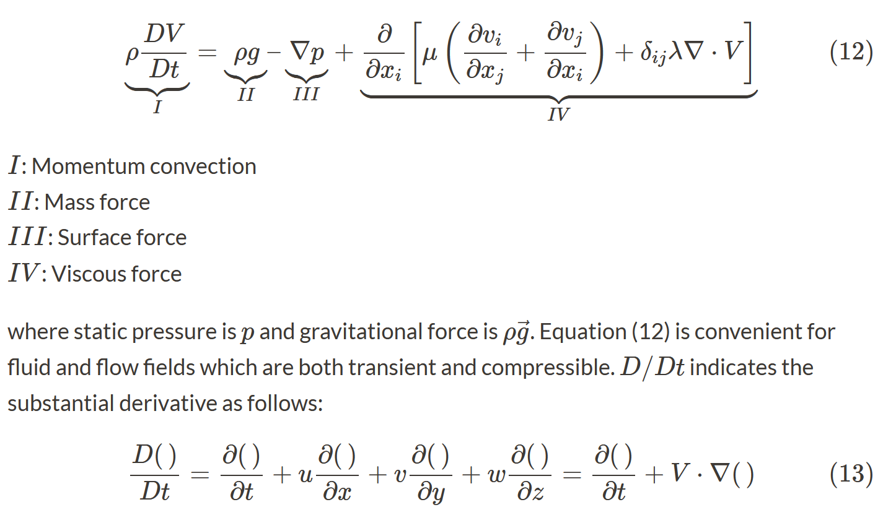
Here mainly conservation of momentum is enforced.
Navier-Stokes equations express conservation of momentum (Newton's second law),conservation of mass and conservation of energy and is used to describe viscous flow.
Density($\rho$), velocity($v$), pressure($p$), viscosity($\mu$) and temperature($T$) are involved.
Refer to [NS equations](https://www.simscale.com/docs/simwiki/numerics-background/what-are-the-navier-stokes-equations/) for details.

For low speed fluids incompressibility is assumed and the equations can be simplified while for high speed ones compressibility should be taken into consideration.

## Courant-Friedrichs-Lewy(CFL) condition
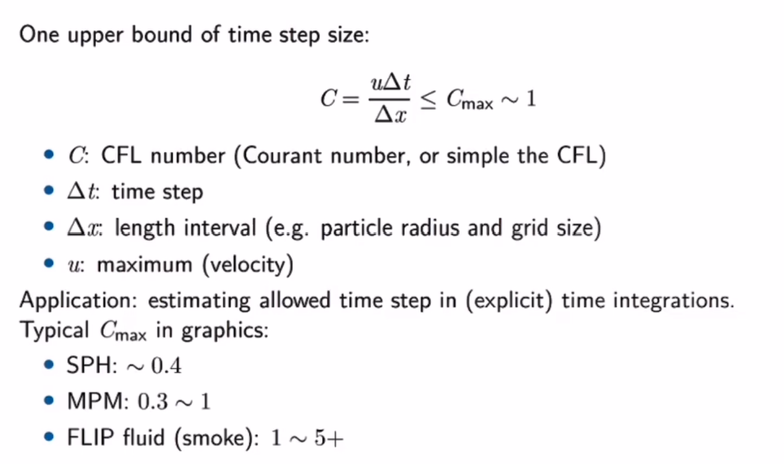

## Neighborhood search(NS)
**Accelerating SPH:**
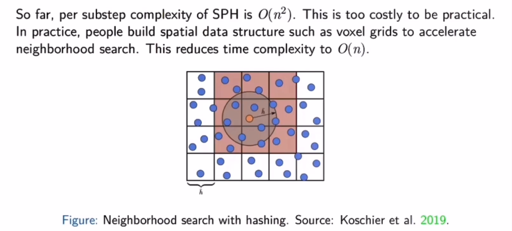
For details of neighborhood list, refer to [Neighbour lists in smoothed particle hydrodynamics](https://ephyslab.uvigo.es/publica/documents/file_259Dominguez_etal_2010_IJNMF_DOI.pdf).
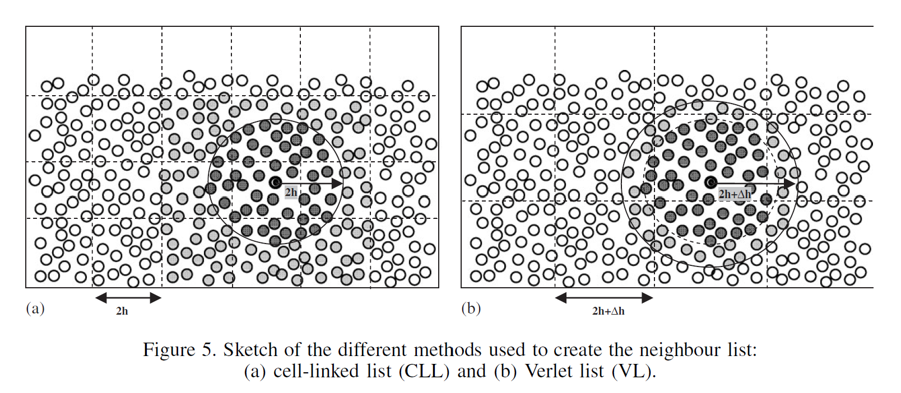
An appropriate number of neighboring particles is 30 to 50 for each particle. If the number exceeds a given maximum value, the computation should be terminated.

## Particle size, smoothing length and kernel support radius
Particle size ($\tilde{h}$), smoothing length ($h$) and kernel support radius ($\hbar$) are 3 important but confusing concepts.
**Particle size ($\tilde{h}$)**: particle size (aka characteristic length) is usually used to define the volume occupied by each particle and hence used to compute volume and mass given density.
**Smoothing length ($h$)**: smoothing length is widely used to control the reach of each particle. However, the actual value of the range of influence is not exactly equal to that of the smoothing length depending on the type of kernel function chosen. $h$ is usually defined as $k * \tilde{h}$ where $k$ is usually set to 2 or 3.
**Kernel support radius ($\hbar$)**: kernel support radius is the exact value of the particle range of influence. Different choice of kernel function can result in different $\hbar$ while the smoothing length keeps unchanged. For instance, in the [classical cubic spline kernel](#kernel-function) $\hbar=2h$.
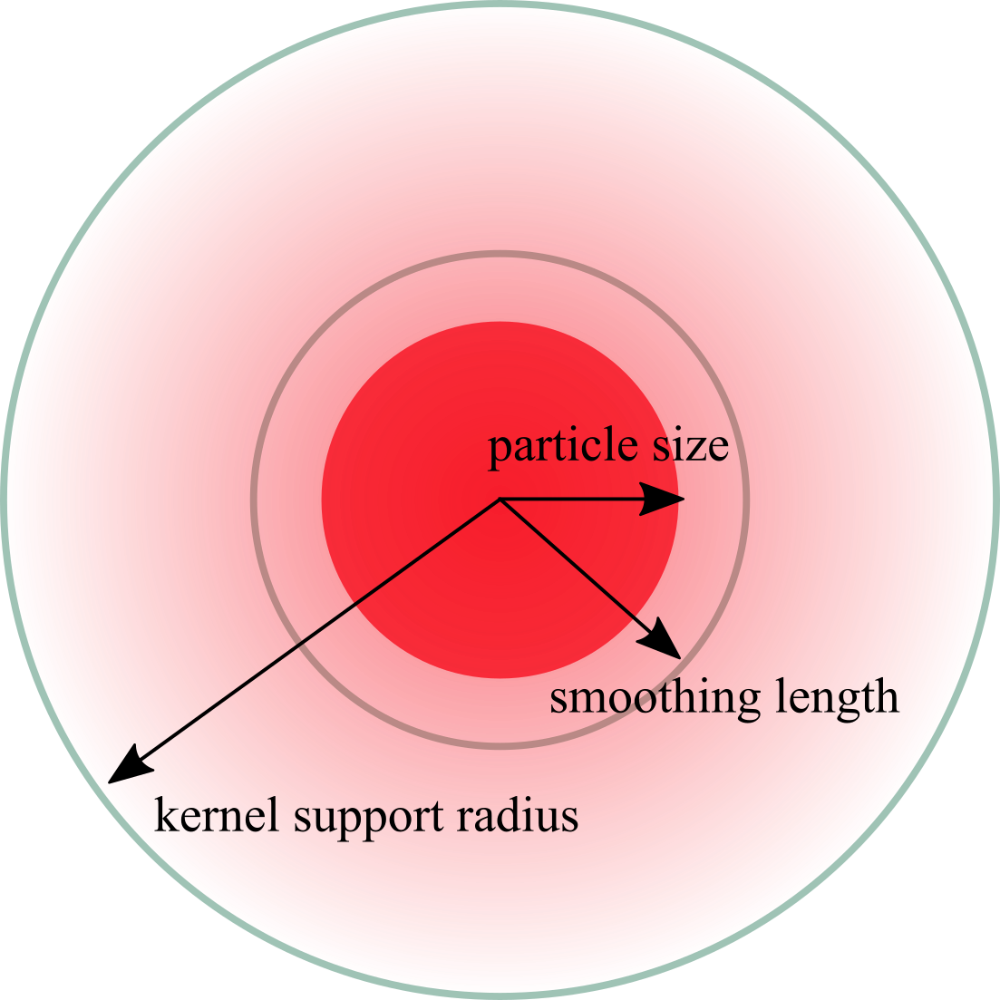

## SPH interpolation
In SPH, particles are used to interpolate a continuous function $A(\mathbf{x})$ at a position $\mathbf{x}$.
For any continuous function $A$, the interpolation is given as
$$A(\mathbf{x})=\sum_j m_j\frac{A(\mathbf{x}_j)}{\rho_j}W(\mathbf{x}-\mathbf{x}_j,h)$$

## Preprocessing
It is essential to create evenly distributed particles for complex geometries to apply SPH to real-life objects. There are some methods to solve this problem.
### Extracting geometry from 3D mesh matrix
An evenly distributed cartesian mesh is firstly created to fill the whole domain. And those elements associated with the geometry is labeled to distinguish them from the others. The preprocessing tool "GenCase" in the project [DualSPHysics](https://dual.sphysics.org/) is based on this method.
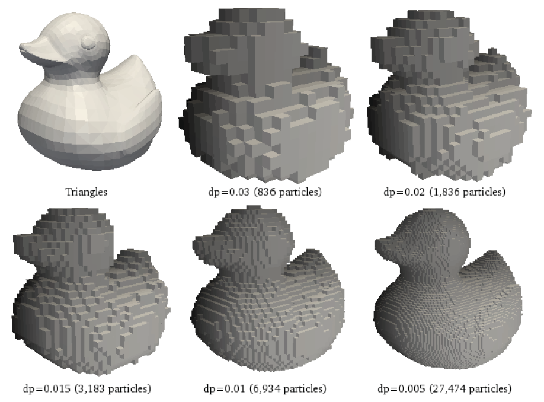
### Converting FEM meshes to SPH particles
This method is based on FEM meshes. The geometry is firstly divided into FEM meshes. And these meshes are then converted to SPH particles. In this method, the meshes should be created as evenly distributed as possible to get a similar smoothing length for each particle which makes this method difficult and less accurate than the first method. The advantage is that this method makes the coupling of SPH and FEM easier and can make use of the mature FEM meshers. It is especially suitable for those analyses during which the heavily distorted FEM meshes can be converted to SPH particles. Abaqus adopts this method for its SPH solver.
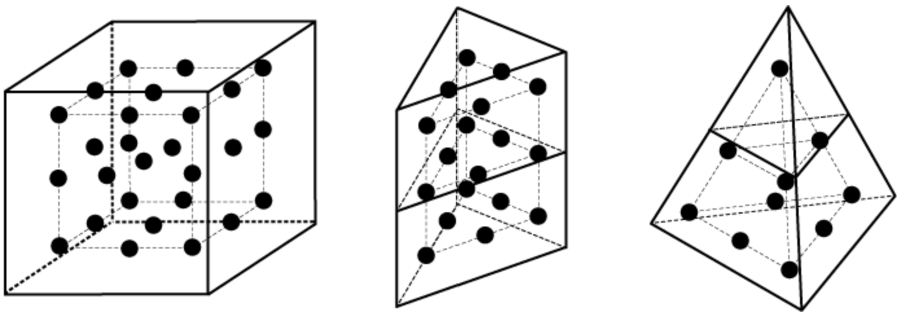
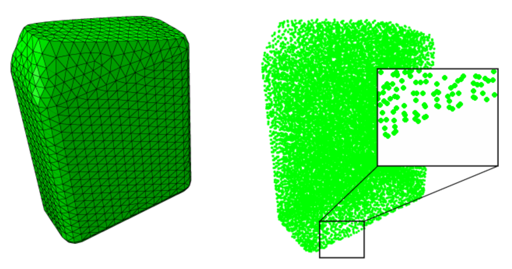

## Weakly compressible SPH (WCSPH)
This method allows for small, user-defined density fluctuations rather than strictly enforcing incompressibility to save time for solving Poisson equation. Actually a simplified pressure equation called Tait equation rather than pressure Poisson equation(PPE) is adopted.
Refer to [WCSPH2007](https://www.researchgate.net/publication/220789258_Weakly_Compressible_SPH_for_Free_Surface_Flows) for more details.

### Kernel function
#### Cubic spline kernel
A commonly used kernel function in SPH is the **cubic spline kernel** [Monaghan1992](http://www.astro.lu.se/~david/teaching/SPH/notes/annurev.aa.30.090192.pdf)(*actually there are many kinds of cubic spline kernels*:joy:):
$$
W(q)=\begin{cases}
  \sigma_3[1-\frac{3}{2}q^2+\frac{3}{4}q^3],\quad&\rm{for\; 0\leq q< 1}\\
  \frac{\sigma_3}{4}(2-q)^3,&\rm{for\; 1\leq q< 2}\\
  0,&\rm{for\; q\ge 2}\\
\end{cases}
$$

where $q=\frac{\|\mathbf{r}\|}{h}$ and $\sigma_3$ is a dimensional normalizing factor given by:
$$
\sigma_3=\begin{cases}
  \frac{2}{3h},\quad&\rm{for\;dim=1}\\
  \frac{10}{7\pi h^2},&\rm{for\;dim=2}\\
  \frac{1}{\pi h^3},&\rm{for\;dim=3}\\
\end{cases}
$$

And the gradient of the kernel function $\nabla W_{ij}$ which is commonly used in SPH is derived as
$$\nabla W_{ij}=\frac{dW_{ij}}{dq}*\frac{\mathbf{r}}{\|\mathbf{r}\|}=\frac{dW_{ij}}{dq}*\frac{\mathbf{x}_i-\mathbf{x}_j}{\|\mathbf{x}_i-\mathbf{x}_j\|}$$

#### Gaussian kernel
$$
W(q)=\sigma_3 e^{-q^2}
$$

where $q=\frac{\|\mathbf{r}\|}{h}$ and $\sigma_3$ is a dimensional normalizing factor given by:
$$
\sigma_3=\begin{cases}
  \frac{1}{\sqrt{\pi}h},\quad&\rm{for\;dim=1}\\
  \frac{1}{\pi h^2},&\rm{for\;dim=2}\\
  \frac{1}{\pi^{\frac{3}{2}} h^3},&\rm{for\;dim=3}\\
\end{cases}
$$

### Governing equations and their SPH formulation
#### Continuity equation
General form
$$\frac{d\rho}{dt}=-\rho\nabla\cdot\mathbf{v}$$

In SPH, the density is calculated as
$$\rho_a=\sum_bm_bW_{ab}$$

where $a$ is the current particle and $b$ denotes its neighbors. $W_{ab}=W(\mathbf{x}_a-\mathbf{x}_b)$ is the kernel function value between $a$ and $b$ and $\|\mathbf{x}_a-\mathbf{x}_b\|=r$ in the kernel function.
And the derivative is
$$\frac{d\rho_a}{dt}=\sum_bm_b\mathbf{v}_{ab}\nabla_aW_{ab}$$

where $\mathbf{v}_{ab}=\mathbf{v}_a-\mathbf{v}_b$ and $\nabla_aW_{ab}=\frac{dW_{ab}}{dq}*\frac{\mathbf{x}_a-\mathbf{x}_b}{\|\mathbf{x}_a-\mathbf{x}_b\|}$ are all vectors with $q=\frac{\|\mathbf{x}_a-\mathbf{x}_b\|}{h}$.
For this method, density changes are only due to relative motion of particles.
#### Momentum equation
General form
$$\frac{d\mathbf{v}}{dt}=-\frac{1}{\rho}\nabla p+\mathbf{g}$$

SPH form (Pressure force + Body force)
$$\frac{d\mathbf{v}_a}{dt}=-\sum_bm_b(\frac{p_a}{\rho_a^2}+\frac{p_b}{\rho_b^2})\nabla_aW_{ab}+\mathbf{g}$$

#### Equation of state (EOS)
There are different form of EOS with different conditions. In WCSPH, low compressibily is adopted.
+ Incompressibility (Poisson equation)
  $$\nabla^2p=\rho\frac{\nabla\cdot\mathbf{v}}{\Delta t}$$

  Solving this Poisson equation is time-consuming(PCG,MGPCG). Standard SPH and other methods like FVM directly solve this equation.
+ High compressibility (Ideal gas equation)
  $$p=k_p\rho\quad {\rm or} \quad p=k_p(\rho-\rho_0)$$

  This method requires a pressure constant $k_p$ and results in a high compressibility.
+ Low compressibility (Tait equation)
  $$\begin{aligned}
    p&=B\left(\left(\frac{\rho}{\rho_0}\right)^\gamma-1\right)\\
    B&=\frac{\kappa\rho_0}{\gamma}
  \end{aligned}$$

  where $\rho_0$ is the initial particle density, $\kappa$ is a stiffness parameter and $\gamma$ is another parameter.
  Actually $\kappa$ should be determined based on the desired density variation through test and tuning. In WCSPH, $\kappa$ is assigned a large value $\kappa=c_s^2$ where $c_s$ denotes the speed of sound in the fluid and $\gamma=7$ is adopted. 
  $$B=\frac{c_s^2\rho_0}{\gamma}$$

  This large stiffness parameter can help keep the density fluctuation small. The relative density fluctuation thus follows the following relation
  $$\frac{|\Delta\rho|}{\rho_0}=\frac{|\rho-\rho_0|}{\rho_0} \sim \frac{|\mathbf{v}_f|^2}{c_s^2}$$

  where $\mathbf{v}_f$ denotes the speed of flow.
  If the sound speed is much larger than the flow speed ($c_s\gg|\mathbf{v}_f|$), the density variation can be controlled at a low level. Define $\eta < \frac{|\mathbf{v}_f|^2}{c_s^2}$ and $\eta=0.01$ is usually chosen to control the density variations of the order of 1%. 
  However, large stiffness results in smaller time step and increases overall computation cost.

### Viscosity
Artificial viscosity is employed to improve numerical stability and to allow for shock phenomena (preventing particle penetration). 
$$\frac{d\mathbf{v}_a}{dt}=\begin{cases}
-\sum_b m_b\Pi_{ab}\nabla_aW_{ab} \qquad&\mathbf{v}_{ab}^T\mathbf{x}_{ab}<0\\
0 &\mathbf{v}_{ab}^T\mathbf{x}_{ab}\ge0
\end{cases}$$
$\Pi_{ab}$ is given as
$$\Pi_{ab}=-\nu\left(\frac{\mathbf{v}_{ab}^T\mathbf{x}_{ab}}{|\mathbf{x}_{ab}|^2+\varepsilon h^2}\right)$$

with the viscous term $\nu=\frac{2\alpha h c_s}{\rho_a+\rho_b}$ and the viscosity constant $\alpha$ is usually in between 0.08 and 0.5. $\varepsilon h^2$ is introduced to avoid singularities for $|\mathbf{x}_{ab}|=0$ with $\varepsilon=0.01$.

> In the paper "On the problem of penetration in particle methods" written by Monaghan in 1989, the viscosity is slightly different from the above one in WCSPH.
$$\Pi_{ab}=\begin{cases}
\frac{\alpha\zeta_{ab}\bar{c}_{ab}+\beta\zeta_{ab}^2}{\bar{\rho}_{ab}} \qquad&\mathbf{v}_{ab}\cdot\mathbf{x}_{ab}<0\\
0 &\mathbf{v}_{ab}\cdot\mathbf{x}_{ab}\ge0
\end{cases}$$
>
> where 
$$\begin{aligned}
  \zeta_{ab}&=-\frac{(\mathbf{v}_{ab}\cdot\mathbf{x}_{ab})h_{ab}}{|\mathbf{x}_{ab}|^2+\varepsilon h_{ab}^2}\\
  \bar{c}_{ab}&=\frac{1}{2}(c_a+c_b)\\
  \bar{\rho}_{ab}&=\frac{1}{2}(\rho_a+\rho_b)\\
  h_{ab}&=\frac{1}{2}(h_a+h_b)\\
\end{aligned}$$
>
> Among them, $c$ is the sound speed of the material, $\alpha$ and $\beta$ are the standard constants. The term associated with $\alpha$ reflects a bulk viscosity and is the same as the one in WCSPH. While the other term with $\beta$ is not included and is mainly used to prevent interpenetration of particles at **high Mach number** (especially useful for high speed cases).

### Surface tension
In WCSPH, a new surface tension model is adopted which relies on cohesion forces.
$$\frac{d\mathbf{v}_a}{dt}=-\frac{\kappa}{m_a}\sum_bm_bW_{ab} \frac{\mathbf{x}_a-\mathbf{x}_k}{|\mathbf{x}_a-\mathbf{x}_k|}$$

The accuracy of the above equation is doubtful and a reasonable value of $\kappa$ is unknown yet. :cry:
Energy dissipation is a problem. Currently the particles in a rectangle will **explode** while forming a circle with only surface tension.

### Boundary particles
$\mathbf{f}_{ak}$ is the force applied to a fluid particle $a$ that collides with a boundary particle $k$.
$$\mathbf{f}_{ak}=\frac{m_k}{m_a+m_k}\Gamma(\mathbf{x}_a,\mathbf{x}_k)\frac{\mathbf{x}_a-\mathbf{x}_k}{|\mathbf{x}_a-\mathbf{x}_k|}$$
$\Gamma$ is defined as 
$$\Gamma(\mathbf{x}_a,\mathbf{x}_k)=0.02\frac{c_s^2}{|\mathbf{x}_a-\mathbf{x}_k|}*\begin{cases}
  \frac{2}{3} & 0<q<\frac{2}{3}\\
  (2q-\frac{3}{2}q^2)&\frac{2}{3}<q<1\\
  \frac{1}{2}(2-q)^2&1<q<2\\
  0 & \rm{otherwise}
\end{cases}$$

with $q=\frac{|\mathbf{x}_a-\mathbf{x}_k|}{h}$

And we have
$$\frac{d\mathbf{v}_a}{dt}=\frac{\mathbf{f}_{ak}}{m_a}$$

### Time step
CFL condition is adopted.

### Computation flow
1. Initialization
   Initialize the position, density, velocity, pressure of each particle (fluid and boundary particles) as well as the background mesh grid (for neighborhood search).
2. Neighborhood search
   For each particle, compute and store its neighboring particles (number and id).
3. Compute $\Delta$
   **Compute $\frac{d\rho}{dt}$**
    + [Continuity equation](#continuity-equation)
      $$\frac{d\rho_a}{dt}=\sum_bm_b\mathbf{v}_{ab}\nabla_aW_{ab}$$

      where $\mathbf{v}_{ab}=\mathbf{v}_a-\mathbf{v}_b$ and $\nabla_aW_{ab}=\frac{dW_{ab}}{dq}*\frac{\mathbf{x}_a-\mathbf{x}_b}{\|\mathbf{x}_a-\mathbf{x}_b\|}$ are all vectors with $q=\frac{\|\mathbf{x}_a-\mathbf{x}_b\|}{h}$.

   **Compute $\frac{d\mathbf{v}}{dt}$**(Actually forces)
    + [Viscosity](#viscosity)(Viscosity force)
      $$\frac{d\mathbf{v}_a}{dt}=\begin{cases}
        -\sum_b m_b\Pi_{ab}\nabla_aW_{ab} \qquad&\mathbf{v}_{ab}^T\mathbf{x}_{ab}<0\\
        0 &\mathbf{v}_{ab}^T\mathbf{x}_{ab}\ge0
      \end{cases}$$

    + [Momentum equation](#momentum-equation)(Pressure force & Body force)
      $$\frac{d\mathbf{v}_a}{dt}=-\sum_bm_b(\frac{p_a}{\rho_a^2}+\frac{p_b}{\rho_b^2})\nabla_aW_{ab}+\mathbf{g}$$

    + [Surface tension](#surface-tension-表面张力)(Surface tension)
      $$\frac{d\mathbf{v}_a}{dt}=-\frac{\kappa}{m_a}\sum_bm_bW_{ab} \frac{\mathbf{x}_a-\mathbf{x}_k}{|\mathbf{x}_a-\mathbf{x}_k|}$$
    
    Summarize these above terms together to get the final $\frac{d\mathbf{v}}{dt}$. Surface tension is doubtful and is not suggested to use.:cry:
4. Enforce boundary conditions
    Refer to [boundary particles](#boundary-particles) for details.
5. Update variables
   **Update position (fluid particle)**
   $$\mathbf{x}_a+=\mathbf{v}_a*\Delta t$$

   **Update velocity (fluid particle)**
   $$\mathbf{v}_a+=\frac{d\mathbf{v}}{dt}*\Delta t$$

   **Update density**
   $$\rho_a+=\frac{d\rho}{dt}*\Delta t$$

   **Update pressure**
    $$\begin{aligned}
    p&=B\left(\left(\frac{\rho}{\rho_0}\right)^\gamma-1\right)    
    \end{aligned}$$

    with $B=\frac{\rho_0 c_s^2}{\gamma}$. Refer to [Equation of state](#equation-of-state-eos) for details.

6. Update time step $\Delta t$ and return to step 2.
   $$\Delta t=C_{cfl}*\min\left[\frac{dh}{v_{\max}},\sqrt{\frac{dh}{a_{\max}}},\frac{dh}{c_s*\sqrt{(\frac{\rho_{\max}}{\rho_0})^\gamma}}\right]$$

   $C_{cfl}$ is commonly set to 0.2.

### Drawbacks
+ Stiffness value is difficult to determine before running the simulation. Thus parameter tuning is inevitable.
+ WCSPH imposes a severe time step restriction because of the large stiffness value. The larger the smaller time step it will be based on CFL condition.

## Predictive-corrective incompressible SPH (PCISPH)
This method allows for small density fluctuations like WCSPH. A prediction-correction scheme is adopted to obtain a **larger time step** than WCSPH. Iteration is needed during the correction process until all particle density fluctuations are smaller than a given threshold.
Pressure is obtained by continuous correction rather than solving a PPE.

### Density correction via pressure change
A density prediction-correction scheme is adopted to control the density variance. This involves direct prediction and following correction loop.
A scaling factor $\delta$ is precomputed for a **prototype particle** with a filled neighborhood and is  used for **all** particles including those without a filled neighborhood like the particles on the free surface.
$$\delta=\frac{-1}{\beta(-\sum_j\nabla W_{ij}\cdot\sum_j\nabla W_{ij}-\sum_j(\nabla W_{ij}\cdot\nabla W_{ij}))}$$

where $\beta=\Delta t^2 m^2 \frac{2}{\rho_0^2}$ and $\nabla W_{ij}=\frac{dW_{ij}}{dq}*\frac{\mathbf{x}_i-\mathbf{x}_j}{\|\mathbf{x}_i-\mathbf{x}_j\|}$ with $q=\frac{\|\mathbf{x}_i-\mathbf{x}_j\|}{h}$.
And the corrective pressure $\tilde p_i$ which aims to correct the density variation is given as
$$\tilde p_i=\delta\rho^*_{err_i}$$

where $\rho^*_{err_i}=\rho^*_i-\rho_0$ is the predicted density error of a particle.
And the corrected pressure is updated
$$p_i+=\tilde p_i$$

This prediction-correction process will repeat until the density variance of each particle reaches the desired threshold.

### Computation flow
1. Initialization

**Iteration 1** While $t<t_{\max}$:

2. Neighborhood search
3. Compute $\frac{d\mathbf{v}}{dt}$(Actually forces)
      + [Viscosity](#viscosity)(Viscosity force)
      $$\frac{d\mathbf{v}_a}{dt}=\begin{cases}
        -\sum_b m_b\Pi_{ab}\nabla_aW_{ab} \qquad&\mathbf{v}_{ab}^T\mathbf{x}_{ab}<0\\
        0 &\mathbf{v}_{ab}^T\mathbf{x}_{ab}\ge0
      \end{cases}$$

      + Body force
      $$\frac{d\mathbf{v}_a}{dt}=\mathbf{g}$$

      Summarize these together $\frac{d\mathbf{v}_i}{dt}={\rm Viscosity+Body}$ to get the final acceleration of each particle without the contribution of pressure.(Pressure force changes during the iteration thus not precomputed here.)
4. Initialize pressure
      $$p_i=0\quad{\rm and}\quad\frac{d\mathbf{v}_{ip}}{dt}=0$$

      where $p_i$ denotes the pressure of each particle and $\frac{d\mathbf{v}_{ip}}{dt}$ denotes the acceleration of each particle caused by pressure force which changes during iteration.
5. Compute [scaling factor](#density-correction-via-pressure-change)
      $$\delta=\frac{-1}{\beta(-\sum_j\nabla W_{ij}\cdot\sum_j\nabla W_{ij}-\sum_j(\nabla W_{ij}\cdot\nabla W_{ij}))}$$

      > This is computed for a **prototype particle** with a filled neighborhood and is used for all particles. It is still unclear what the prototype particle looks like.:cry:

**Iteration 2** While $\rho^*_{err\max} > {\rm threshold}$:

6. Compute predicted variables
   + Compute predicted velocity
     $$\mathbf{v}^*_i=\mathbf{v}_i+\Delta t (\frac{d\mathbf{v}_i}{dt}+\frac{d\mathbf{v}_{ip}}{dt})$$

     where $*$ denotes predicted value, $i$ denotes each particle and $\frac{d\mathbf{v}_{ip}}{dt}$ denotes acceleration resulting from pressure force.
   + Compute predicted position
     $$\mathbf{x}_i^*=\mathbf{x}_i+\Delta t\mathbf{v}_i^*$$

    > Note: $\mathbf{v}_i$, $\mathbf{x}_i$ and the following $\rho_i$ keep unchanged during iteration 2.

7. Compute corrected pressure
   + Compute $\frac{d\rho}{dt}$
    [Continuity equation](#continuity-equation)
    $$\frac{d\rho_i}{dt}=\sum_jm_j\mathbf{v}_{ij}\nabla W_{ij}$$
     
    > In the given code, $m_j$ is not considered in the equation. Still unclear the reason behind that.:cry:
   + Compute predicted density
     $$\rho^*_i=\rho_i+\Delta t\frac{d\rho}{dt}$$
   + Compute density error
     $$\rho^*_{erri}=\rho^*_i-\rho_{0i}$$
   + Update predicted pressure
     $$p_i+=\delta\rho^*_{erri}$$

8. Compute new pressure force
   $$\frac{d\mathbf{v}_{ip}}{dt}=-\sum_jm_j(\frac{p_i}{\rho_i^2}+\frac{p_j}{\rho_j^2})\nabla W_{ij}$$

**End Iteration 2**

9. Update variables
   $$\begin{aligned}
     \mathbf{v}_i&+=\Delta t (\frac{d\mathbf{v}_i}{dt}+\frac{d\mathbf{v}_{ip}}{dt})\\
     \mathbf{x}_i&+=\mathbf{x}_i+\Delta t \mathbf{v}_i\\
     \rho_i&+=\Delta t \frac{d\rho_i}{dt}\\
   \end{aligned}$$
10. Enforce [boundary particles](#boundary-particles) (Same as WCSPH)
11. Adapt time step $\Delta t$
    $$\Delta t=\min\left[C_{CFLv}\frac{dh}{v_{\max}},C_{CFLa}\sqrt{\frac{dh}{a_{\max}}}\right]$$

    > Usually $C_{CFLv}=0.25$ and $C_{CFLa}=0.05$.

**End Iteration 1**
> Note :dog: about implementation
> + The neighborhood search is only executed once for each time step and the neighbor information is reused in the prediction process.
> + A minimum number of iteration is used in the prediction correction loop to limit temporal fluctuations in the pressure field. 3 is chosen as the minimum number.

The comparison of algorithms used in WCSPH and PCISPH is summarized below.
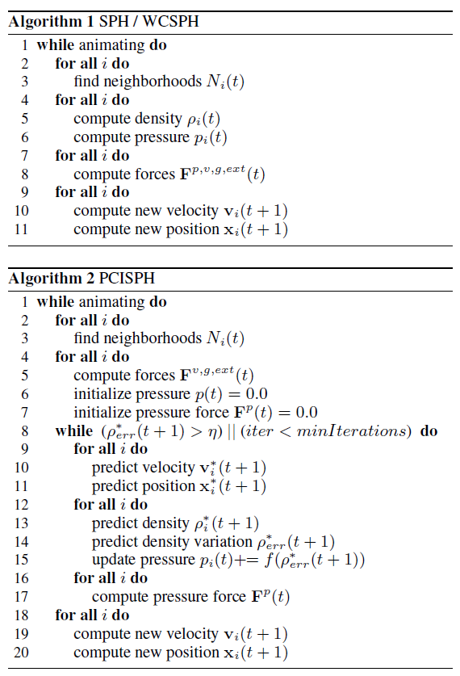

## Implicit incompressible SPH (IISPH)
IISPH adopts a **semi-implicit** scheme. The semi-implicit scheme is achieved by separating non-pressure forces and pressure forces apart with an intermediate state. For non-pressure forces, the intermediate state is explicitly achieved. For pressure forces, a linear system of equations should be implicitly resolved.
This system of linear equations is solved for pressure using relaxed Jacobi iteration method while enforcing the constant density condition.

### Continuity equation in IISPH
For continuity equation
$$\frac{D\rho}{Dt}=-\rho\nabla\cdot\mathbf{v}$$

The terms of it can be expressed as
$$\begin{aligned}
  \frac{D\rho_i}{Dt}&=\frac{\rho_i(t+\Delta t)-\rho_i(t)}{\Delta t}\\
  \nabla\cdot\mathbf{v}_i&=-\frac{1}{\rho_i}\sum_jm_j\mathbf{v}_{ij}\nabla W_{ij}\\
\end{aligned}$$

Thus the continuity equation can be rewritten in IISPH as
$$\frac{\rho_i(t+\Delta t)-\rho_i(t)}{\Delta t}=\sum_jm_j\mathbf{v}_{ij}(t+\Delta t)\nabla W_{ij}$$

where $\mathbf{v}_{ij}(t+\Delta t)=\mathbf{v}_i(t+\Delta t)-\mathbf{v}_j(t+\Delta t)$.

### Pressure and non-pressure force
For the continuity equation in IISPH
$$\mathbf{v}_i(t+\Delta t)=\mathbf{v}_i(t)+\Delta t\frac{\mathbf{F}_i^{adv}(t)+\mathbf{F}_i^p(t)}{m_i}$$

where $\mathbf{F}_i^{p}(t)$ is the pressure force and $\mathbf{F}_i^{adv}(t)$ is the non-pressure force including [viscosity](#viscosity), body force($g$) and [surface tension](#surface-tension-表面张力).
Non-pressure force is known and can be obtained by
$$\mathbf{F}_i^{adv}(t)=\mathbf{F}^{viscosity}_i(t)+m_ig+\mathbf{F}^{surface tension}_i(t)$$

Pressure force is unknown and can be expressed (similar to [momentum equation](#momentum-equation)) as
$$\mathbf{F}_i^{p}(t)=-m_i\sum_jm_j\left(\frac{p_i(t)}{\rho_i^2(t)}+\frac{p_j(t)}{\rho_j^2(t)}\right)\nabla W_{ij}(t)$$

where pressure $p(t)$ is unknown.
> For each particle in SPH, $m,\rho,\mathbf{v},\mathbf{x},p$ are the 5 key particle features. In IISPH, $m,\rho$ assume unchanged during the process and the key point is to solve for pressure.

### Semi-implicit scheme
Based on the above equations, a semi-implicit scheme can be derived.
**Explicit part**
An **intermediate state** is introduced where the known non-pressure force is firstly used to get the intermediate velocity $\mathbf{v}_i^{adv}$ and density $\rho_i^{adv}$.
$$\begin{aligned}
  \mathbf{v}_i^{adv}&=\mathbf{v}_i(t)+\Delta t\frac{\mathbf{F}_i^{adv}(t)}{m_i}\\
  \frac{\rho_i^{adv}-\rho_i(t)}{\Delta t}=\sum_jm_j\mathbf{v}^{adv}_{ij}\nabla W_{ij}(t) \Rightarrow \rho_i^{adv}&=\rho_i(t)+\Delta t\sum_jm_j\mathbf{v}^{adv}_{ij}\nabla W_{ij}(t)
\end{aligned}$$

where $\mathbf{v}^{adv}_{ij}=\mathbf{v}^{adv}_{i}-\mathbf{v}^{adv}_{j}$.
**Implicit part**
Based on the intermediate state, pressure force is involved in the implicit part to solve for unknown pressure.
$$\Delta t^2\sum_jm_j\left(\frac{\mathbf{F}_i^p(t)}{m_i}-\frac{\mathbf{F}_j^p(t)}{m_j}\right)\nabla W_{ij}(t)=\rho_0-\rho_i^{adv}$$

> The derivation of the above equation is based on the continuity equation and the assumption that $\rho_i(t+\Delta t)=\rho_0$.
> $$\begin{aligned}
  \frac{\rho_i(t+\Delta t)-\rho_i(t)}{\Delta t}&=\sum_jm_j\mathbf{v}_{ij}(t+\Delta t)\nabla W_{ij}\\
  \frac{\rho_0-\rho_i(t)}{\Delta t}&=\sum_jm_j\mathbf{v}_{ij}(t+\Delta t)\nabla W_{ij}\\
  \frac{\rho_0-\rho_i(t)}{\Delta t}&=\sum_jm_j(\mathbf{v}_{i}(t+\Delta t)-\mathbf{v}_{j}(t+\Delta t))\nabla W_{ij}\\
  \frac{\rho_0-\rho_i(t)}{\Delta t}&=\sum_jm_j\left[\left(\mathbf{v}_i(t)+\Delta t\frac{\mathbf{F}_i^{adv}(t)}{m_i}+\Delta t\frac{\mathbf{F}_i^p(t)}{m_i}\right)-\left(\mathbf{v}_i(t)+\Delta t\frac{\mathbf{F}_j^{adv}(t)}{m_j}+\Delta t\frac{\mathbf{F}_j^p(t)}{m_j}\right)\right]\nabla W_{ij}\\
  \frac{\rho_0-\rho_i(t)}{\Delta t}&=\sum_jm_j\left[\left(\mathbf{v}_i(t)+\Delta t\frac{\mathbf{F}_i^{adv}(t)}{m_i}\right)-\left(\mathbf{v}_i(t)+\Delta t\frac{\mathbf{F}_j^{adv}(t)}{m_j}\right)\right]\nabla W_{ij}+\sum_jm_j\left(\Delta t\frac{\mathbf{F}_i^p(t)}{m_i}-\Delta t\frac{\mathbf{F}_j^p(t)}{m_j}\right)\nabla W_{ij}\\
  \frac{\rho_0-\rho_i(t)}{\Delta t}&=\sum_jm_j(\mathbf{v}_i^{adv}-\mathbf{v}_j^{adv})\nabla W_{ij}+\Delta t\sum_jm_j\left(\frac{\mathbf{F}_i^p(t)}{m_i}-\frac{\mathbf{F}_j^p(t)}{m_j}\right)\nabla W_{ij}\\
  \frac{\rho_0-\rho_i(t)}{\Delta t}&=\frac{\rho_i^{adv}-\rho_i(t)}{\Delta t}+\Delta t\sum_jm_j\left(\frac{\mathbf{F}_i^p(t)}{m_i}-\frac{\mathbf{F}_j^p(t)}{m_j}\right)\nabla W_{ij}\\
  \frac{\rho_0-\rho_i^{adv}}{\Delta t}&=\Delta t\sum_jm_j\left(\frac{\mathbf{F}_i^p(t)}{m_i}-\frac{\mathbf{F}_j^p(t)}{m_j}\right)\nabla W_{ij}\\
  \rho_0-\rho_i^{adv}&=\Delta t^2\sum_jm_j\left(\frac{\mathbf{F}_i^p(t)}{m_i}-\frac{\mathbf{F}_j^p(t)}{m_j}\right)\nabla W_{ij}\\
\end{aligned}$$

Substitute the pressure force in the above equation, we have
$$\begin{aligned}
  \rho_0-\rho_i^{adv}&=\Delta t^2\sum_jm_j((-\sum_jm_j\left(\frac{p_i(t)}{\rho_i^2(t)}+\frac{p_j(t)}{\rho_j^2(t)}\right)\nabla W_{ij})-(-\sum_km_k\left(\frac{p_j(t)}{\rho_j^2(t)}+\frac{p_k(t)}{\rho_k^2(t)}\right)\nabla W_{jk}))\nabla W_{ij}\\
  &=\sum_jm_j\left((-\Delta t^2\sum_j\frac{m_j}{\rho_i^2}\nabla W_{ij})p_i+\sum_j(-\Delta t^2\frac{m_j}{\rho_j^2}\nabla W_{ij}p_j)-(-\Delta t^2\sum_k\frac{m_k}{\rho_j^2}\nabla W_{jk})p_j-\sum_k(-\Delta t^2\frac{m_k}{\rho_k^2}\nabla W_{jk}p_k)\right)\nabla W_{ij}\\
  &=\sum_jm_j(\mathbf{d}_{ii}p_i+\sum_j\mathbf{d}_{ij}p_j-\mathbf{d}_{jj}p_j-\sum_k\mathbf{d}_{jk}p_k)\nabla W_{ij}
\end{aligned}$$

with
$$\begin{aligned}
  \mathbf{d}_{ii}&=-\Delta t^2\sum_j\frac{m_j}{\rho_i^2}\nabla W_{ij}\\
  \mathbf{d}_{ij}&=-\Delta t^2\frac{m_j}{\rho_j^2}\nabla W_{ij}\\
\end{aligned}$$

The above equation can be further written as the following form by extracting unknown pressure. ==[KEY EQUATION]==
$$\begin{aligned}
  \rho_0-\rho_i^{adv}&=\sum_jm_j(\mathbf{d}_{ii}p_i+\sum_j\mathbf{d}_{ij}p_j-\mathbf{d}_{jj}p_j-\sum_k\mathbf{d}_{jk}p_k)\nabla W_{ij}\\
  &=p_i\sum_jm_j(\mathbf{d}_{ii}-\mathbf{d}_{ji})\nabla W_{ij}+\sum_jm_j(\sum_j\mathbf{d}_{ij}p_j-\mathbf{d}_{jj}p_j-\sum_{k\neq i}\mathbf{d}_{jk}p_k)\nabla W_{ij}
\end{aligned}$$

Thus this can be written in matrix form
$$\mathbf{A}(t)\mathbf{p}(t)=\mathbf{b}(t)$$

where $\mathbf{b}(t)=[\rho_0-\rho_1^{adv},\rho_0-\rho_2^{adv},\dots]^T$ and $\mathbf{p}(t)=[p_1,p_2,\dots]^T$ are the unknowns.
For this system of linear equations, **relaxed Jacobi** method is adopted.
The coefficient matrix is divided into diagonal and non-diagonal matrices with $n$ denoting the total number of particles.
$$\mathbf{A}(t)=\mathbf{D}+\mathbf{R}$$

where
$$\mathbf{D}=\begin{bmatrix}
  a_{11} & 0 & \cdots & 0\\
  0 & a_{22} & \cdots & 0\\
  \vdots & \vdots & \ddots & \vdots\\
  0 & 0 & \cdots & a_{nn}\\
\end{bmatrix}$$

$$\mathbf{R}=\begin{bmatrix}
  0 & a_{12} & \cdots & a_{1n}\\
  a_{21} & 0 & \cdots & a_{2n}\\
  \vdots & \vdots & \ddots & \vdots\\
  a_{n1} & a_{n2} & \cdots & 0\\
\end{bmatrix}$$

With relaxed Jaboci method, the iteration equation is expressed as
$$\mathbf{p}^{l+1}(t)=(1-\omega)\mathbf{p}^l(t)+\omega\mathbf{D}^{-1}(\mathbf{b}(t)-\mathbf{R}\mathbf{p}^l(t))$$

where $l$ denotes iteration index and $\omega$ denotes relaxation factor.

> Actually, this relaxed Jacobi method is probably known as successive over relaxation method (**SOR**). For this method, the system itself should fullfill some conditions to ensure convergence like the coefficient matrix $\mathbf{A}$ should be a strictly diagonally dominant matrix, etc. However in IISPH, these conditions are not considered rigorously. From my point of view, further provement should be added.

Each line (each particle) of this system of linear equations can be written as
$$\sum_j a_{ij}p_j=\rho_0-\rho_i^{adv}$$

where $a_{ii}=\sum_jm_j(\mathbf{d}_{ii}-\mathbf{d}_{ji})\nabla W_{ij}$ and $\sum_{j\neq i}a_{ij}p_j=\sum_jm_j(\sum_j\mathbf{d}_{ij}p_j-\mathbf{d}_{jj}p_j-\sum_{k\neq i}\mathbf{d}_{jk}p_k)\nabla W_{ij}$ can be derived from the key equation.
And the corresponding iteration equation is expressed as
$$\begin{aligned}
  p_i^{l+1}&=(1-\omega)p_i^l+\omega\frac{\rho_0-\rho_i^{adv}-\sum_{j\neq i}a_{ij}p_j^l}{a_{ii}}\\
  &=(1-\omega)p_i^l+\frac{\omega}{a_{ii}}\left(\rho_0-\rho_i^{adv}-\sum_jm_j(\sum_j\mathbf{d}_{ij}p_j^l-\mathbf{d}_{jj}p_j^l-\sum_{k\neq i}\mathbf{d}_{jk}p_k^l)\nabla W_{ij}\right)
\end{aligned}$$

This iteration will not terminate until the error is smaller than the given threshold.
Usually average density $\rho_{avg}^l=\frac{\sum_i \rho_i^l}{n}$ is predicted and used to compute residual.
$$\rho_i^l=\sum_jm_j(\mathbf{d}_{ii}p_i+\sum_j\mathbf{d}_{ij}p_j-\mathbf{d}_{jj}p_j-\sum_k\mathbf{d}_{jk}p_k)\nabla W_{ij}+\rho_i^{adv}$$

### Rigid-fluid coupling
To be continued...

### Computation flow
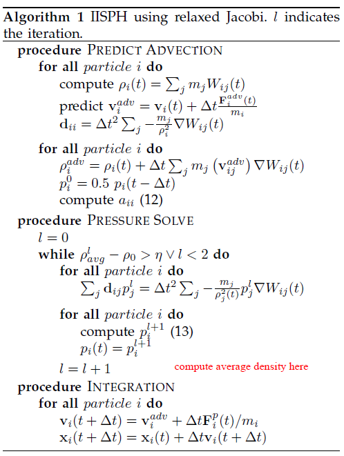
> Notes :dog: about implementation:
> + The relaxation factor $\omega$ is difficult to determine in SOR. Usually trial and error are adopted to search for an optimal value regarding convergence.
In IISPH, $\omega=0.5$ is adopted. 
> + The initial pressure for the iteration is chosen as $p_i^0=0.5p_i(t-\Delta t)$ for convergence.
> + For each particle, 7 scalars are computed and stored for 3D cases, namely $a_{ii}$, $\mathbf{d}_{ii}$ and $\sum_j\mathbf{d}_{ij}p_j^l$ in each iteration.
> + In the iteration equation, $\sum_{k\neq i}\mathbf{d}_{jk}p_k^l=\sum_k\mathbf{d}_{jk}p_k^l-\mathbf{d}_{ji}p_i^l$. Thus the term $\sum_k\mathbf{d}_{jk}p_k^l$ can be accessed from particle without computation and only $\mathbf{d}_{ji}=-\Delta t^2\frac{m_i}{\rho_i^2}\nabla W_{ji}$ should be computed.
> + In each iteration, pressure clamping is adopted, i.e. $p_i^l=\max(0,p_i^l)$.
> + During the process, particle mass $m_i$ and density $\rho_i$ keep unchanged. Whether predicted density should be used is unclear yet :cry:. Currently we choose to use $\rho_0$ during the whole process.

## Divergence-free SPH (DFSPH)
DFSPH adopts a constant density solver and a divergence-free solver simultaneously to fullfill the constant density condition and the divergence-free condition.
### NS equations
The incompressible, isothermal NS equations in Lagrangian coordinates is adopted.
$$
\begin{aligned}
  \frac{D\mathbf{v}}{Dt}=-\frac{1}{\rho}\nabla p+\nu\nabla^2\mathbf{v}+\frac{\mathbf{f}}{\rho}
\end{aligned}
$$

where $\rho,p,\nu,\mathbf{v},\mathbf{f}$ denote density, pressure, kinematic viscosity, velocity and body force respectively.
This equation is based on the incompressibility assumption which is further maintained by the **divergence-free velocity field condition**.
$$
\begin{aligned}
  \frac{D\rho}{Dt}=-\rho(\nabla\cdot\mathbf{v})=0\Leftrightarrow\nabla\cdot\mathbf{v}=0
\end{aligned}
$$

Divergence-free helps the enforcement of incompressibility. However, this is not enough since numerical errors may also cause fluid compressibility. To correct this, another condition needs to be fullfilled called **constant density condition**(commonly adopted by other common SPH methods like PCISPH and IISPH) which is written as
$$
\rho-\rho_0=0
$$

To deal with these 2 conditions, 2 pressure solvers (**divergence-free solver + constant density solver**) are adopted simultaneously to consider the divergence error and density error, respectively.

### Overall computation flow
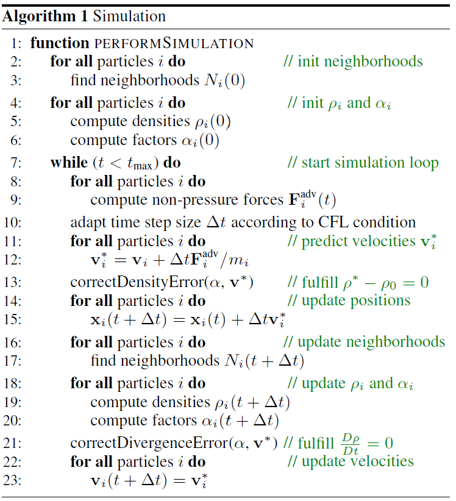
Similar to **IISPH**, an intermediate state([$\mathbf{F}_i^{adv}$](#pressure-and-non-pressure-force)) is computed without pressure forces. Based on this intermediate state, pressure is adjusted to fullfill the constant density and divergence-free conditions respectively with an EOS like in **WCSPH**.

> :warning: Problems
> + **Particle deficiency problem**
> How to deal with particles that do not have enough neighbors?? (Density is underestimated!!:cry:)
> + **Boundary particle problem**
> How to deal with the boundary conditions with particles?
> + **Neighborhood search**
> How to implement compact hashing?
> + **Solid simulation**
> How to simulate solid like concrete?

### Divergence-free solver
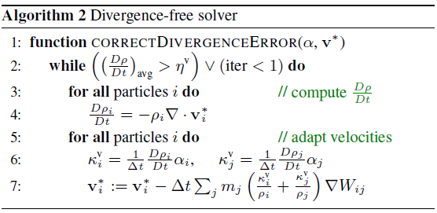
A commonly used [EOS](#equation-of-state-eos) is written as
$$p=\frac{\kappa\rho_0}{\gamma}\left(\left(\frac{\rho}{\rho_0}\right)^\gamma-1\right)$$

By choosing $\gamma=1$, we have
$$p_i=\kappa_i(\rho_i-\rho_0)$$

The pressure force of particle $i$ is determined by
$$\mathbf{F}_i^p=-\frac{m_i}{\rho_i}\nabla p_i=-\frac{m_i}{\rho_i}\kappa_i^v\sum_jm_j\nabla W_{ij}$$

And the pressure force acting from particle $i$ on its neighboring particle $j$ is determined by
$$\mathbf{F}^p_{j\leftarrow i}=-\frac{m_i}{\rho_i}\frac{\partial p_i}{\partial \mathbf{x}_j}=\frac{m_i}{\rho_i}\kappa_i^vm_j\nabla W_{ij}$$

Based on the continuity equation, the density gradient is computed as
$$\frac{D\rho_i}{Dt}=\sum_jm_j(\mathbf{v}_i-\mathbf{v}_j)\nabla W_{ij}$$

The density gradient resulting from pressure forces is computed as
$$(\frac{D\rho_i}{Dt})^p=\Delta t\sum_jm_j\left(\frac{\mathbf{F}_i^p}{m_i}-\frac{\mathbf{F}^p_{j\leftarrow i}}{m_i}\right)\nabla W_{ij}$$

To fulfill the divergence-free condition, we have
$$\begin{aligned}
  &\frac{D\rho_i}{Dt}+(\frac{D\rho_i}{Dt})^p=0\\
  &\Rightarrow\frac{D\rho_i}{Dt}=-\Delta t\sum_jm_j\left(\frac{\mathbf{F}_i^p}{m_i}-\frac{\mathbf{F}^p_{j\leftarrow i}}{m_i}\right)\nabla W_{ij}
\end{aligned}$$

By inserting the pressure forces, we finally get
$$\frac{D\rho_i}{Dt}=\kappa_i^v\frac{\Delta t}{\rho_i}\left(\left|\sum_jm_j\nabla W_{ij}\right|^2+\sum_j|m_j\nabla W_{ij}|^2\right)$$

For each particle, $\kappa$ can be computed for divergence-free condition.
$$\begin{aligned}
  \kappa_i^v&=\frac{1}{\Delta t}\frac{D\rho_i}{Dt}\cdot\frac{\rho_i}{\left|\sum_jm_j\nabla W_{ij}\right|^2+\sum_j|m_j\nabla W_{ij}|^2}\\
  &=\frac{1}{\Delta t}\frac{D\rho_i}{Dt}\cdot\alpha_i\\
\end{aligned}$$

where $\frac{D\rho_i}{Dt}=\sum_jm_j(\mathbf{v}_i-\mathbf{v}_j)\nabla W_{ij}$.

And the total pressure forces acting on particle $i$ is
$$\begin{aligned}
  \mathbf{F}^p_{i,total}&=\mathbf{F}^p_i+\sum_j\mathbf{F}^p_{i\leftarrow j}\\
  &=-\frac{m_i}{\rho_i}\kappa_i^v\sum_jm_j\nabla W_{ij}-\sum_j\frac{m_j}{\rho_j}\kappa_j^vm_i\nabla W_{ij}\\
  &=-m_i\sum_jm_j\left(\frac{\kappa_i^v}{\rho_i}+\frac{\kappa_j^v}{\rho_j}\right)\nabla W_{ij}
\end{aligned}$$

And the velocity can thus be updated as in the figure.
> Notes:pig::
> + To prevent zero denominator, $\alpha_i=\frac{\rho_i}{\max\{\left|\sum_jm_j\nabla W_{ij}\right|^2+\sum_j|m_j\nabla W_{ij}|^2,\varepsilon\}}$ where $\varepsilon=10^{-6}$.
> + $\alpha_i$ solely depends on particle positions, thus this value can be precomputed before the iteration.
> + Warm start can be adopted for the iteration.
> + Unlike other methods, in DFSPH each particle has its individual $\kappa$.

### Constant density solver
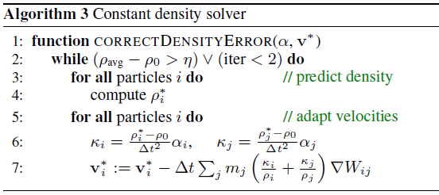
This constant density solver is altered to reuse the precomputed $\alpha_i$ for cheap computation.
A predictor-corrector scheme is developed.
$$\rho_i^*=\rho_i+\Delta t\frac{D\rho_i}{Dt}=\rho_i+\Delta t\sum_jm_j(\mathbf{v}_i^*-\mathbf{v}_j^*)\nabla W_{ij}$$

And to correct the predicted density to the initial value, we have
$$\begin{aligned}
  \frac{\rho_0-\rho_i^*}{\Delta t}&=-\Delta t\sum_jm_j\left(\frac{\mathbf{F}_i^p}{m_i}-\frac{\mathbf{F}^p_{j\leftarrow i}}{m_i}\right)\nabla W_{ij}\\
  \Rightarrow \rho_i^*-\rho_0&=\Delta t^2\sum_jm_j\left(\frac{\mathbf{F}_i^p}{m_i}-\frac{\mathbf{F}^p_{j\leftarrow i}}{m_i}\right)\nabla W_{ij}\\
  \Rightarrow \kappa_i&=\frac{1}{\Delta t^2}(\rho_i^*-\rho_0)\alpha_i
\end{aligned}$$

Similar to the divergence-free solver, the velocity can be updated.

> Notes:pig::
> + Warm start can be adopted.
> + Lookup tables is a technique used in the approximation of kernel function and its gradient. (still unclear how:cry:)

### DFSPH cases
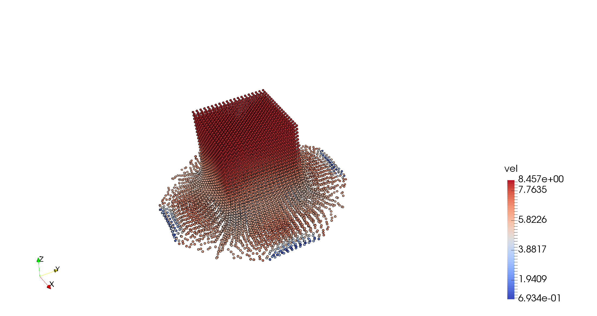

## Reconstructing smooth surfaces
Marching cube is the main method for reshaping.
[Reconstructing Surfaces of Particle-Based Fluids Using Anisotropic Kernels](https://www.cc.gatech.edu/~turk/my_papers/sph_surfaces.pdf) for smooth surfaces.

## Solid SPH

