# Simulation with Taichi
<!-- @import "[TOC]" {cmd="toc" depthFrom=2 depthTo=5 orderedList=false} -->

<!-- code_chunk_output -->

- [Simulation with Taichi](#simulation-with-taichi)
  - [Taichi language](#taichi-language)
  - [Taichi syntax basics](#taichi-syntax-basics)
    - [Data format](#data-format)
    - [Kernel and function](#kernel-and-function)
    - [For loops](#for-loops)
    - [Atomic operations](#atomic-operations)
    - [Scope](#scope)
    - [Phases of a Taichi program](#phases-of-a-taichi-program)
    - [Debug mode](#debug-mode)
  - [Lagrangian and Eulerian View](#lagrangian-and-eulerian-view)
    - [Lagrangian simulation approaches (1)](#lagrangian-simulation-approaches-1)
      - [Mass-spring system](#mass-spring-system)
      - [Time integration](#time-integration)
      - [Explicit v.s. implicit time integration](#explicit-vs-implicit-time-integration)
      - [Smoothed particle hydrodynamics(SPH)](#smoothed-particle-hydrodynamicssph)
      - [Output mp4 and gif in taichi](#output-mp4-and-gif-in-taichi)
    - [Lagrangian simulation approaches (2)](#lagrangian-simulation-approaches-2)
      - [Basics of deformation, elasticity and FEM](#basics-of-deformation-elasticity-and-fem)
      - [Taichi programming language advanced features](#taichi-programming-language-advanced-features)
        - [ODOP](#odop)
        - [Metaprogramming](#metaprogramming)
        - [Differentiable programming](#differentiable-programming)
        - [Visualization](#visualization)
    - [Eulerian Fluid Simulation](#eulerian-fluid-simulation)
      - [Gradient](#gradient)
      - [Divergence](#divergence)
      - [Curl](#curl)
      - [Laplace operator $\Delta$](#laplace-operator-delta)
    - [Poisson's Equation and Fast Method](#poissons-equation-and-fast-method)
  - [Linear FEM and Topology optimization](#linear-fem-and-topology-optimization)
    - [FEM overview](#fem-overview)
    - [Discretizing Poisson's equation](#discretizing-poissons-equation)
      - [2D Poisson's equation](#2d-poissons-equation)
      - [Weak formulation](#weak-formulation)
      - [Getting rid of second-order terms](#getting-rid-of-second-order-terms)
      - [Discretization](#discretization)
    - [Discretizing linear elasticity](#discretizing-linear-elasticity)
      - [Linear elasticity FEM](#linear-elasticity-fem)
      - [Index notation](#index-notation)
      - [Discretize Cauchy momentum equation using FEM](#discretize-cauchy-momentum-equation-using-fem)
      - [Building the linear system](#building-the-linear-system)
    - [Topology optimization](#topology-optimization)
  - [Smoothed Particle Hydrodynamics (SPH)](#smoothed-particle-hydrodynamics-sph)
    - [Navier-Stokes equations](#navier-stokes-equations)
    - [Courant-Friedrichs-Lewy(CFL) condition](#courant-friedrichs-lewycfl-condition)
    - [Neighborhood search(NS)](#neighborhood-searchns)
    - [Particle size, smoothing length and kernel support radius](#particle-size-smoothing-length-and-kernel-support-radius)
    - [SPH interpolation](#sph-interpolation)
    - [Weakly compressible SPH (WCSPH)](#weakly-compressible-sph-wcsph)
      - [Kernel function](#kernel-function)
      - [Governing equations and their SPH formulation](#governing-equations-and-their-sph-formulation)
        - [Continuity equation](#continuity-equation)
        - [Momentum equation](#momentum-equation)
        - [Equation of state (EOS)](#equation-of-state-eos)
      - [Viscosity](#viscosity)
      - [Surface tension (表面张力)](#surface-tension-表面张力)
      - [Boundary particles](#boundary-particles)
      - [Time step](#time-step)
      - [Computation flow](#computation-flow)
      - [Drawbacks](#drawbacks)
    - [Predictive-corrective incompressible SPH (PCISPH)](#predictive-corrective-incompressible-sph-pcisph)
      - [Density correction via pressure change](#density-correction-via-pressure-change)
      - [Computation flow](#computation-flow-1)
    - [Implicit incompressible SPH (IISPH)](#implicit-incompressible-sph-iisph)
      - [Continuity equation in IISPH](#continuity-equation-in-iisph)
      - [Pressure and non-pressure force](#pressure-and-non-pressure-force)
      - [Semi-implicit scheme](#semi-implicit-scheme)
      - [Rigid-fluid coupling](#rigid-fluid-coupling)
      - [Computation flow](#computation-flow-2)
    - [Divergence-free SPH (DFSPH)](#divergence-free-sph-dfsph)
      - [NS equations](#ns-equations)
      - [Overall computation flow](#overall-computation-flow)
      - [Divergence-free solver](#divergence-free-solver)
      - [Constant density solver](#constant-density-solver)
      - [DFSPH cases](#dfsph-cases)
    - [Reconstructing smooth surfaces](#reconstructing-smooth-surfaces)
  - [Hybrid Eulerian-Lagrangian](#hybrid-eulerian-lagrangian)
    - [Particle-in-cell (PIC/APIC/FLIP)](#particle-in-cell-picapicflip)
      - [Interpolation function (kernel)](#interpolation-function-kernel)
    - [Material Point Method (MPM)](#material-point-method-mpm)
      - [Traditional MPM](#traditional-mpm)
        - [Deformation gradient](#deformation-gradient)
        - [Push forward and pull back (lagrangian and eulerian function)](#push-forward-and-pull-back-lagrangian-and-eulerian-function)
        - [Constitutive model](#constitutive-model)
        - [Governing equations](#governing-equations)
        - [Material particles](#material-particles)
          - [Interpolation function](#interpolation-function)
          - [Lagrangian/Eulerian mass](#lagrangianeulerian-mass)
          - [Lagrangian/Eulerian momentum](#lagrangianeulerian-momentum)
        - [Discretization](#discretization-1)
          - [Discrete time](#discrete-time)
          - [Discrete space](#discrete-space)
          - [Estimating volume](#estimating-volume)
          - [Deformation gradient evolution](#deformation-gradient-evolution)
          - [Forces as energy gradient](#forces-as-energy-gradient)
        - [Explicit time integration scheme](#explicit-time-integration-scheme)
        - [Implicit time integration](#implicit-time-integration)
        - [Collison objects](#collison-objects)
        - [Lagrangian forces](#lagrangian-forces)
      - [MLS-MPM (Moving Least Squares MPM)](#mls-mpm-moving-least-squares-mpm)
        - [:ghost: PIC](#ghost-pic)
        - [:ghost: APIC](#ghost-apic)
        - [:ghost: MLS-MPM](#ghost-mls-mpm)
      - [Constitutive Models](#constitutive-models)
        - [Elastic solids](#elastic-solids)
        - [Weakly compressible fluids](#weakly-compressible-fluids)
        - [Elastoplastic solids](#elastoplastic-solids)
        - [Singular value decomposition (SVD)](#singular-value-decomposition-svd)
      - [Lagrangian forces in MPM](#lagrangian-forces-in-mpm)
      - [Introducing Taichi "field"](#introducing-taichi-field)
      - [MPM Extension](#mpm-extension)
      - [Moving least squares method (MLS)](#moving-least-squares-method-mls)
        - [Least squares (LS)](#least-squares-ls)
        - [Weighted least squares (WLS)](#weighted-least-squares-wls)
        - [Moving least squares (MLS)](#moving-least-squares-mls)
      - [CPIC (Compatible PIC)](#cpic-compatible-pic)
      - [MPM-DEM Coupling](#mpm-dem-coupling)
  - [High performance physical simulation](#high-performance-physical-simulation)
    - [Hardware Architecture](#hardware-architecture)
      - [Background](#background)
      - [Locality](#locality)
    - [Advanced Taichi Programming](#advanced-taichi-programming)
      - [Structural Nodes (SNodes)](#structural-nodes-snodes)
  - [THE END](#the-end)

<!-- /code_chunk_output -->

## Taichi language
==Decouple== data structure from computation.
stencil
Spatial sparsity is specially treated in taichi. Different data structures can be used to process this sparsity in the compiler.
Single program multiple data (SPMD)
Data structure: array of structure(AOS) & structure of array(SOA)

## Taichi syntax basics
The gene of Taichi is parallel computing.
### Data format
==Tensor== is a multidim array whose elements can be everything even matrices.
```python
import taichi as ti
ti.init()

a = ti.var(dt=ti.f32, shape=(42,63)) # a tensor of 42X63 scalars
b = ti.Vector(3, dt=ti.f32, shape=4) # a tensor of 4X3D vectors
c = ti.Matrix(2,2,dt=ti.f32,shape=(3,5)) # a tensor of 3X5 2X2 matrices
# ti.* defines the type of each element and the first part defines the size of each element
loss = ti.var(dt=ti.f32, shape=()) # this is a scalar defined in tensor form
loss[None]=3 # use this to assign value to a scalar in a tensor form
```

### Kernel and function
In Taichi, kernel is the computation function.
Kernels must be decorated with @ti.kernel. They can call functions but cannot be call other kernels.
Taichi functions can be called directly by Taichi kernels and other Taichi functions but not python. Only **one return** is supported up to now. They must be decorated with @ti.func.

Element-wise product *; marix product @.

### For loops
For loops in Taichi have 2 forms.
+ Range-for loops: Similar to Python. Will be parallelized when used at the outermost scope.
+ Struct-for loops: Iterates over (sparse) tensor elements.
For loops at the outermost scope in Taichi is **automatically parallelized**.

```py
ti.init(arch=ti.gpu)
n = 320
pixels = ti.var(dt=ti.f32, shape=(2*n, n))
@ti.kernel
def paint(t:ti.f32):
    for i,j in pixels:
        pixels[i,j] = i*3+j*4+t
```

### Atomic operations
Atomic operation is designed to deal with parallel computing. An atomic operation will go from start to finish without interruption of other threads.
In Taichi, augmented assignments (x[i]+=1)
```py
a[None] += 1 [right]
ti.atomic_add(a[None], 1) [right]
a[None] = a[None] + 1 [wrong]
```

### Scope
Taichi-scope: in @ti.kernel or @ti.func. Compiled in Taichi and run in parallel.

Python-scope: Compiled in Python.

### Phases of a Taichi program
+ Initialization: ti.init(...)
+ Tensor allocation: ti.var, ti.Vector, ti.Matrix
+ Computation (lauch kernels...)
+ Optional: restart the Taichi system (clear memory, destroy variables and kernels...) ti.reset()
  

> :grey_exclamation::eyes: After the first ti.kernel, no more tensor allocation is allowed.

```py
# fractal.py
import taichi as ti
ti.init(arch=ti.cpu)

n=320
pixels = ti.var(dt=ti.f32, shape=(2*n, n))

@ti.func
def complex_sqr(z):
    return ti.Vector([z[0]**2 - z[1]**2, z[1] * z[0] *2])

@ti.kernel
def paint(t: ti.f32):
    for i,j in pixels:
        c = ti.Vector([-0.8, ti.cos(t) * 0.2])
        z = ti.Vector([i/n - 1, j/n - 0.5]) * 2
        iterations = 0
        while z.norm() < 20 and iterations < 50:
            z = complex_sqr(z) + c
            iterations += 1
        pixels[i, j] = 1 - iterations * 0.02

gui = ti.GUI("Julia Set", res=(n * 2, n))
for i in range(1000000):
    paint(i * 0.03)
    gui.set_image(pixels)
    gui.show()
```

### Debug mode
debug = True (cpu only)
```py
ti.init(debug=True, arch=ti.cpu)
a = ti.var(dt=ti.f32, shape=(10))
b = ti.var(dt=ti.f32, shape=(10))
@ti.kernel
def shift():
    for i in range(10):
        a[i] = b[i+1]
# bound checker is only activated in debug mode to save time in normal mode.
shift()
```

## Lagrangian and Eulerian View

Lagrangian view: move with object.

Eulerian view: static.

### Lagrangian simulation approaches (1)

#### Mass-spring system
$$
\begin{aligned}
    \mathbf{f}{ij}&=-k(\|\mathbf{x}_i-\mathbf{x}_j\|_2-l_{ij})(\widehat{\mathbf{x}_i-\mathbf{x}_j})\quad(\rm Hooke's\,law)\\
    \mathbf{f}_i&=\sum_j^{j\neq i}\mathbf{f}_{ij}\\
    \frac{\partial \mathbf{v}_i}{\partial t}&=\frac{1}{m_i}\mathbf{f}_i\quad(\rm Newton's\,second\,law\,of\,motion)\\
    \frac{\partial \mathbf{x}_i}{\partial t}&=\mathbf{v}_i\\
\end{aligned}
$$

$\widehat{\mathbf{x}_i-\mathbf{x}_j}$: direction vector from particle $i$ to particle $j$ (unit vector).
$\widehat{\Box}$ means **normalization**.

**Implicit time integration:**
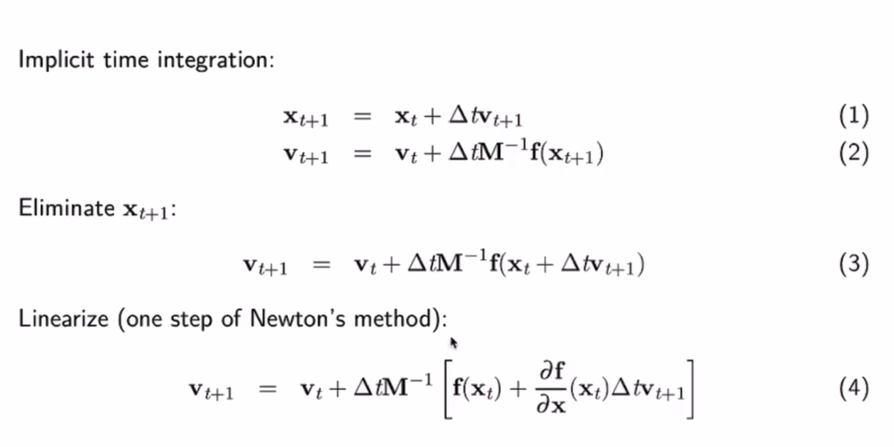
with taylor expansion


To solver this linear system, there are many methods like Jacobi iteration/Gauss-Seidel iteration or conjugate gradients(共轭梯度), etc.
**Unifying explict and implicit:**
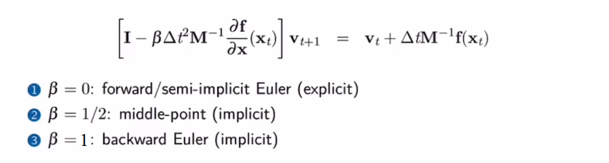
**Solve faster**
For system with millions of mass points and springs,
+ Sparse matrices
+ Conjugate gradients
+ Preconditioning
+ Use position-based dynamics(PBD)
+ Also some faster approches like Fast mass-spring system solver("Fast simulation of mass-spring systems" in ACM Transactions)


#### Time integration
:one: Forward Euler (explicit)
$$
\begin{aligned}
\mathbf{v}_{t+1}&=\mathbf{v}_t+\Delta t\frac{\mathbf{f}_t}{m}\\
\mathbf{x}_{t+1}&=\mathbf{x}_t+\Delta t\mathbf{v}_t\\
\end{aligned}
$$

:two: Semi implicit Euler (aka. symplectic Euler, explicit)
$$
\begin{aligned}
\mathbf{v}_{t+1}&=\mathbf{v}_t+\Delta t\frac{\mathbf{f}_t}{m}\\
\mathbf{x}_{t+1}&=\mathbf{x}_t+\Delta t\mathbf{v}_{t+1}\\
\end{aligned}
$$

:three: Backward Euler (often with Newton's method, implicit)

#### Explicit v.s. implicit time integration
Explicit (forward Euler, symplectic Euler, RK, ...)
$$\Delta t \leq c\sqrt{\frac{m}{k}} \quad c\approx1$$

Implicit (backward Euler, middle-point, ...)

#### Smoothed particle hydrodynamics(SPH)
Refer to [SPH](#smoothed-particle-hydrodynamics-sph) for details.
#### Output mp4 and gif in taichi
ti.imwrite(img, filename)
ti video -f 24 or ti video -f 60
ti git -i input.mp4

Make sure ffmpeg installed!

### Lagrangian simulation approaches (2)

#### Basics of deformation, elasticity and FEM
**Deformation**
Deformation map $\phi$:$$\mathbf{x}_{\rm deformed}=\phi(\mathbf{x}_{\rm rest})$$

> This relates rest material position with deformed material position.

Deformation gradient $\mathbf{F}$:$$\mathbf{F}:=\frac{\partial\mathbf{x}_{\rm deformed}}{\partial\mathbf{x}_{\rm rest}}$$

> Deformation gradients are translational invariant.
> $\phi_1=\phi(\mathbf{x}_{\rm rest})$ and $\phi_2=\phi(\mathbf{x}_{\rm rest})+\rm c$ have the same $\mathbf{F}$.

Deform/rest volume ratio $J=\det(\mathbf{F})$

**Elasticity**
Hyperelasticity
whose stress-strain relationship is defined by **strain energy density function**.
$$\psi=\psi(\mathbf{F})$$

There are different measures of stress:
* THe First Piola-Kirchhoff stress tensor (PK1):$\mathbf{P}(\mathbf{F})=\frac{\partial\psi(\mathbf{F})}{\partial\mathbf{F}}$ (easy to compute but in rest space)
* Kirchhoff stress: $\boldsymbol{\tau}$
* Cauchy stress tensor: $\boldsymbol{\sigma}$ (symmetric)

Relationship: $\boldsymbol{\tau}=J\boldsymbol{\sigma}=\mathbf{P}\mathbf{F}^T\quad\mathbf{P}=J\boldsymbol{\sigma}\mathbf{F}^{-T}\quad \rm Traction\,\mathbf{t}=\boldsymbol{\sigma}^T\boldsymbol{n}$

* Young's modulus $E = \frac{\sigma}{\varepsilon}$
* Bulk modulus $K = -V\frac{dP}{dV}$
* Poisson's ratio $\nu\in[0,0.5)$
* Lame's first parameter $\mu$; Lame's second parameter $\lambda$ (aka. shear modulus $G$)

conversion formula:
$$K=\frac{E}{3(1-2\nu)}\qquad\lambda=\frac{E\nu}{(1+\nu)(1-2\nu)}\qquad\mu=\frac{E}{2(1+\nu)}$$

Popular hyperelastic material models (for each element)
* Neo-Hookean
  * $\psi(\mathbf{F})=\frac{\mu}{2}\sum_i[(\mathbf{F}^T\mathbf{F})_{ii}-1]-\mu\log(J)+\frac{\lambda}{2}\log^2(J)$
  * $\mathbf{P}(\mathbf{F})=\frac{\partial\psi(\mathbf{F})}{\partial\mathbf{F}}=\mu(\mathbf{F}-\mathbf{F}^{-T})+\lambda\log(J)\mathbf{F}^{-T}$
* (Fixed) Corotated
  * $\psi(\mathbf{F})=\mu\sum_i(\mathbf{\sigma}_i-1)^2+\frac{\lambda}{2}(J-1)^2$
  * $\mathbf{P}(\mathbf{F})=\frac{\partial \psi}{\partial \mathbf{F}}=2\mu(\mathbf{F}-\mathbf{R})+\lambda(J-1)J\mathbf{F}^{-T}$

**FEM**
Linear tetrahedral FEM
The deformation map $\phi$ is affine and thus deformation gradient $\mathbf{F}$ is **constant** within a single tetrahedral element:
$$\rm \mathbf{x}_{deformed}=\mathbf{F}\mathbf{x}_{rest}+\mathbf{b}$$

For every element $e$, its elastic potential energy
$$U(e)=\int_e\psi(\mathbf{F}(\mathbf{x}))\mathbf{x}=V_e\psi(\mathbf{F}_e)$$

For explicit scheme (semi-implicit)
$$\mathbf{v}_{t+1,i}=\mathbf{v}_{t,i}+\Delta t\frac{\mathbf{f}_{t,i}}{m_i}$$

$$\mathbf{x}_{t+1,i}=\mathbf{x}_{t,i}+\Delta t\mathbf{v}_{t+1,i}$$

$$\mathbf{f}_{t,i}\equiv-\frac{\partial U}{\partial \mathbf{x}_i}=-\sum_e\frac{\partial U(e)}{\partial \mathbf{x}_i}=-\sum_e V_e\frac{\partial\psi(\mathbf{F}_e)}{\partial\mathbf{F}_e}\frac{\partial \mathbf{F}_e}{\partial \mathbf{x}_i}=-\sum_eV_e\mathbf{P}(\mathbf{F}_e)\frac{\partial\mathbf{F}_e}{\partial\mathbf{x}_i}$$

#### Taichi programming language advanced features
##### ODOP
Data-oriented programming (DOP)
Objective data-oriented programming (ODOP)
+ 3 important decorators
  + Use @ti.data_oriented to decorate class.
  + Use @ti.kernel to decorate class members functions that are Taichi kernels.
  + Use @ti.func to decorate class members functions that are Taichi functions.

##### Metaprogramming
+ Allow to pass almost anything to Taichi kernels
+ Improve run-time performance by moving run-time costs to compile time
+ Achieve dimensionality independence
+ Simplify the development of Taichi standard library
```py
@ti.kernel
def copy(x: ti.template(), y: ti.template(), c: ti.f32):
    for i in x:
        y[i] = x[i] + c
```
Variable aliasing
##### Differentiable programming
reverse-mode automatic differentiation (AutoDiff)
$$f(x)\Rightarrow\frac{\partial f(x)}{\partial x}$$
##### Visualization


### Eulerian Fluid Simulation
#### Gradient
梯度
Hamilton operator $\nabla=(\frac{\partial}{\partial x_1},\frac{\partial}{\partial x_2},\dots,\frac{\partial}{\partial x_n})$
对于标量场$F(x_1,x_2,\dots,x_n)$,其梯度为矢量$\nabla F=(\frac{\partial F}{\partial x_1},\frac{\partial F}{\partial x_2},\dots,\frac{\partial F}{\partial x_n})$ 
对于矢量场$\boldsymbol{F}(x_1,x_2,\dots,x_n)=(F_1,F_2,\dots,F_n)$,
其梯度为二阶张量$\nabla\boldsymbol{F}_{ij}=\frac{\partial F_i}{\partial x_j}$ (Jacobi matrix)
对于标量场，其旋度为其梯度最大的方向，且梯度大小即为旋度模量。

#### Divergence
散度
“径向发散概念”
散度作用于矢量场得到标量
$\rm{div}\boldsymbol{F}=\nabla\cdot\boldsymbol{F}=\frac{\partial F_1}{\partial x_1}+\frac{\partial F_2}{\partial x_2}+\dots+\frac{\partial F_n}{\partial x_n}$
散度表示空间矢量场各点发散的强弱程度，物理意义为表征场的有源性，为场量在该点通量的体密度。
* $\rm{div}\boldsymbol{F}>0$表示该点为正源（发散源）；
* $\rm{div}\boldsymbol{F}<0$表示该点为负源（洞或汇）；
* $\rm{div}\boldsymbol{F}=0$表示该点无源。

可以用于理解高斯公式（高斯散度定理）
$\int_V\nabla\cdot\boldsymbol{F}\,dV=\int_S\boldsymbol{F}\cdot\,d\boldsymbol{S}$
即封闭区域表面通量之和等于体积域内旋度即通量体密度的体积积分。

通量为单位时间内通过某个曲面的量
散度即通量强度

#### Curl
旋度
“周向发散概念”
旋度作用于矢量场得到矢量
对于三维场量$\boldsymbol{F}=F_x\hat i+F_y\hat j+F_z\hat k$
其旋度可以表示为
$$\rm{curl}\boldsymbol{F}=\nabla\times\boldsymbol{F}=\begin{vmatrix}
    \hat i&\hat j&\hat k\\
    \frac{\partial}{\partial x}&\frac{\partial}{\partial y}&\frac{\partial}{\partial z}\\
    F_x&F_y&F_z\\
\end{vmatrix}$$

环流量是单位时间内环绕某个曲线的量
旋度是环流量强度
其方向符合右手定则

#### Laplace operator $\Delta$
拉普拉斯算子为梯度$\nabla$的散度$\nabla\cdot$
对于标量场函数$F$
$\Delta F=\nabla\cdot\nabla F=(\frac{\partial}{\partial x_1},\frac{\partial}{\partial x_2},\dots,\frac{\partial}{\partial x_n})\cdot(\frac{\partial F}{\partial x_1},\frac{\partial F}{\partial x_2},\dots,\frac{\partial F}{\partial x_n})=\sum_{i=1}^n\frac{\partial^2 F}{\partial x_i^2}$

advection
projection
Velocity-pressure formula(速度-压力型式N-S)
Velocity-vorticity formula(速度-旋度型式N-S):涡方法
$$\nabla \cdot (\nabla p)=\Delta p=\frac{\rho}{\Delta t}\nabla\cdot \boldsymbol{u}$$
Poisson's equation:
$$\Delta p=f$$
Laplace's equation:
$$\Delta p=0$$
Some simple explicit time integration schemes
* Forward Euler("RK1")
$$\rm{p-=dt*velocity(p)}$$
* Explicit Midpoint("RK2")
$$\rm{p\_mid=p-0.5*dt*velocity(p)}$$

$$\rm{p-=dt*velocity(p\_mid)}$$
* RK3
$$\begin{aligned}
    v1&=velocity(p)\\
    p1&=p-0.5*dt*v1\\
    v2&=velocity(p1)\\
    p2&=p-0.75*dt*v2\\
    v3&=velocity(p2)\\
    p&-=dt*(2/9*v1+1/3*v2+4/9*v3)
\end{aligned}$$


### Poisson's Equation and Fast Method
快速多级展开算法(fast multipole method [fmm])
Tree code(Burnus hut)
multipole localpole
M2M Transform
M2L
L2L

[shortcourse_fmm](https://math.nyu.edu/faculty/greengar/shortcourse_fmm.pdf)

Boundary element method

Other fast summation methods:
* PPPM: Combining PDE form and summation forms
* Kernel Independent FMM

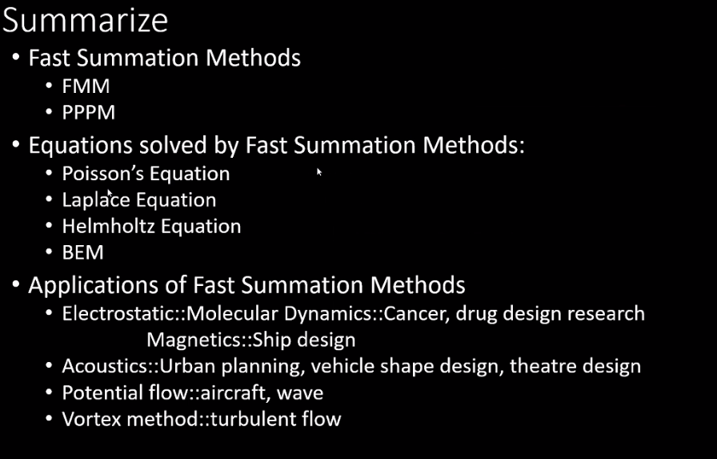

## Linear FEM and Topology optimization
### FEM overview
It belongs to the family of Galerkin methods.
- Convert strong (accurate at every point) to weak form
- Integrate by parts
- Use divergence theorem to simplify equations and enforce Neumann boundary conditions
- Discretization (build stiffness matrix and right-hand side)
- Solve the linear system

### Discretizing Poisson's equation
#### 2D Poisson's equation
$\nabla\cdot\nabla u=0$

Dirichlet boundary: displacement(第一类边界条件)
$u(x)=f(x)$
Neumann boundary: some kind of force(第二类边界条件)
$\nabla u(x)\cdot \boldsymbol{n}=g(x)$
#### Weak formulation
Arbitrary 2D test function $w(x)$:
$\nabla\cdot\nabla u=0 \Leftrightarrow \forall w,\iint_\Omega w(\nabla\cdot\nabla u)dA=0$
#### Getting rid of second-order terms
We want to get rid of $\nabla\cdot\nabla$ in $\nabla\cdot\nabla u=0$.
Integrate by parts:
$\nabla w\cdot\nabla u+w\nabla\cdot\nabla u=\nabla\cdot(w\nabla u)$
Since $\nabla\cdot\nabla u=0$, we have
$\nabla w\cdot\nabla u=\nabla\cdot(w\nabla u)$
Thus we have
$\nabla\cdot\nabla u=0 \Leftrightarrow \forall w, \iint_\Omega\nabla w\cdot \nabla u\, dA=\iint_\Omega\nabla\cdot(w\nabla u)dA$.
Apply divergence theorem to RHS(right-hand side)
$\iint_\Omega\nabla w\cdot \nabla u\, dA=\oint_{\partial \Omega} w\nabla u\cdot d\boldsymbol{n}$

#### Discretization
We represent $u(x)$ as 
$u(x)=\sum_j u_j \phi_j(x)$
Substitute this into the former equation
$\forall w, \iint_\Omega\nabla w\cdot \nabla (\sum_j u_j \phi_j)\, dA=\oint_{\partial \Omega} w\nabla u\cdot d\boldsymbol{n}$
We also use basis function $\phi_i$ as the test function $w$, and we have
$\forall i, \iint_\Omega\nabla \phi_i\cdot \nabla (\sum_j u_j \phi_j)\, dA=\oint_{\partial \Omega} \phi_i\nabla u\cdot d\boldsymbol{n}$
Extract $\sum_j u_j$ out of $\iint$
$\forall i, \sum_j(\iint_\Omega\nabla \phi_i\cdot \nabla \phi_j\, dA)u_j=\oint_{\partial \Omega} \phi_i\nabla u\cdot d\boldsymbol{n}$
In matrix form
$\boldsymbol{Ku=f}$

- Dirichlet BCs $u(x)=f(x), x\in \partial\Omega$:
set $u_i=f(x_i)$
- Neumann BCs $\nabla u(x)\cdot\boldsymbol{n}=g(x),x\in\partial\Omega$: 
Plug g into the RHS of the equation, which yields non-zeros in $\boldsymbol{f}$. (Some kind of force)
### Discretizing linear elasticity
#### Linear elasticity FEM
Cauchy momentum equation
$\frac{Dv}{Dt}=\frac{1}{\rho}\nabla\cdot\sigma+g$
v: velocity
$\rho$: density
$\sigma$: cauchy stress tensor
g: body force

For quasi-static state($v=0$), constant density, no gravity:
$\nabla\cdot\sigma=0$
#### Index notation
$\frac{Dv}{Dt}=\frac{1}{\rho}\nabla\cdot\sigma+g \Leftrightarrow \frac{Dv_\alpha}{Dt}=\frac{1}{\rho}\sum_\beta \sigma_{\alpha\beta,\beta}+g_\alpha$
#### Discretize Cauchy momentum equation using FEM
$\forall\alpha\forall i, \iint_\Omega\sum_\beta[\sigma(u(x))]_{\alpha\beta}\phi_{i\alpha}(x)dA=\oint_{\partial\Omega}\sum_\beta(\sigma_{\alpha\beta}\phi_{i\alpha}dn_\beta)$
#### Building the linear system
If $\sigma$ is a linear function of $u$,
$Ku=f$ can be explicitly expressed.

### Topology optimization
simp(Solid Isotropic Material with Penalization) 
oc(Optimility Criterion)
minimize deformation energy

The most common topology optimization problem is minimal compliance:
$$
\begin{aligned}
  \min\quad L(\rho)&=u^TK(\rho)u\\
  s.t. \quad K(\rho)u&=f\\
  \sum_e \rho_e&\leq cV\\
  \rho_e&\in [\rho_{\min},1]\\
\end{aligned}
$$

$L$: measure of deformation energy, or the loss function
$c$: volume fraction ($c \in (0,1]$)
$\rho_e$: material occupancy of cell $e$ (0=empty, 1=filled, $\rho$ is usually $10^{-2}$ or $10^{-3}$.)
$V$: total volume

## Smoothed Particle Hydrodynamics (SPH)
For an overview of the concepts of SPH, refer to [tutorial](https://interactivecomputergraphics.github.io/SPH-Tutorial/).
### Navier-Stokes equations

Here mainly conservation of momentum is enforced.
Navier-Stokes equations express conservation of momentum (Newton's second law),conservation of mass and conservation of energy and is used to describe viscous flow.
Density($\rho$), velocity($v$), pressure($p$), viscosity($\mu$) and temperature($T$) are involved.
Refer to [NS equations](https://www.simscale.com/docs/simwiki/numerics-background/what-are-the-navier-stokes-equations/) for details.

For low speed fluids incompressibility is assumed and the equations can be simplified while for high speed ones compressibility should be taken into consideration.

### Courant-Friedrichs-Lewy(CFL) condition
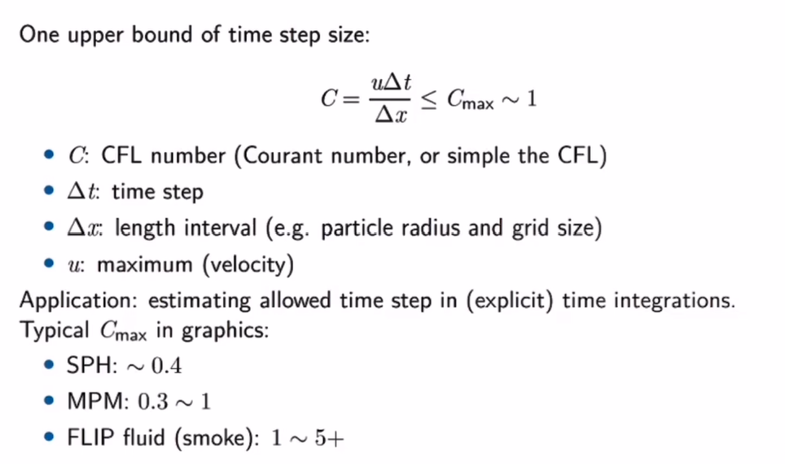

### Neighborhood search(NS)
**Accelerating SPH:**

For details of neighborhood list, refer to [Neighbour lists in smoothed particle hydrodynamics](https://ephyslab.uvigo.es/publica/documents/file_259Dominguez_etal_2010_IJNMF_DOI.pdf).
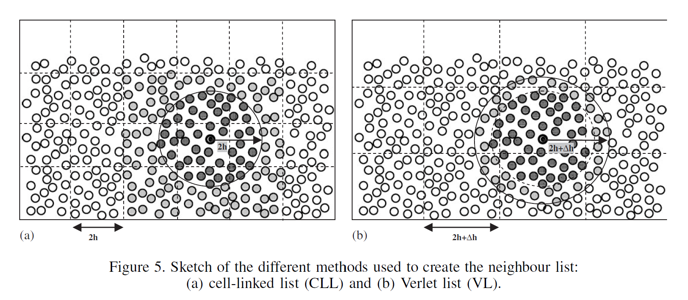
An appropriate number of neighboring particles is 30 to 50 for each particle. If the number exceeds a given maximum value, the computation should be terminated.

### Particle size, smoothing length and kernel support radius
Particle size ($\tilde{h}$), smoothing length ($h$) and kernel support radius ($\hbar$) are 3 important but confusing concepts.
**Particle size ($\tilde{h}$)**: particle size (aka characteristic length) is usually used to define the volume occupied by each particle and hence used to compute volume and mass given density.
**Smoothing length ($h$)**: smoothing length is widely used to control the reach of each particle. However, the actual value of the range of influence is not exactly equal to that of the smoothing length depending on the type of kernel function chosen. $h$ is usually defined as $k * \tilde{h}$ where $k$ is usually set to 1.3 or 1.5.
**Kernel support radius ($\hbar$)**: kernel support radius is the exact value of the particle range of influence. Different choice of kernel function can result in different $\hbar$ while the smoothing length keeps unchanged. For instance, in the [traditional cubic spline kernel](#kernel-function) $\hbar=2h$.


### SPH interpolation
In SPH, particles are used to interpolate a continuous function $A(\mathbf{x})$ at a position $\mathbf{x}$.
For any continuous function $A$, the interpolation is given as
$$A(\mathbf{x})=\sum_j m_j\frac{A(\mathbf{x}_j)}{\rho_j}W(\mathbf{x}-\mathbf{x}_j,h)$$

### Weakly compressible SPH (WCSPH)
This method allows for small, user-defined density fluctuations rather than strictly enforcing incompressibility to save time for solving Poisson equation. Actually a simplified pressure equation called Tait equation rather than pressure Poisson equation(PPE) is adopted.
Refer to [WCSPH2007](https://www.researchgate.net/publication/220789258_Weakly_Compressible_SPH_for_Free_Surface_Flows) for more details.

#### Kernel function
A commonly used kernel function in SPH is the cubic spline kernel [Monaghan1992](http://www.astro.lu.se/~david/teaching/SPH/notes/annurev.aa.30.090192.pdf)(*actually there are many kinds of cubic spline kernels*:joy:):
$$
W(q)=\begin{cases}
  \sigma_3[1-\frac{3}{2}q^2+\frac{3}{4}q^3],\quad&\rm{for\; 0\leq q< 1}\\
  \frac{\sigma_3}{4}(2-q)^3,&\rm{for\; 1\leq q< 2}\\
  0,&\rm{for\; q\ge 2}\\
\end{cases}
$$

where $q=\frac{\|\mathbf{r}\|}{h}$ and $\sigma_3$ is a dimensional normalizing factor given by:
$$
\sigma_3=\begin{cases}
  \frac{2}{3h},\quad&\rm{for\;dim=1}\\
  \frac{10}{7\pi h^2},&\rm{for\;dim=2}\\
  \frac{1}{\pi h^3},&\rm{for\;dim=3}\\
\end{cases}
$$

And the gradient of the kernel function $\nabla W_{ij}$ which is commonly used in SPH is derived as
$$\nabla W_{ij}=\frac{dW_{ij}}{dq}*\frac{\mathbf{r}}{\|\mathbf{r}\|}=\frac{dW_{ij}}{dq}*\frac{\mathbf{x}_i-\mathbf{x}_j}{\|\mathbf{x}_i-\mathbf{x}_j\|}$$

#### Governing equations and their SPH formulation
##### Continuity equation
General form
$$\frac{d\rho}{dt}=-\rho\nabla\cdot\mathbf{v}$$

In SPH, the density is calculated as
$$\rho_a=\sum_bm_bW_{ab}$$

where $a$ is the current particle and $b$ denotes its neighbors. $W_{ab}=W(\mathbf{x}_a-\mathbf{x}_b)$ is the kernel function value between $a$ and $b$ and $\|\mathbf{x}_a-\mathbf{x}_b\|=r$ in the kernel function.
And the derivative is
$$\frac{d\rho_a}{dt}=\sum_bm_b\mathbf{v}_{ab}\nabla_aW_{ab}$$

where $\mathbf{v}_{ab}=\mathbf{v}_a-\mathbf{v}_b$ and $\nabla_aW_{ab}=\frac{dW_{ab}}{dq}*\frac{\mathbf{x}_a-\mathbf{x}_b}{\|\mathbf{x}_a-\mathbf{x}_b\|}$ are all vectors with $q=\frac{\|\mathbf{x}_a-\mathbf{x}_b\|}{h}$.
For this method, density changes are only due to relative motion of particles.
##### Momentum equation
General form
$$\frac{d\mathbf{v}}{dt}=-\frac{1}{\rho}\nabla p+\mathbf{g}$$

SPH form (Pressure force + Body force)
$$\frac{d\mathbf{v}_a}{dt}=-\sum_bm_b(\frac{p_a}{\rho_a^2}+\frac{p_b}{\rho_b^2})\nabla_aW_{ab}+\mathbf{g}$$

##### Equation of state (EOS)
There are different form of EOS with different conditions. In WCSPH, low compressibily is adopted.
+ Incompressibility (Poisson equation)
  $$\nabla^2p=\rho\frac{\nabla\cdot\mathbf{v}}{\Delta t}$$

  Solving this Poisson equation is time-consuming(PCG,MGPCG). Standard SPH and other methods like FVM directly solve this equation.
+ High compressibility (Ideal gas equation)
  $$p=k_p\rho\quad {\rm or} \quad p=k_p(\rho-\rho_0)$$

  This method requires a pressure constant $k_p$ and results in a high compressibility.
+ Low compressibility (Tait equation)
  $$\begin{aligned}
    p&=B\left(\left(\frac{\rho}{\rho_0}\right)^\gamma-1\right)\\
    B&=\frac{\kappa\rho_0}{\gamma}
  \end{aligned}$$

  where $\rho_0$ is the initial particle density, $\kappa$ is a stiffness parameter and $\gamma$ is another parameter.
  Actually $\kappa$ should be determined based on the desired density variation through test and tuning. In WCSPH, $\kappa$ is assigned a large value $\kappa=c_s^2$ where $c_s$ denotes the speed of sound in the fluid and $\gamma=7$ is adopted. 
  $$B=\frac{c_s^2\rho_0}{\gamma}$$

  This large stiffness parameter can help keep the density fluctuation small. The relative density fluctuation thus follows the following relation
  $$\frac{|\Delta\rho|}{\rho_0}=\frac{|\rho-\rho_0|}{\rho_0} \sim \frac{|\mathbf{v}_f|^2}{c_s^2}$$

  where $\mathbf{v}_f$ denotes the speed of flow.
  If the sound speed is much larger than the flow speed ($c_s\gg|\mathbf{v}_f|$), the density variation can be controlled at a low level. Define $\eta < \frac{|\mathbf{v}_f|^2}{c_s^2}$ and $\eta=0.01$ is usually chosen to control the density variations of the order of 1%. 
  However, large stiffness results in smaller time step and increases overall computation cost.

#### Viscosity
Artificial viscosity is employed to improve numerical stability and to allow for shock phenomena. 
$$\frac{d\mathbf{v}_a}{dt}=\begin{cases}
-\sum_b m_b\Pi_{ab}\nabla_aW_{ab} \qquad&\mathbf{v}_{ab}^T\mathbf{x}_{ab}<0\\
0 &\mathbf{v}_{ab}^T\mathbf{x}_{ab}\ge0
\end{cases}$$
$\Pi_{ab}$ is given as
$$\Pi_{ab}=-\nu\left(\frac{\mathbf{v}_{ab}^T\mathbf{x}_{ab}}{|\mathbf{x}_{ab}|^2+\varepsilon h^2}\right)$$

with the viscous term $\nu=\frac{2\alpha h c_s}{\rho_a+\rho_b}$ and the viscosity constant $\alpha$ is usually in between 0.08 and 0.5. $\varepsilon h^2$ is introduced to avoid singularities for $|\mathbf{x}_{ab}|=0$ with $\varepsilon=0.01$.

#### Surface tension (表面张力)
In WCSPH, a new surface tension model is adopted which relies on cohesion forces.
$$\frac{d\mathbf{v}_a}{dt}=-\frac{\kappa}{m_a}\sum_bm_bW_{ab} \frac{\mathbf{x}_a-\mathbf{x}_k}{|\mathbf{x}_a-\mathbf{x}_k|}$$

The accuracy of the above equation is doubtful and a reasonable value of $\kappa$ is unknown yet. :cry:
Energy dissipation is a problem. Currently the particles in a rectangle will **explode** while forming a circle with only surface tension.


#### Boundary particles
$\mathbf{f}_{ak}$ is the force applied to a fluid particle $a$ that collides with a boundary particle $k$.
$$\mathbf{f}_{ak}=\frac{m_k}{m_a+m_k}\Gamma(\mathbf{x}_a,\mathbf{x}_k)\frac{\mathbf{x}_a-\mathbf{x}_k}{|\mathbf{x}_a-\mathbf{x}_k|}$$
$\Gamma$ is defined as 
$$\Gamma(\mathbf{x}_a,\mathbf{x}_k)=0.02\frac{c_s^2}{|\mathbf{x}_a-\mathbf{x}_k|}*\begin{cases}
  \frac{2}{3} & 0<q<\frac{2}{3}\\
  (2q-\frac{3}{2}q^2)&\frac{2}{3}<q<1\\
  \frac{1}{2}(2-q)^2&1<q<2\\
  0 & \rm{otherwise}
\end{cases}$$

with $q=\frac{|\mathbf{x}_a-\mathbf{x}_k|}{h}$

And we have
$$\frac{d\mathbf{v}_a}{dt}=\frac{\mathbf{f}_{ak}}{m_a}$$

#### Time step
CFL condition is adopted.

#### Computation flow
1. Initialization
   Initialize the position, density, velocity, pressure of each particle (fluid and boundary particles) as well as the background mesh grid (for neighborhood search).
2. Neighborhood search
   For each particle, compute and store its neighboring particles (number and id).
3. Compute $\Delta$
   **Compute $\frac{d\rho}{dt}$**
    + [Continuity equation](#continuity-equation)
      $$\frac{d\rho_a}{dt}=\sum_bm_b\mathbf{v}_{ab}\nabla_aW_{ab}$$

      where $\mathbf{v}_{ab}=\mathbf{v}_a-\mathbf{v}_b$ and $\nabla_aW_{ab}=\frac{dW_{ab}}{dq}*\frac{\mathbf{x}_a-\mathbf{x}_b}{\|\mathbf{x}_a-\mathbf{x}_b\|}$ are all vectors with $q=\frac{\|\mathbf{x}_a-\mathbf{x}_b\|}{h}$.

   **Compute $\frac{d\mathbf{v}}{dt}$**(Actually forces)
    + [Viscosity](#viscosity)(Viscosity force)
      $$\frac{d\mathbf{v}_a}{dt}=\begin{cases}
        -\sum_b m_b\Pi_{ab}\nabla_aW_{ab} \qquad&\mathbf{v}_{ab}^T\mathbf{x}_{ab}<0\\
        0 &\mathbf{v}_{ab}^T\mathbf{x}_{ab}\ge0
      \end{cases}$$

    + [Momentum equation](#momentum-equation)(Pressure force & Body force)
      $$\frac{d\mathbf{v}_a}{dt}=-\sum_bm_b(\frac{p_a}{\rho_a^2}+\frac{p_b}{\rho_b^2})\nabla_aW_{ab}+\mathbf{g}$$

    + [Surface tension](#surface-tension-表面张力)(Surface tension)
      $$\frac{d\mathbf{v}_a}{dt}=-\frac{\kappa}{m_a}\sum_bm_bW_{ab} \frac{\mathbf{x}_a-\mathbf{x}_k}{|\mathbf{x}_a-\mathbf{x}_k|}$$
    
    Summarize these above terms together to get the final $\frac{d\mathbf{v}}{dt}$. Surface tension is doubtful and is not suggested to use.:cry:
4. Enforce boundary conditions
    Refer to [boundary particles](#boundary-particles) for details.
5. Update variables
   **Update position (fluid particle)**
   $$\mathbf{x}_a+=\mathbf{v}_a*\Delta t$$

   **Update velocity (fluid particle)**
   $$\mathbf{v}_a+=\frac{d\mathbf{v}}{dt}*\Delta t$$

   **Update density**
   $$\rho_a+=\frac{d\rho}{dt}*\Delta t$$

   **Update pressure**
    $$\begin{aligned}
    p&=B\left(\left(\frac{\rho}{\rho_0}\right)^\gamma-1\right)    
    \end{aligned}$$

    with $B=\frac{\rho_0 c_s^2}{\gamma}$. Refer to [Equation of state](#equation-of-state-eos) for details.

6. Update time step $\Delta t$ and return to step 2.
   $$\Delta t=C_{cfl}*\min\left[\frac{dh}{v_{\max}},\sqrt{\frac{dh}{a_{\max}}},\frac{dh}{c_s*\sqrt{(\frac{\rho_{\max}}{\rho_0})^\gamma}}\right]$$

   $C_{cfl}$ is commonly set to 0.2.

#### Drawbacks
+ Stiffness value is difficult to determine before running the simulation. Thus parameter tuning is inevitable.
+ WCSPH imposes a severe time step restriction because of the large stiffness value. The larger the smaller time step it will be based on CFL condition.


### Predictive-corrective incompressible SPH (PCISPH)
This method allows for small density fluctuations like WCSPH. A prediction-correction scheme is adopted to obtain a **larger time step** than WCSPH. Iteration is needed during the correction process until all particle density fluctuations are smaller than a given threshold.
Pressure is obtained by continuous correction rather than solving a PPE.

#### Density correction via pressure change
A density prediction-correction scheme is adopted to control the density variance. This involves direct prediction and following correction loop.
A scaling factor $\delta$ is precomputed for a **prototype particle** with a filled neighborhood and is  used for **all** particles including those without a filled neighborhood like the particles on the free surface.
$$\delta=\frac{-1}{\beta(-\sum_j\nabla W_{ij}\cdot\sum_j\nabla W_{ij}-\sum_j(\nabla W_{ij}\cdot\nabla W_{ij}))}$$

where $\beta=\Delta t^2 m^2 \frac{2}{\rho_0^2}$ and $\nabla W_{ij}=\frac{dW_{ij}}{dq}*\frac{\mathbf{x}_i-\mathbf{x}_j}{\|\mathbf{x}_i-\mathbf{x}_j\|}$ with $q=\frac{\|\mathbf{x}_i-\mathbf{x}_j\|}{h}$.
And the corrective pressure $\tilde p_i$ which aims to correct the density variation is given as
$$\tilde p_i=\delta\rho^*_{err_i}$$

where $\rho^*_{err_i}=\rho^*_i-\rho_0$ is the predicted density error of a particle.
And the corrected pressure is updated
$$p_i+=\tilde p_i$$

This prediction-correction process will repeat until the density variance of each particle reaches the desired threshold.

#### Computation flow
1. Initialization

**Iteration 1** While $t<t_{\max}$:

2. Neighborhood search
3. Compute $\frac{d\mathbf{v}}{dt}$(Actually forces)
      + [Viscosity](#viscosity)(Viscosity force)
      $$\frac{d\mathbf{v}_a}{dt}=\begin{cases}
        -\sum_b m_b\Pi_{ab}\nabla_aW_{ab} \qquad&\mathbf{v}_{ab}^T\mathbf{x}_{ab}<0\\
        0 &\mathbf{v}_{ab}^T\mathbf{x}_{ab}\ge0
      \end{cases}$$

      + Body force
      $$\frac{d\mathbf{v}_a}{dt}=\mathbf{g}$$

      Summarize these together $\frac{d\mathbf{v}_i}{dt}={\rm Viscosity+Body}$ to get the final acceleration of each particle without the contribution of pressure.(Pressure force changes during the iteration thus not precomputed here.)
4. Initialize pressure
      $$p_i=0\quad{\rm and}\quad\frac{d\mathbf{v}_{ip}}{dt}=0$$

      where $p_i$ denotes the pressure of each particle and $\frac{d\mathbf{v}_{ip}}{dt}$ denotes the acceleration of each particle caused by pressure force which changes during iteration.
5. Compute [scaling factor](#density-correction-via-pressure-change)
      $$\delta=\frac{-1}{\beta(-\sum_j\nabla W_{ij}\cdot\sum_j\nabla W_{ij}-\sum_j(\nabla W_{ij}\cdot\nabla W_{ij}))}$$

      > This is computed for a **prototype particle** with a filled neighborhood and is used for all particles. It is still unclear what the prototype particle looks like.:cry:

**Iteration 2** While $\rho^*_{err\max} > {\rm threshold}$:

6. Compute predicted variables
   + Compute predicted velocity
     $$\mathbf{v}^*_i=\mathbf{v}_i+\Delta t (\frac{d\mathbf{v}_i}{dt}+\frac{d\mathbf{v}_{ip}}{dt})$$

     where $*$ denotes predicted value, $i$ denotes each particle and $\frac{d\mathbf{v}_{ip}}{dt}$ denotes acceleration resulting from pressure force.
   + Compute predicted position
     $$\mathbf{x}_i^*=\mathbf{x}_i+\Delta t\mathbf{v}_i^*$$

    > Note: $\mathbf{v}_i$, $\mathbf{x}_i$ and the following $\rho_i$ keep unchanged during iteration 2.

7. Compute corrected pressure
   + Compute $\frac{d\rho}{dt}$
    [Continuity equation](#continuity-equation)
    $$\frac{d\rho_i}{dt}=\sum_jm_j\mathbf{v}_{ij}\nabla W_{ij}$$
     
    > In the given code, $m_j$ is not considered in the equation. Still unclear the reason behind that.:cry:
   + Compute predicted density
     $$\rho^*_i=\rho_i+\Delta t\frac{d\rho}{dt}$$
   + Compute density error
     $$\rho^*_{erri}=\rho^*_i-\rho_{0i}$$
   + Update predicted pressure
     $$p_i+=\delta\rho^*_{erri}$$

8. Compute new pressure force
   $$\frac{d\mathbf{v}_{ip}}{dt}=-\sum_jm_j(\frac{p_i}{\rho_i^2}+\frac{p_j}{\rho_j^2})\nabla W_{ij}$$

**End Iteration 2**

9. Update variables
   $$\begin{aligned}
     \mathbf{v}_i&+=\Delta t (\frac{d\mathbf{v}_i}{dt}+\frac{d\mathbf{v}_{ip}}{dt})\\
     \mathbf{x}_i&+=\mathbf{x}_i+\Delta t \mathbf{v}_i\\
     \rho_i&+=\Delta t \frac{d\rho_i}{dt}\\
   \end{aligned}$$
10. Enforce [boundary particles](#boundary-particles) (Same as WCSPH)
11. Adapt time step $\Delta t$
    $$\Delta t=\min\left[C_{CFLv}\frac{dh}{v_{\max}},C_{CFLa}\sqrt{\frac{dh}{a_{\max}}}\right]$$

    > Usually $C_{CFLv}=0.25$ and $C_{CFLa}=0.05$.

**End Iteration 1**
> Note :dog: about implementation
> + The neighborhood search is only executed once for each time step and the neighbor information is reused in the prediction process.
> + A minimum number of iteration is used in the prediction correction loop to limit temporal fluctuations in the pressure field. 3 is chosen as the minimum number.

The comparison of algorithms used in WCSPH and PCISPH is summarized below.


### Implicit incompressible SPH (IISPH)
IISPH adopts a **semi-implicit** scheme. The semi-implicit scheme is achieved by separating non-pressure forces and pressure forces apart with an intermediate state. For non-pressure forces, the intermediate state is explicitly achieved. For pressure forces, a linear system of equations should be implicitly resolved.
This system of linear equations is solved for pressure using relaxed Jacobi iteration method while enforcing the constant density condition.

#### Continuity equation in IISPH
For continuity equation
$$\frac{D\rho}{Dt}=-\rho\nabla\cdot\mathbf{v}$$

The terms of it can be expressed as
$$\begin{aligned}
  \frac{D\rho_i}{Dt}&=\frac{\rho_i(t+\Delta t)-\rho_i(t)}{\Delta t}\\
  \nabla\cdot\mathbf{v}_i&=-\frac{1}{\rho_i}\sum_jm_j\mathbf{v}_{ij}\nabla W_{ij}\\
\end{aligned}$$

Thus the continuity equation can be rewritten in IISPH as
$$\frac{\rho_i(t+\Delta t)-\rho_i(t)}{\Delta t}=\sum_jm_j\mathbf{v}_{ij}(t+\Delta t)\nabla W_{ij}$$

where $\mathbf{v}_{ij}(t+\Delta t)=\mathbf{v}_i(t+\Delta t)-\mathbf{v}_j(t+\Delta t)$.

#### Pressure and non-pressure force
For the continuity equation in IISPH
$$\mathbf{v}_i(t+\Delta t)=\mathbf{v}_i(t)+\Delta t\frac{\mathbf{F}_i^{adv}(t)+\mathbf{F}_i^p(t)}{m_i}$$

where $\mathbf{F}_i^{p}(t)$ is the pressure force and $\mathbf{F}_i^{adv}(t)$ is the non-pressure force including [viscosity](#viscosity), body force($g$) and [surface tension](#surface-tension-表面张力).
Non-pressure force is known and can be obtained by
$$\mathbf{F}_i^{adv}(t)=\mathbf{F}^{viscosity}_i(t)+m_ig+\mathbf{F}^{surface tension}_i(t)$$

Pressure force is unknown and can be expressed (similar to [momentum equation](#momentum-equation)) as
$$\mathbf{F}_i^{p}(t)=-m_i\sum_jm_j\left(\frac{p_i(t)}{\rho_i^2(t)}+\frac{p_j(t)}{\rho_j^2(t)}\right)\nabla W_{ij}(t)$$

where pressure $p(t)$ is unknown.
> For each particle in SPH, $m,\rho,\mathbf{v},\mathbf{x},p$ are the 5 key particle features. In IISPH, $m,\rho$ assume unchanged during the process and the key point is to solve for pressure.

#### Semi-implicit scheme
Based on the above equations, a semi-implicit scheme can be derived.
**Explicit part**
An **intermediate state** is introduced where the known non-pressure force is firstly used to get the intermediate velocity $\mathbf{v}_i^{adv}$ and density $\rho_i^{adv}$.
$$\begin{aligned}
  \mathbf{v}_i^{adv}&=\mathbf{v}_i(t)+\Delta t\frac{\mathbf{F}_i^{adv}(t)}{m_i}\\
  \frac{\rho_i^{adv}-\rho_i(t)}{\Delta t}=\sum_jm_j\mathbf{v}^{adv}_{ij}\nabla W_{ij}(t) \Rightarrow \rho_i^{adv}&=\rho_i(t)+\Delta t\sum_jm_j\mathbf{v}^{adv}_{ij}\nabla W_{ij}(t)
\end{aligned}$$

where $\mathbf{v}^{adv}_{ij}=\mathbf{v}^{adv}_{i}-\mathbf{v}^{adv}_{j}$.
**Implicit part**
Based on the intermediate state, pressure force is involved in the implicit part to solve for unknown pressure.
$$\Delta t^2\sum_jm_j\left(\frac{\mathbf{F}_i^p(t)}{m_i}-\frac{\mathbf{F}_j^p(t)}{m_j}\right)\nabla W_{ij}(t)=\rho_0-\rho_i^{adv}$$

> The derivation of the above equation is based on the continuity equation and the assumption that $\rho_i(t+\Delta t)=\rho_0$.
> $$\begin{aligned}
  \frac{\rho_i(t+\Delta t)-\rho_i(t)}{\Delta t}&=\sum_jm_j\mathbf{v}_{ij}(t+\Delta t)\nabla W_{ij}\\
  \frac{\rho_0-\rho_i(t)}{\Delta t}&=\sum_jm_j\mathbf{v}_{ij}(t+\Delta t)\nabla W_{ij}\\
  \frac{\rho_0-\rho_i(t)}{\Delta t}&=\sum_jm_j(\mathbf{v}_{i}(t+\Delta t)-\mathbf{v}_{j}(t+\Delta t))\nabla W_{ij}\\
  \frac{\rho_0-\rho_i(t)}{\Delta t}&=\sum_jm_j\left[\left(\mathbf{v}_i(t)+\Delta t\frac{\mathbf{F}_i^{adv}(t)}{m_i}+\Delta t\frac{\mathbf{F}_i^p(t)}{m_i}\right)-\left(\mathbf{v}_i(t)+\Delta t\frac{\mathbf{F}_j^{adv}(t)}{m_j}+\Delta t\frac{\mathbf{F}_j^p(t)}{m_j}\right)\right]\nabla W_{ij}\\
  \frac{\rho_0-\rho_i(t)}{\Delta t}&=\sum_jm_j\left[\left(\mathbf{v}_i(t)+\Delta t\frac{\mathbf{F}_i^{adv}(t)}{m_i}\right)-\left(\mathbf{v}_i(t)+\Delta t\frac{\mathbf{F}_j^{adv}(t)}{m_j}\right)\right]\nabla W_{ij}+\sum_jm_j\left(\Delta t\frac{\mathbf{F}_i^p(t)}{m_i}-\Delta t\frac{\mathbf{F}_j^p(t)}{m_j}\right)\nabla W_{ij}\\
  \frac{\rho_0-\rho_i(t)}{\Delta t}&=\sum_jm_j(\mathbf{v}_i^{adv}-\mathbf{v}_j^{adv})\nabla W_{ij}+\Delta t\sum_jm_j\left(\frac{\mathbf{F}_i^p(t)}{m_i}-\frac{\mathbf{F}_j^p(t)}{m_j}\right)\nabla W_{ij}\\
  \frac{\rho_0-\rho_i(t)}{\Delta t}&=\frac{\rho_i^{adv}-\rho_i(t)}{\Delta t}+\Delta t\sum_jm_j\left(\frac{\mathbf{F}_i^p(t)}{m_i}-\frac{\mathbf{F}_j^p(t)}{m_j}\right)\nabla W_{ij}\\
  \frac{\rho_0-\rho_i^{adv}}{\Delta t}&=\Delta t\sum_jm_j\left(\frac{\mathbf{F}_i^p(t)}{m_i}-\frac{\mathbf{F}_j^p(t)}{m_j}\right)\nabla W_{ij}\\
  \rho_0-\rho_i^{adv}&=\Delta t^2\sum_jm_j\left(\frac{\mathbf{F}_i^p(t)}{m_i}-\frac{\mathbf{F}_j^p(t)}{m_j}\right)\nabla W_{ij}\\
\end{aligned}$$

Substitute the pressure force in the above equation, we have
$$\begin{aligned}
  \rho_0-\rho_i^{adv}&=\Delta t^2\sum_jm_j((-\sum_jm_j\left(\frac{p_i(t)}{\rho_i^2(t)}+\frac{p_j(t)}{\rho_j^2(t)}\right)\nabla W_{ij})-(-\sum_km_k\left(\frac{p_j(t)}{\rho_j^2(t)}+\frac{p_k(t)}{\rho_k^2(t)}\right)\nabla W_{jk}))\nabla W_{ij}\\
  &=\sum_jm_j\left((-\Delta t^2\sum_j\frac{m_j}{\rho_i^2}\nabla W_{ij})p_i+\sum_j(-\Delta t^2\frac{m_j}{\rho_j^2}\nabla W_{ij}p_j)-(-\Delta t^2\sum_k\frac{m_k}{\rho_j^2}\nabla W_{jk})p_j-\sum_k(-\Delta t^2\frac{m_k}{\rho_k^2}\nabla W_{jk}p_k)\right)\nabla W_{ij}\\
  &=\sum_jm_j(\mathbf{d}_{ii}p_i+\sum_j\mathbf{d}_{ij}p_j-\mathbf{d}_{jj}p_j-\sum_k\mathbf{d}_{jk}p_k)\nabla W_{ij}
\end{aligned}$$

with
$$\begin{aligned}
  \mathbf{d}_{ii}&=-\Delta t^2\sum_j\frac{m_j}{\rho_i^2}\nabla W_{ij}\\
  \mathbf{d}_{ij}&=-\Delta t^2\frac{m_j}{\rho_j^2}\nabla W_{ij}\\
\end{aligned}$$

The above equation can be further written as the following form by extracting unknown pressure. ==[KEY EQUATION]==
$$\begin{aligned}
  \rho_0-\rho_i^{adv}&=\sum_jm_j(\mathbf{d}_{ii}p_i+\sum_j\mathbf{d}_{ij}p_j-\mathbf{d}_{jj}p_j-\sum_k\mathbf{d}_{jk}p_k)\nabla W_{ij}\\
  &=p_i\sum_jm_j(\mathbf{d}_{ii}-\mathbf{d}_{ji})\nabla W_{ij}+\sum_jm_j(\sum_j\mathbf{d}_{ij}p_j-\mathbf{d}_{jj}p_j-\sum_{k\neq i}\mathbf{d}_{jk}p_k)\nabla W_{ij}
\end{aligned}$$

Thus this can be written in matrix form
$$\mathbf{A}(t)\mathbf{p}(t)=\mathbf{b}(t)$$

where $\mathbf{b}(t)=[\rho_0-\rho_1^{adv},\rho_0-\rho_2^{adv},\dots]^T$ and $\mathbf{p}(t)=[p_1,p_2,\dots]^T$ are the unknowns.
For this system of linear equations, **relaxed Jacobi** method is adopted.
The coefficient matrix is divided into diagonal and non-diagonal matrices with $n$ denoting the total number of particles.
$$\mathbf{A}(t)=\mathbf{D}+\mathbf{R}$$

where
$$\mathbf{D}=\begin{bmatrix}
  a_{11} & 0 & \cdots & 0\\
  0 & a_{22} & \cdots & 0\\
  \vdots & \vdots & \ddots & \vdots\\
  0 & 0 & \cdots & a_{nn}\\
\end{bmatrix}$$

$$\mathbf{R}=\begin{bmatrix}
  0 & a_{12} & \cdots & a_{1n}\\
  a_{21} & 0 & \cdots & a_{2n}\\
  \vdots & \vdots & \ddots & \vdots\\
  a_{n1} & a_{n2} & \cdots & 0\\
\end{bmatrix}$$

With relaxed Jaboci method, the iteration equation is expressed as
$$\mathbf{p}^{l+1}(t)=(1-\omega)\mathbf{p}^l(t)+\omega\mathbf{D}^{-1}(\mathbf{b}(t)-\mathbf{R}\mathbf{p}^l(t))$$

where $l$ denotes iteration index and $\omega$ denotes relaxation factor.

> Actually, this relaxed Jacobi method is probably known as successive over relaxation method (**SOR**). For this method, the system itself should fullfill some conditions to ensure convergence like the coefficient matrix $\mathbf{A}$ should be a strictly diagonally dominant matrix, etc. However in IISPH, these conditions are not considered rigorously. From my point of view, further provement should be added.

Each line (each particle) of this system of linear equations can be written as
$$\sum_j a_{ij}p_j=\rho_0-\rho_i^{adv}$$

where $a_{ii}=\sum_jm_j(\mathbf{d}_{ii}-\mathbf{d}_{ji})\nabla W_{ij}$ and $\sum_{j\neq i}a_{ij}p_j=\sum_jm_j(\sum_j\mathbf{d}_{ij}p_j-\mathbf{d}_{jj}p_j-\sum_{k\neq i}\mathbf{d}_{jk}p_k)\nabla W_{ij}$ can be derived from the key equation.
And the corresponding iteration equation is expressed as
$$\begin{aligned}
  p_i^{l+1}&=(1-\omega)p_i^l+\omega\frac{\rho_0-\rho_i^{adv}-\sum_{j\neq i}a_{ij}p_j^l}{a_{ii}}\\
  &=(1-\omega)p_i^l+\frac{\omega}{a_{ii}}\left(\rho_0-\rho_i^{adv}-\sum_jm_j(\sum_j\mathbf{d}_{ij}p_j^l-\mathbf{d}_{jj}p_j^l-\sum_{k\neq i}\mathbf{d}_{jk}p_k^l)\nabla W_{ij}\right)
\end{aligned}$$

This iteration will not terminate until the error is smaller than the given threshold.
Usually average density $\rho_{avg}^l=\frac{\sum_i \rho_i^l}{n}$ is predicted and used to compute residual.
$$\rho_i^l=\sum_jm_j(\mathbf{d}_{ii}p_i+\sum_j\mathbf{d}_{ij}p_j-\mathbf{d}_{jj}p_j-\sum_k\mathbf{d}_{jk}p_k)\nabla W_{ij}+\rho_i^{adv}$$

#### Rigid-fluid coupling
To be continued...

#### Computation flow

> Notes :dog: about implementation:
> + The relaxation factor $\omega$ is difficult to determine in SOR. Usually trial and error are adopted to search for an optimal value regarding convergence.
In IISPH, $\omega=0.5$ is adopted. 
> + The initial pressure for the iteration is chosen as $p_i^0=0.5p_i(t-\Delta t)$ for convergence.
> + For each particle, 7 scalars are computed and stored for 3D cases, namely $a_{ii}$, $\mathbf{d}_{ii}$ and $\sum_j\mathbf{d}_{ij}p_j^l$ in each iteration.
> + In the iteration equation, $\sum_{k\neq i}\mathbf{d}_{jk}p_k^l=\sum_k\mathbf{d}_{jk}p_k^l-\mathbf{d}_{ji}p_i^l$. Thus the term $\sum_k\mathbf{d}_{jk}p_k^l$ can be accessed from particle without computation and only $\mathbf{d}_{ji}=-\Delta t^2\frac{m_i}{\rho_i^2}\nabla W_{ji}$ should be computed.
> + In each iteration, pressure clamping is adopted, i.e. $p_i^l=\max(0,p_i^l)$.
> + During the process, particle mass $m_i$ and density $\rho_i$ keep unchanged. Whether predicted density should be used is unclear yet :cry:. Currently we choose to use $\rho_0$ during the whole process.

### Divergence-free SPH (DFSPH)
DFSPH adopts a constant density solver and a divergence-free solver simultaneously to fullfill the constant density condition and the divergence-free condition.
#### NS equations
The incompressible, isothermal NS equations in Lagrangian coordinates is adopted.
$$
\begin{aligned}
  \frac{D\mathbf{v}}{Dt}=-\frac{1}{\rho}\nabla p+\nu\nabla^2\mathbf{v}+\frac{\mathbf{f}}{\rho}
\end{aligned}
$$

where $\rho,p,\nu,\mathbf{v},\mathbf{f}$ denote density, pressure, kinematic viscosity, velocity and body force respectively.
This equation is based on the incompressibility assumption which is further maintained by the **divergence-free velocity field condition**.
$$
\begin{aligned}
  \frac{D\rho}{Dt}=-\rho(\nabla\cdot\mathbf{v})=0\Leftrightarrow\nabla\cdot\mathbf{v}=0
\end{aligned}
$$

Divergence-free helps the enforcement of incompressibility. However, this is not enough since numerical errors may also cause fluid compressibility. To correct this, another condition needs to be fullfilled called **constant density condition**(commonly adopted by other common SPH methods like PCISPH and IISPH) which is written as
$$
\rho-\rho_0=0
$$

To deal with these 2 conditions, 2 pressure solvers (**divergence-free solver + constant density solver**) are adopted simultaneously to consider the divergence error and density error, respectively.

#### Overall computation flow
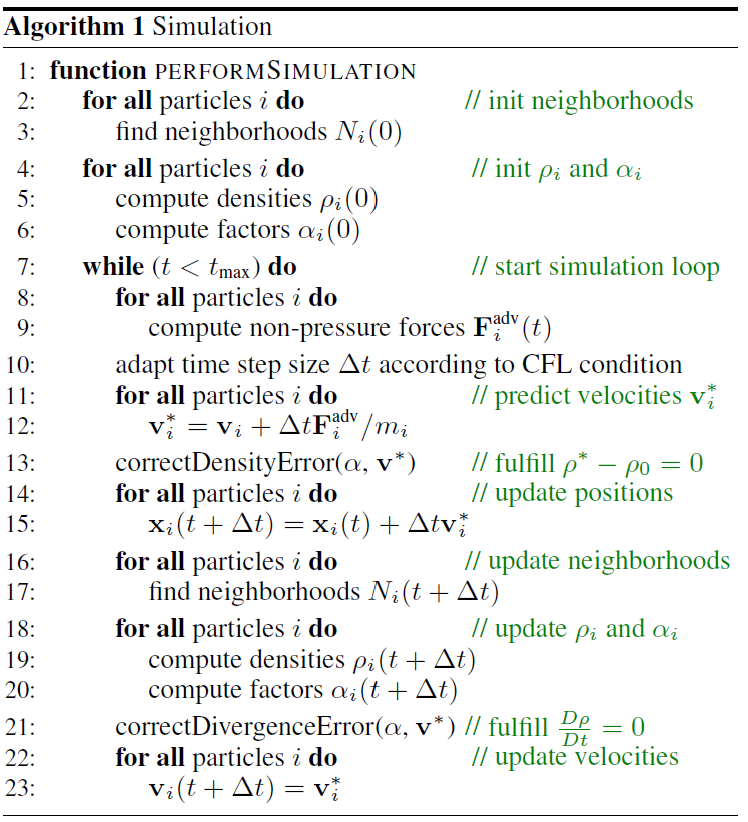
Similar to **IISPH**, an intermediate state([$\mathbf{F}_i^{adv}$](#pressure-and-non-pressure-force)) is computed without pressure forces. Based on this intermediate state, pressure is adjusted to fullfill the constant density and divergence-free conditions respectively with an EOS like in **WCSPH**.

> :warning: Problems
> + **Particle deficiency problem**
> How to deal with particles that do not have enough neighbors?? (Density is underestimated!!:cry:)
> + **Boundary particle problem**
> How to deal with the boundary conditions with particles?


#### Divergence-free solver

A commonly used [EOS](#equation-of-state-eos) is written as
$$p=\frac{\kappa\rho_0}{\gamma}\left(\left(\frac{\rho}{\rho_0}\right)^\gamma-1\right)$$

By choosing $\gamma=1$, we have
$$p_i=\kappa_i(\rho_i-\rho_0)$$

The pressure force of particle $i$ is determined by
$$\mathbf{F}_i^p=-\frac{m_i}{\rho_i}\nabla p_i=-\frac{m_i}{\rho_i}\kappa_i^v\sum_jm_j\nabla W_{ij}$$

And the pressure force acting from particle $i$ on its neighboring particle $j$ is determined by
$$\mathbf{F}^p_{j\leftarrow i}=-\frac{m_i}{\rho_i}\frac{\partial p_i}{\partial \mathbf{x}_j}=\frac{m_i}{\rho_i}\kappa_i^vm_j\nabla W_{ij}$$

Based on the continuity equation, the density gradient is computed as
$$\frac{D\rho_i}{Dt}=\sum_jm_j(\mathbf{v}_i-\mathbf{v}_j)\nabla W_{ij}$$

The density gradient resulting from pressure forces is computed as
$$(\frac{D\rho_i}{Dt})^p=\Delta t\sum_jm_j\left(\frac{\mathbf{F}_i^p}{m_i}-\frac{\mathbf{F}^p_{j\leftarrow i}}{m_i}\right)\nabla W_{ij}$$

To fulfill the divergence-free condition, we have
$$\begin{aligned}
  &\frac{D\rho_i}{Dt}+(\frac{D\rho_i}{Dt})^p=0\\
  &\Rightarrow\frac{D\rho_i}{Dt}=-\Delta t\sum_jm_j\left(\frac{\mathbf{F}_i^p}{m_i}-\frac{\mathbf{F}^p_{j\leftarrow i}}{m_i}\right)\nabla W_{ij}
\end{aligned}$$

By inserting the pressure forces, we finally get
$$\frac{D\rho_i}{Dt}=\kappa_i^v\frac{\Delta t}{\rho_i}\left(\left|\sum_jm_j\nabla W_{ij}\right|^2+\sum_j|m_j\nabla W_{ij}|^2\right)$$

For each particle, $\kappa$ can be computed for divergence-free condition.
$$\begin{aligned}
  \kappa_i^v&=\frac{1}{\Delta t}\frac{D\rho_i}{Dt}\cdot\frac{\rho_i}{\left|\sum_jm_j\nabla W_{ij}\right|^2+\sum_j|m_j\nabla W_{ij}|^2}\\
  &=\frac{1}{\Delta t}\frac{D\rho_i}{Dt}\cdot\alpha_i\\
\end{aligned}$$

where $\frac{D\rho_i}{Dt}=\sum_jm_j(\mathbf{v}_i-\mathbf{v}_j)\nabla W_{ij}$.

And the total pressure forces acting on particle $i$ is
$$\begin{aligned}
  \mathbf{F}^p_{i,total}&=\mathbf{F}^p_i+\sum_j\mathbf{F}^p_{i\leftarrow j}\\
  &=-\frac{m_i}{\rho_i}\kappa_i^v\sum_jm_j\nabla W_{ij}-\sum_j\frac{m_j}{\rho_j}\kappa_j^vm_i\nabla W_{ij}\\
  &=-m_i\sum_jm_j\left(\frac{\kappa_i^v}{\rho_i}+\frac{\kappa_j^v}{\rho_j}\right)\nabla W_{ij}
\end{aligned}$$

And the velocity can thus be updated as in the figure.
> Notes:pig::
> + To prevent zero denominator, $\alpha_i=\frac{\rho_i}{\max\{\left|\sum_jm_j\nabla W_{ij}\right|^2+\sum_j|m_j\nabla W_{ij}|^2,\varepsilon\}}$ where $\varepsilon=10^{-6}$.
> + $\alpha_i$ solely depends on particle positions, thus this value can be precomputed before the iteration.
> + Warm start can be adopted for the iteration.
> + Unlike other methods, in DFSPH each particle has its individual $\kappa$.

#### Constant density solver
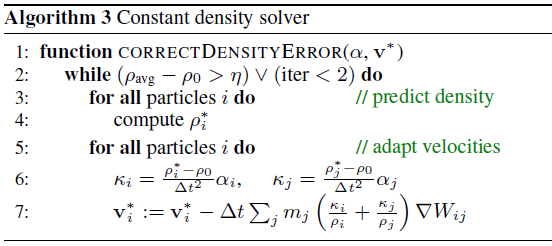
This constant density solver is altered to reuse the precomputed $\alpha_i$ for cheap computation.
A predictor-corrector scheme is developed.
$$\rho_i^*=\rho_i+\Delta t\frac{D\rho_i}{Dt}=\rho_i+\Delta t\sum_jm_j(\mathbf{v}_i^*-\mathbf{v}_j^*)\nabla W_{ij}$$

And to correct the predicted density to the initial value, we have
$$\begin{aligned}
  \frac{\rho_0-\rho_i^*}{\Delta t}&=-\Delta t\sum_jm_j\left(\frac{\mathbf{F}_i^p}{m_i}-\frac{\mathbf{F}^p_{j\leftarrow i}}{m_i}\right)\nabla W_{ij}\\
  \Rightarrow \rho_i^*-\rho_0&=\Delta t^2\sum_jm_j\left(\frac{\mathbf{F}_i^p}{m_i}-\frac{\mathbf{F}^p_{j\leftarrow i}}{m_i}\right)\nabla W_{ij}\\
  \Rightarrow \kappa_i&=\frac{1}{\Delta t^2}(\rho_i^*-\rho_0)\alpha_i
\end{aligned}$$

Similar to the divergence-free solver, the velocity can be updated.

> Notes:pig::
> + Warm start can be adopted.
> + Lookup tables is a technique used in the approximation of kernel function and its gradient. (still unclear how:cry:)


#### DFSPH cases

### Reconstructing smooth surfaces
Marching cube is the main method for reshaping.
[Reconstructing Surfaces of Particle-Based Fluids Using Anisotropic Kernels](https://www.cc.gatech.edu/~turk/my_papers/sph_surfaces.pdf) for smooth surfaces.


## Hybrid Eulerian-Lagrangian

A fluid solver usually has 2 components:
- Advection (evolving the fields)
- Projection (enforcing incompressibility)

Eulerian grid is good at projection. (the grids are fixed and is suitable for searching for neighbors)
Lagrangian particles are good at advection. (just move the particles)

Combine them together where lagrangian particles store most of the information while eulerian grids are auxiliary.


### Particle-in-cell (PIC/APIC/FLIP)
Use particles to carry information while grid as the framework.

P2G (particle to grid): transfer info from particles to grids using kernel functions (scatter).

G2P (grid to particle): transfer info from grid to particle (gather). [Angular momentum is not conserved.]

The particles interact with each other through grids.

$p$ refers to particle and $i$ refers to grid.

:dog: Energy dissipation (numerical diffusion) is obvious.
DOF is lost during G2P??.
DOFs of particles are lost in P2G=>G2P since typically the number of particles is much more than that of grids. In G2P, particle velocities are totally overwritten from grids thus some information of particles is lost. In FLIP, the particle velocities are incremented rather than overwritten.

2 solutions:
- Transfer more information (rotation...): APIC,PolyPIC
**APIC**[affine particle in cell] + bilibili video
**highly recommended for homework**
**PolyPIC**[polynomial particle in cell]
- Transfer the delta: FLIP
**FLIP**[fluid implicit particles]
gather $\Delta$ of the physical quantities rather than themselves.
PIC: $v_p^{t+1}=gather(v_i^{t+1})$
FLIP: $v_p^{t+1}=v_p^t+gather(v_i^{t+1}-v_i^{t})$
PIC is dissipative while FLIP is too noisy.
Combine!! $\Rightarrow$ FLIP0.99=FLIP * 0.99+PIC * 0.01

To know more about **APIC** and its difference with **PIC** and **FLIP**, refer to *An angular momentum conserving affine-particle-in-cell method (2017JCP)*.
**PIC** loses information during the mapping cycle P2G/G2P thus energy dissipation occurs.
**FLIP** transfers incremental information during cycle and preserves each particle's original information to some extent however too much noise occurs.
**APIC** transfers more information like velocity gradient matrix thus the energy dissipation can be avoided to some extent.

PIC is almost never used in graphics.
APIC is suggested to start with.

Refer to [pic_vs_apic codes](Taichi_images/pic_vs_apic.py) to learn about the difference between PIC and APIC.

#### Interpolation function (kernel)
There are mainly 3 kinds of interpolation function used in PIC/APIC/MPM.

For both PIC and APIC, information transfer occurs between each particle ($p$) and its surrounding 4(linear)/9(quadratic)/16(cubic) grid points ($i$). In the figures below, each red particle inside intersects with the surrounding blue grid points through the **kernel function**, which is defined on grid points.
**Linear**
<div align=center>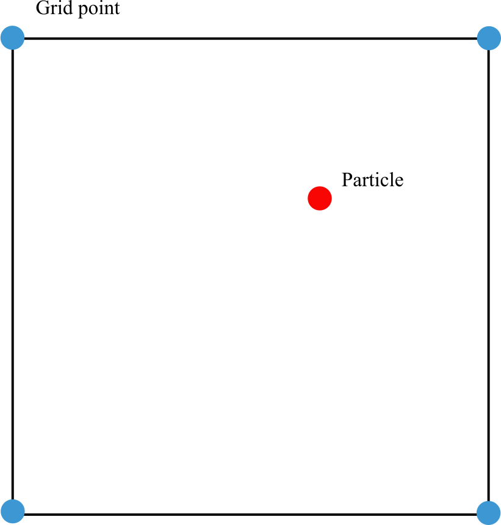</div>

**Quadratic**
<div align=center>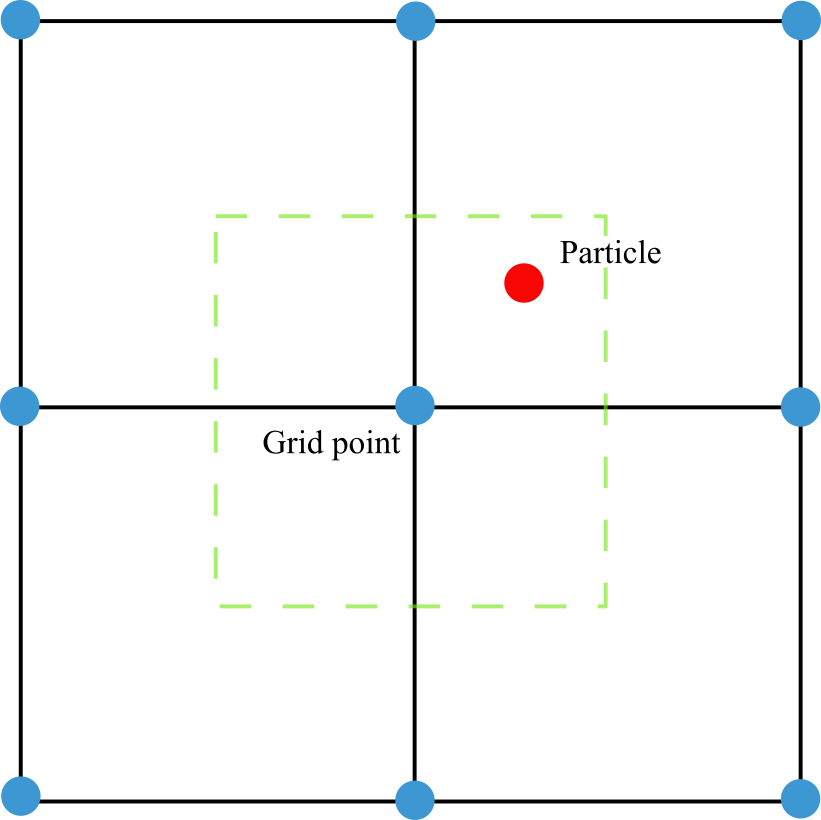</div>

**Cubic**
<div align=center></div>


During P2G and G2P cycle, the velocity is kind of smoothed and energy dissipation occurs.

APIC conserves angular momentum!
**Angular momentum conservation (角动量守恒)**
Angular momentum (角动量): $m\mathbf{r}\times \mathbf{v}$
Moment (力矩): $\mathbf{r}\times\mathbf{F}$
其中$\mathbf{r}$为位置矢量。
角动量守恒条件：合力矩为0
根本在于$\mathbf{F}=m\mathbf{a} \Rightarrow \mathbf{r}\times\mathbf{F}=m\mathbf{r}\times\mathbf{a}$
如果合力矩为0，则速度保持不变，角动量恒定

动量守恒，角动量守恒都源于牛顿第二定律。

合力矩和角动量的关系可以类比合力与动量的关系。


### Material Point Method (MPM)
No elements in MPM.
MPM particles => FEM quadrature points (Gaussian points)
MPM equations are derived using weak formulation.

#### Traditional MPM
Refer to [2016 MPM course](https://www.seas.upenn.edu/~cffjiang/research/mpmcourse/mpmcourse.pdf) for details.

##### Deformation gradient
$\mathbf{X}$: undeformed space.
$\mathbf{x}$: deformed space.
$\phi(\mathbf{X},t)$: deformation map.
Their relationship is denoted with
$$\mathbf{x}=\phi(\mathbf{X},t)$$

For translation: $\mathbf{x}=\mathbf{X}+vt\mathbf{n}$
where $\mathbf{n}$ is the moving direction.
For rotation: $\mathbf{x}=\mathbf{R}\mathbf{X}+\mathbf{b}$
where $\mathbf{R}$ is the rotation matrix.(For 2D cases, $\mathbf{R}=\begin{bmatrix}
  \cos\theta & -\sin\theta\\ \sin\theta & \cos\theta
\end{bmatrix}$)

Deformation gradient:
$$\mathbf{F}=\frac{\partial\phi(\mathbf{X},t)}{\partial\mathbf{X}}=\frac{\partial\mathbf{x}(\mathbf{X},t)}{\partial\mathbf{X}}$$

$$F_{ij}=\frac{\partial\phi_i}{\partial X_j}=\frac{\partial x_i}{\partial X_j},\quad i,j=1,\dots,d$$

For rigid translation: $\mathbf{F}=\mathbf{I}_{d\times d}$.
For rigid rotation: $\mathbf{F}=\mathbf{R}$.

The determinant of $\mathbf{F}$:
$$J=\det(\mathbf{F})$$

This characterizes the infinitesimal volume change and represents the **ratio** of the infinitesimal volume of material in configuration $\Omega^t$ to the original volume in $\Omega^0$.

+ $J=1$ means no volume change during the transformation. For rigid motions (rotations and translations), $J=1$.
+ $J>1$ means volume increase.
+ $J<1$ means volume decrease.
+ $J=0$ means volume becomes 0. In the real world this is impossible while numerically it is possible, eg. the material is so compressed that it becomes a plane or a line or a single volumeless point.
+ $J<0$ means the material is inverted. For a 2D triangle, this means one vertex passes through its opposing edge, resulting in negative area.


##### Push forward and pull back (lagrangian and eulerian function)
==Definition：==
Push forward $\Rightarrow$ Eulerian (function of $\mathbf{x}$)
$$v(\mathbf{x},t)=V(\phi^{-1}(\mathbf{x},t),t)$$

where $v$ is the push forward of $V$.
Pull back $\Rightarrow$ Lagrangian (function of $\mathbf{X}$)
$$V(\mathbf{X},t)=v(\phi(\mathbf{X},t),t)$$

where $V$ is the pull back of $v$.

==Material derivative:==
For a general Eulerian function $f(\cdot,t)$,
$$\frac{D}{Dt}f(\mathbf{x},t)=\frac{\partial f(\mathbf{x},t)}{\partial t}+\frac{\partial f(\mathbf{x},t)}{\partial x_j}v_j(\mathbf{x},t)$$

where Eulerian $\frac{D}{Dt}f(\mathbf{x},t)$ is the push forward of $\frac{\partial F}{\partial t}$ and $F$ is a Lagrangian function.

==Volume and area change:==
Volume:
$$v=JdV$$

where $J=\det(\mathbf{F})$, $v\Rightarrow x$(Eulerian), $V\Rightarrow X$(Lagrangian).
Based on this we have
$$\int_{B^t}g(\mathbf{x})d\mathbf{x}=\int_{B^0}G(\mathbf{X})J(\mathbf{X},t)d\mathbf{X}$$

where $g$ is the push forward of $G$.

Area:
$$d\mathbf{s}=\mathbf{F}^{-T}Jd\mathbf{S}\quad or\quad \mathbf{n}ds=\mathbf{F}^{-T}J\mathbf{N}dS$$

where $s$ and $S$ are tiny areas.
Based on this we have
$$\int_{\partial B^t}h(\mathbf{x},t)\cdot\mathbf{n}(\mathbf{x})ds(\mathbf{x})=\int_{\partial B^0}H(\mathbf{X})\cdot\mathbf{F}^{-T}(\mathbf{X},t)N(\mathbf{X})J(\mathbf{X},t)dS(\mathbf{X})$$


##### Constitutive model
For **hyperelastic** material:
PK1 stress (First Piola-Kirchoff stress) $\mathbf{P}$ can be derived from 
$$\mathbf{P}=\frac{\partial\psi(\mathbf{F})}{\partial\mathbf{F}}$$

where $\psi$ is the elastic energy density function (scalar function) and $\mathbf{F}$ is the deformation gradient.
With index notation,
$$P_{ij}=\frac{\partial\psi}{\partial{F_{ij}}}$$

The Cauchy stress can be obtained from
$$\mathbf{\sigma}=\frac{1}{J}\mathbf{P}\mathbf{F}^T=\frac{1}{\det(\mathbf{F})}\frac{\partial\psi}{\partial\mathbf{F}}\mathbf{F}^T$$

2 common hyperelastic materials: Neo-Hookean and Fixed Corotated.
Refer to [elastic solids](#elastic-solids).

##### Governing equations
Conservation of mass + Conservation of momentum

> Determinant differentiation rule:
> For an invertible matrix $\mathbf{A}$,
> $$\frac{\partial\det(\mathbf{A})}{\partial \mathbf{A}}=\det(\mathbf{A}) \mathbf{A}^{-T}$$
> This leads to the commonly used rule:
> $$\frac{\partial\det(\mathbf{F})}{\partial \mathbf{F}}=\det(\mathbf{F}) \mathbf{F}^{-T}$$

==Weak form of force balance==
Mainly based on conservation of momentum.
(Actually momentum theorem rather than conservation).
$$m\Delta\mathbf{v}=\mathbf{F}\Delta t\Leftrightarrow \frac{m\Delta\mathbf{v}}{\Delta t}=\mathbf{F}$$
Lagrangian view:
$$\int_{\Omega^0}Q_i(\mathbf{X},t)R(\mathbf{X},0)A_i(\mathbf{X},t)d\mathbf{X}=\int_{\partial\Omega^0}Q_iT_ids(\mathbf{X})-\int_{\Omega^0}Q_{i,j}P_{ij}d\mathbf{X}$$

Eulerian view:
$$\int_{\Omega^t}q_i(\mathbf{x},t)\rho(\mathbf{x},t)a_i(\mathbf{x},t)d\mathbf{x}=\int_{\partial\Omega^t}q_it_ids(\mathbf{x})-\int_{\Omega^t}q_{i,k}\sigma_{ik}d\mathbf{x}$$

Here $i,j,k$ are component index for dimensions, $t_i$ is the $i$ component of boundary force $\mathbf{t}$. 
LHS (left-hand side) is some kind of momentum change rate over time while RHS is some kind of net force ignoring the external force.

##### Material particles
Momentum and mass are transfered between grid and particle through interpolation function.
Index notation:
Particle $\qquad\Leftrightarrow\qquad$ $p$
Grid $\qquad\Leftrightarrow\qquad$ $i$

###### Interpolation function
The interpolation function is defined over the Eulerian grid rather than on the material particles like the kernel of SPH particles.
$$w_{ip}=N_\mathbf{i}(\mathbf{x}_p)=N(\frac{1}{h}(x_p-x_i))N(\frac{1}{h}(y_p-y_i))N(\frac{1}{h}(z_p-z_i))$$

$$\nabla w_{ip}=\nabla N_{\mathbf{i}}(\mathbf{x}_p)=
\begin{pmatrix}
  \frac{1}{h}N'(\frac{1}{h}(x_p-x_i))N(\frac{1}{h}(y_p-y_i))N(\frac{1}{h}(z_p-z_i))\\
  N(\frac{1}{h}(x_p-x_i))\frac{1}{h}N'(\frac{1}{h}(y_p-y_i))N(\frac{1}{h}(z_p-z_i))\\
  N(\frac{1}{h}(x_p-x_i))N(\frac{1}{h}(y_p-y_i))\frac{1}{h}N'(\frac{1}{h}(z_p-z_i))\\
\end{pmatrix}$$

Refer to [interpolation function](#interpolation-function-kernel) for plots of linear/quadratic/cubic functions.

###### Lagrangian/Eulerian mass
P2G mass transfer:
$$m_i=\sum_p m_p N_i(\mathbf{x}_p)$$

This ensures the conservation of mass through the partition of unity assumption on interpolation function $\sum_i N_i(\mathbf{x}_p)=1$:
$$\sum_i m_i = \sum_i\sum_p m_p N_i(\mathbf{x}_p) = \sum_p m_p \sum_i N_i(\mathbf{x}_p) = \sum_p m_p$$

No G2P mass transfer since the particle mass never changes.
###### Lagrangian/Eulerian momentum
P2G momentum transfer:
$$\begin{aligned}
  (m\mathbf{v})_i &= \sum_p m_p \mathbf{v}_p N_i(\mathbf{x}_p)\\
  \mathbf{v}_i &= \frac{(m\mathbf{v})_i}{m_i}
\end{aligned}$$

Since $\sum_i m\mathbf{v}_i = \sum_i(m\mathbf{v})_i=\sum_p\sum_i m_p \mathbf{v}_p N_i(\mathbf{x}_p)=\sum_p m_p \mathbf{v}_p$, momentum is conserved in P2G transfer.

G2P velocity transfer:
Since particle mass keeps unchanged, only velocity is transfered in G2P rather than momentum.
$$\mathbf{v}_p = \sum_i\mathbf{v}_iN_i(\mathbf{x}_p)$$

Since $\sum_p m_p\mathbf{v}_p=\sum_p m_p\sum_i\mathbf{v}_iN_i(\mathbf{x}_p) = \sum_i\mathbf{v}_i\sum_pm_pN_i(\mathbf{x}_p)=\sum_i m_i \mathbf{v}_i$, momentum is conserved in G2P transfer.
> Note:pig:: Unlike mass, total momentum keeps changing in the system. This is achieved in Grid operations through introducing impulse. Details will be given later.

##### Discretization
In this part, $i,j,k$ denote grid nodes, $\alpha,\beta,\gamma$ denote dimensional components. 
For instance, $q_{i\alpha}$ means the $\alpha$ component of the vector quantity $\mathbf{q}$ that is stored at node $i$.
###### Discrete time
By introducing $a_{\alpha}(\mathbf{x},t^n)=\frac{1}{\Delta t}(v_\alpha^{n+1}(\mathbf{x})-v_\alpha^n(\mathbf{x}))$ into the [weak form governing equation](#governing-equations), we have
$$\begin{aligned}
  &\frac{1}{\Delta t}\int_{\Omega^{t^n}} q_\alpha(\mathbf{x},t^n)\rho(\mathbf{x},t^n)(v_\alpha^{n+1}(\mathbf{x})-v_\alpha^n(\mathbf{x}))d\mathbf{x}\\&=\int_{\partial\Omega^{t^n}}q_\alpha(\mathbf{x},t^n)t_\alpha(\mathbf{x},t^n)ds(\mathbf{x})-\int_{\Omega^{t^n}}q_{\alpha,\beta}(\mathbf{x},t^n)\sigma_{\alpha\beta}(\mathbf{x},t^n)d\mathbf{x}
\end{aligned}$$

###### Discrete space
Further discretize the [weak form force balance equation](#discrete-time) over space, we have 
$$\frac{((mv)_{i\alpha}^{n+1}-(mv)_{i\alpha}^{n})}{\Delta t}=\int_{\partial\Omega^{t^n}}N_i(\mathbf{x})t_\alpha(\mathbf{x},t^n)ds(\mathbf{x})-\int_{\Omega^{t^n}}N_{i,\beta}(\mathbf{x})\sigma_{\alpha\beta}(\mathbf{x},t^n)d\mathbf{x}$$

Assuming we have an estimate of the Cauchy stress $\mathbf{\sigma}_p^n=\mathbf{\sigma}(\mathbf{x}_p^n,t^n)$ at each Lagrangian particle $\mathbf{x}_p^n$, force on the Eulerian grid node $i$ can be written as
$$\int_{\Omega^{t^n}}N_{i,\beta}(\mathbf{x})\sigma_{\alpha\beta}(\mathbf{x},t^n)d\mathbf{x}\approx\sum_p\sigma_{p\,\alpha\beta}^nN_{i,\beta}(\mathbf{x}_p^n)V_p^n$$

where $V_p^n$ is the volume particle $p$ occupied at time $t^n$.

###### Estimating volume
There are mainly 2 methods to estimate.
+ Estimation based on grid density
  $$\begin{aligned}
    &m_p\approx R(\mathbf{X}_p,0)V_p^0\approx \rho(\mathbf{x}_p^n,t^n)V_p^n\\
    &\rho(\mathbf{x}_p^n,t^n)\approx\sum_i\rho_i^nN_i(\mathbf{x}_p^n)\\
    &\rho_i^n=\frac{m_i^n}{\Delta x^d}\\
  \end{aligned}
  $$

  where $\Delta x$ is the size of each Eulerian grid and $d$ is the dimension. 
  Since grid density is easy to compute, the volume can be estimated
  $$V_p^n\approx\frac{m_p}{\rho(\mathbf{x}_p^n,t^n)}\approx\frac{m_p}{\sum_i\frac{m_i^n}{\Delta x^d}N_i(\mathbf{x}_p^n)}=\frac{m_p\Delta x^d}{\sum_i m_i^n N_i(\mathbf{x}_p^n)}$$

+ Estimation based on deformation gradient
  Typically we have
  $$V_p^n \approx J_p^n V_p^0$$

  where $J_p^n = \det(\mathbf{F}_p^n)$.

Baed on the second method and substituting Cauchy stress $\boldsymbol{\sigma}$ with $\frac{1}{J}\mathbf{P}\mathbf{F}^T$, the [force on the Eulerian grid node $i$](#discrete-space) can be further rewritten as
$$\sum_p\sigma_{p\,\alpha\beta}^n N_{i,\beta}(\mathbf{x}_p^n)V_p^n=\sum_p\frac{1}{J_p^n}P_{p\,\alpha\gamma}^n F_{p\,\beta\gamma}^n N_{i,\beta}(\mathbf{x}_p^n)V_p^0J_p^n=\sum_p P_{p\,\alpha\gamma}^n F_{p\,\beta\gamma}^n N_{i,\beta}(\mathbf{x}_p^n)V_p^0$$

Now the discretized weak form force balance equation can be written as
$$\frac{((mv)_{i\alpha}^{n+1}-(mv)_{i\alpha}^{n})}{\Delta t}=\int_{\partial\Omega^{t^n}}N_i(\mathbf{x})t_\alpha(\mathbf{x},t^n)ds(\mathbf{x})-\sum_p P_{p\,\alpha\gamma}^n F_{p\,\beta\gamma}^n N_{i,\beta}(\mathbf{x}_p^n)V_p^0$$

> Note: Different constitutive models are introduced to the scheme by expressing the PK1 stress $\mathbf{P}$ in different ways. 
> In computer graphics, **hyperelastic** material is preferred since it has a well defined potential energy $\psi$ and the PK1 stress can be easily computed as $\mathbf{P}=\frac{\partial\psi}{\partial\mathbf{F}}$.

###### Deformation gradient evolution
$$\begin{aligned}
  &\frac{\partial}{\partial t}\mathbf{F}(\mathbf{X}_p,t^{n+1})\approx\frac{\mathbf{F}_p^{n+1}-\mathbf{F}_p^n}{\Delta t}\\
  &\mathbf{F}_p^{n+1}=\mathbf{F}_p^n+\Delta t \frac{\partial}{\partial t}\mathbf{F}(\mathbf{X}_p,t^{n+1})
\end{aligned}$$

where $\mathbf{F}(\mathbf{X}_p,t^{n+1})$ is simplified as $\mathbf{F}_p^{n+1}$.
Also we have
$$\begin{aligned}
  &\frac{\partial}{\partial t}\mathbf{F}(\mathbf{X},t^{n+1})=\frac{\partial\mathbf{V}}{\partial\mathbf{X}}(\mathbf{X},t^{n+1})=\frac{\partial \mathbf{v}^{n+1}(\mathbf{x})}{\partial\mathbf{x}}\mathbf{F}(\mathbf{X},t^n)\\
  &\mathbf{v}^{n+1}(\mathbf{x})=\sum_i \mathbf{v}_i^{n+1}N_i(\mathbf{x})\\
  &\frac{\partial \mathbf{v}^{n+1}(\mathbf{x})}{\partial\mathbf{x}}=\sum_i \mathbf{v}_i^{n+1}(\frac{\partial N_i(\mathbf{x})}{\partial\mathbf{x}})^T
\end{aligned}$$

Combining them together we have
$$\mathbf{F}_p^{n+1}=(\mathbf{I}+\Delta t\sum_i \mathbf{v}_i^{n+1}(\frac{\partial N_i(\mathbf{x}_p^n)}{\partial\mathbf{x}})^T)\mathbf{F}_p^n$$

Based on this, $\mathbf{F}_p^{n+1}$ can be obtained given $\mathbf{v}_i^{n+1}$ and $\mathbf{F}_p^n$ at each particle.

###### Forces as energy gradient
[Force on the Eulerian grid node](#estimating-volume) (derived from weak form governing equation) can also be derived from energy gradient for hyperelastic material.

##### Explicit time integration scheme
+ Particle to grid (P2G)
  + $(m\mathbf{v})_i^{n+1}=\sum_pw_{ip}(m_p\mathbf{v}_p^n+\mathbf{B}_p(\mathbf{D}_p)^{-1}(\mathbf{x}_i-\mathbf{x}_p))$ (**Grid momentum**)
    > This is from APIC.
    > $$\begin{aligned}\mathbf{C}_p &= \mathbf{B}_p (\mathbf{D}_p)^{-1}\\\mathbf{D}_p &= \sum_i w_{ip} (\mathbf{x}_i-\mathbf{x}_p)(\mathbf{x}_i-\mathbf{x}_p)^T\\ \mathbf{B}_p &= \sum_i w_{ip} \mathbf{v}_i (\mathbf{x}_i-\mathbf{x}_p)^T  \end{aligned}$$
    >
    > For quadratic kernel, $\mathbf{D}_p=\frac{\Delta x^2}{4}\mathbf{I}$ and $\mathbf{C}_p=\frac{4}{{\Delta x}^2}\sum_i w_{ip} \mathbf{v}_i (\mathbf{x}_i-\mathbf{x}_p)^T$;
    > For cubic kernel, $\mathbf{D}_p=\frac{\Delta x^2}{3}\mathbf{I}$ and $\mathbf{C}_p=\frac{3}{{\Delta x}^2}\sum_i w_{ip} \mathbf{v}_i (\mathbf{x}_i-\mathbf{x}_p)^T$;
    > For linear kernel, $\mathbf{C}_p=\sum_i\mathbf{v}_i(\frac{\partial N_i}{\partial\mathbf{x}}(\mathbf{x}_p))^T=\sum_i\mathbf{v}_i(\nabla w_{ip})^T$
  + $m_i^{n+1}=\sum_p m_p w_{ip}$ (**Grid mass**)
+ Grid operations
  + $\hat\mathbf{v}_i^{n+1}=\frac{(m\mathbf{v})_i^{n+1}}{m_i}$ (**Grid velocity**)
  + Only label the grid nodes with nonzero masses as solver unknowns. (**Identify grid DOF**)
  + $\mathbf{f}_i^n=-\sum_p \mathbf{P}_p^n {\mathbf{F}_p^n}^T \nabla w_{ip}^n V_p^0$ or $\mathbf{f}_i^n=-\sum_p\boldsymbol{\sigma}_p^n \nabla w_{ip}^n V_p^n$ (**Compute grid forces**)
    > The 2 formulas can be transferred via $\boldsymbol{\sigma}=\frac{1}{J}\mathbf{P}\mathbf{F}^T$ and $V_p^n=JV_p^0$.
    > For hyperelastic material, $\mathbf{P}$ is easily obtained by $\mathbf{P}=\frac{\partial\psi_p}{\partial\mathbf{F}_p}$ thus the 1st formula is used.
  + $\mathbf{v}_i^{n+1}=\hat\mathbf{v}_i^{n+1}+\Delta t\frac{\mathbf{f}    _i^n}{m_i}$ (**Grid velocity update**)
    > Boundary conditions and collision objects are also taken into account in this part.
+ Grid to particle (G2P)
  + $\mathbf{F}_p^{n+1}=(\mathbf{I}+\Delta t\sum_i \mathbf{v}_i^{n+1}(\nabla w_{ip}^n)^T)\mathbf{F}_p^n$ (**Particle deformation gradient update**)
    > Gradient of interpolation function is needed here. $\nabla w_{ip} = \frac{\partial N_i(\mathbf{x}_p)}{\partial\mathbf{x}}$ is a $d$ dimensional vector.
  + $\mathbf{D}_p = \sum_i w_{ip} (\mathbf{x}_i-\mathbf{x}_p)(\mathbf{x}_i-\mathbf{x}_p)^T$ and $\mathbf{B}_p = \sum_i w_{ip} \mathbf{v}_i (\mathbf{x}_i-\mathbf{x}_p)^T$
    > Actually this is $\mathbf{C}_p = \mathbf{B}_p (\mathbf{D}_p)^{-1}$ update.
  + $\mathbf{v}_p^{n+1}=\sum_i w_{ip}\mathbf{v}_i^{n+1}$ (**Particle velocity update**)
  + $\mathbf{x}_p^{n+1}=\mathbf{x}_p^n+\Delta t \mathbf{v}_p^{n+1}$ (**Particle advection**)

##### Implicit time integration
The main difference from explicit scheme lies in the **grid velocity update** step.
+ In explicit:
  $\mathbf{v}_i^{n+1}=\hat\mathbf{v}_i^{n+1}+\Delta t\frac{\mathbf{f} _i(\mathbf{x}_i^n)}{m_i}$
+ In implicit:
  $\mathbf{v}_i^{n+1}=\hat\mathbf{v}_i^{n+1}+\Delta t\frac{\mathbf{f}  _i(\mathbf{x}_i^{n+1})}{m_i}$
  > Force is implicitly dependent on grid motion thus the grid velocity cannot be updated directly (backward Euler system).

  With the aid of the equation of motion 
  $$\mathbf{h}(\mathbf{v}^{n+1})=\mathbf{M}\mathbf{v}^{n+1}-\mathbf{M}\mathbf{v}^n-\Delta t\mathbf{f}_i(\mathbf{x}^n+\Delta t\mathbf{v}^{n+1})=\mathbf{0}$$
  
  the updated grid velocity can be computed with Newton-Raphson iteration method
  $$\mathbf{v}^{(i+1)}=\mathbf{v}^{(i)}-(\frac{\partial\mathbf{h}}{\partial\mathbf{v}}(\mathbf{v}^{(i)}))^{-1}\mathbf{h}(\mathbf{v}^{(i)})$$
  > where $(i)$ denotes the $i$ th iteration step rather than grid node. At each step, $\mathbf{F}_p$ should also be updated. Usually only one iteration step is taken.

Solving this eqation with NR method is equivalent to minimizing the following objective function:
$$E(\mathbf{v}_i)=\sum_i\frac{1}{2}m_i\|\mathbf{v}_i-\mathbf{v}_i^n\|^2+e(\mathbf{x}_i^n+\Delta t \mathbf{v}_i)$$

Transfering the problem to an optimization problem enables a **larger time step**. This can occur only when the forces can be derived from a potential energy function and the details are omitted here.  

##### Collison objects
The collison is enforced on grid node velocity immediately after forces are applied to grid velocities.
collison detection + relative velocity computation

##### Lagrangian forces
$$\mathbf{f}=-\frac{\partial U}{\partial \mathbf{x}}$$

where $U$ is the total energy.

#### MLS-MPM (Moving Least Squares MPM)
Refer to [MLS-MPM](https://www.seas.upenn.edu/~cffjiang/research/mlsmpm/hu2018mlsmpm.pdf) for details.
Using MLS shape function in MPM
Easier to implement than traditional MPM since velocity gradient is approximated with affine matrix.
Based on APIC.
> ti example mpm88/99/128

$i$ => grid node, $p$ => particle

##### :ghost: PIC
+ Particle to grid (P2G)
  + $(m\mathbf{v})_i^{n+1}=\sum_p w_{ip} m_p \mathbf{v}_p^n$
  + $m_i^{n+1}=\sum_p m_p w_{ip}$
+ Grid operations
  + $\mathbf{v}_i^{n+1}=\frac{(m\mathbf{v})_i^{n+1}}{m_i^{n+1}}$
+ Grid to particle (G2P)
  + $\mathbf{v}_p^{n+1}=\sum_i w_{ip}\mathbf{v}_i^{n+1}$
  + $\mathbf{x}_p^{n+1}=\mathbf{x}_p^n+\Delta t \mathbf{v}_p^{n+1}$


##### :ghost: APIC

The main difference lies in the fact that in G2P, more information (velocity gradient matrix $\boldsymbol{C}_p$) is transfered.
==Particle velocity gradient $C_p$:== the formula of it here is based on **quadratic** B-Spline kernel function. For Cubic or other kernels, the expression is different.
> **How to derive $\mathbf{C}_p$??**
$$
\begin{aligned}
  \mathbf{C}_p &= \mathbf{B}_p (\mathbf{D}_p)^{-1}\\
  \mathbf{D}_p &= \sum_i \omega_{ip} (\mathbf{x}_i-\mathbf{x}_p)(\mathbf{x}_i-\mathbf{x}_p)^T\\
  \mathbf{B}_p &= \sum_i \omega_{ip} \mathbf{v}_i (\mathbf{x}_i-\mathbf{x}_p)^T
\end{aligned}
$$
>
> Among these equations, $i$ represents grid node and $p$ represents particle. For **quadratic** kernel funciton(interpolation stencil), $\mathbf{D}_p=\frac{\Delta x^2}{4}\mathbf{I}$ and for **cubic**, $\mathbf{D}_p=\frac{\Delta x^2}{3}\mathbf{I}$ where $\Delta x$ is the size of the grid. The detailed derivation is omitted here.

==Incompressible:== 常密度假定，即忽略内能变化，能量守恒表现为动能+势能守恒

##### :ghost: MLS-MPM


> In P2G, $\boldsymbol{P}(\boldsymbol{F}_p^{n+1})=\frac{\partial\boldsymbol{\psi}}{\partial\bold{F}}$ refers to PK1 stress tensor of the specific constitutive model. For hyperelastic models with a well-defined potential energy density function, this is easy to get.

> For MLS-MPM, the main difficulty lies in P2G where Grid momentum is hard to obtain considering constitutive model.

> Comparing with traditional MPM, the main contribution is the unification of the affine matrix and velocity gradient. ($\mathbf{C}_p \approx \nabla \mathbf{v}_p$)

**How to derive grid momentum:**

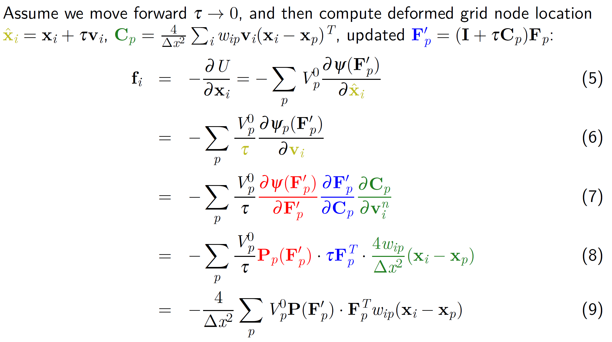

**How to employ a different material???**
Substitute different forms of PK1 stress $\mathbf{P}(\mathbf{F})$.


Enforcing boundary conditions (BC) on grid velocity:
+ Sticky: $\boldsymbol{v}_i^{n+1}=\boldsymbol{0}$
+ Slip: $\boldsymbol{v}_i^{n+1}=\hat\boldsymbol{v}_i^{n+1}-\boldsymbol{n}(\boldsymbol{n}^T\hat\boldsymbol{v}_i^{n+1})$
+ Separate: $\boldsymbol{v}_i^{n+1}=\hat\boldsymbol{v}_i^{n+1}-\boldsymbol{n}\cdot\min(\boldsymbol{n}^T\hat\boldsymbol{v}_i^{n+1},0)$

> For boundary condition enforcement:
> For PIC/APIC, when applying BC to a cube moving in x direction, the cube composed of particles will be compressed without moving in y direction.
> For MLS-MPM however, the cube will collapse and move in y direction once impeded in x direction. This mainly results from the deformation gradient and constitutive model??

#### Constitutive Models
+ Fluid: Equation-of-States (EOS)
+ Elastoplastic objects (snow, sand etc.): Yield criteria
+ PK1 stress ...

##### Elastic solids
PK1 stresses of hyperelastic models:
+ Neo-Hookean
+ (Fixed) Corotated

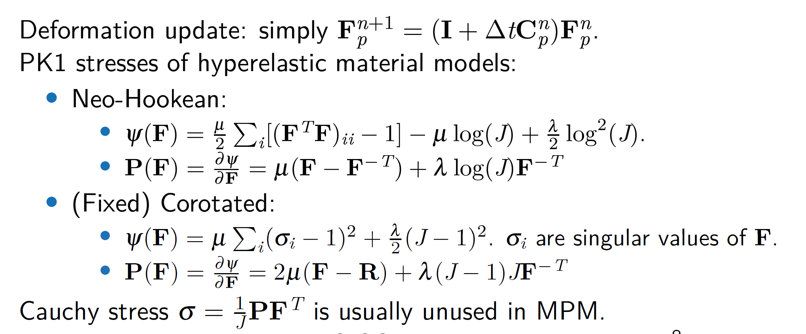
> $\mathbf{F}=\mathbf{R}\mathbf{S}$ is the polar decomposition of $\mathbf{F}$ ($\mathbf{R}$ a rotation matrix and $\mathbf{S}$ symmetric). 
> Since $\mathbf{F}=\mathbf{U}\boldsymbol{\Sigma}\mathbf{V}^T=\mathbf{U}\mathbf{V}^T\mathbf{V}\boldsymbol{\Sigma}\mathbf{V}^T$, we can simply get $\mathbf{R}=\mathbf{U}\mathbf{V}^T$ and $\mathbf{S}=\mathbf{V}\boldsymbol{\Sigma}\mathbf{V}^T$.

For more information, refer to [2016 MPM course](https://www.seas.upenn.edu/~cffjiang/research/mpmcourse/mpmcourse.pdf) given by Jiang etc.

##### Weakly compressible fluids


##### Elastoplastic solids

We can also refer to snow paper.


##### Singular value decomposition (SVD)
Every real matrix $M_{n\times m}$ can be decomposed into $M_{n\times m}=U_{n\times n}\Sigma_{n\times m}V_{m\times m}^T$
U,V => rotation
$\Sigma$ => streching

Diagonal entries $\sigma_{i}=\Sigma_{ii}$ are called singular values.


#### Lagrangian forces in MPM
Treat MPM particles as FEM vertices, and use FEM potential energy model. A triangular mesh is needed.
> ti example mpm_lagrangian_forces

#### Introducing Taichi "field"
New feature in 0.6.22
Use "field" instead of "tensor" since Taichi v0.6.22.
ti.tensor, ti.var are deprecated with "field".

ti.var => ti.field(dtype=f32, shape=[]) -> a[None]
ti.tensor => ti.field(dtype=f32, shape=[256,256])


"field" refers to global variable.
ti.Vector.field
ti.Matrix.field

#### MPM Extension
Refer to [MPM course](https://www.seas.upenn.edu/~cffjiang/research/mpmcourse/mpmcourse.pdf) and [MLS-MPM](https://www.seas.upenn.edu/~cffjiang/research/mlsmpm/hu2018mlsmpm.pdf).

Dirichlet boundary (第一类边界条件): 边界上待求变量值已知
Neumann boundary (第二类边界条件/自然边界条件): 边界上待求变量外法线方向导数确定

Key contribution: MLS-MPM uses MLS shape functions.

Signed distance function (SDF): this function is used to perform inside/outside queries. Different shapes usually have different SDFs.
For the SDF of any point,  its sign represents the point's relative location and its return value should be the shortest distance between the shape and the given point.

#### Moving least squares method (MLS)
Refer to [LS-WLS-MLS](https://www.docin.com/p-271196866.html).
To reconstruct a field based on discrete point cloud.
##### Least squares (LS)
> Global approximation. Each sample point is treated equally.

Objective function
$$\min_{f\in\prod^d_m}\sum_i \|f(\mathbf{x}_i)-f_i\|^2$$

where $d$ refers to dimension, $m$ refers to degree of the polynomial space, $\mathbf{x}_i$ is the sampling points with given function value $f_i$.
$$f(\mathbf{x})=\mathbf{b}(\mathbf{x})^T\mathbf{c}$$

The key point is to compute the coefficients vector $\mathbf{c}$.

##### Weighted least squares (WLS)
> Global approximation based on local approximation and weighted summation.

Objective function:
$$\min_{f\in\prod^d_m}\sum_i \theta(\|\bar\mathbf{x}-\mathbf{x}_i\|)\|f(\mathbf{x}_i)-f_i\|^2$$

where $\bar\mathbf{x}$ is a given point, $\theta(\|\bar\mathbf{x}-\mathbf{x}_i\|)$ is a weight function centered at $\bar\mathbf{x}$. The output optimal function is
$$f_{\bar\mathbf{x}}(\mathbf{x})=\mathbf{b}(\mathbf{x}-\bar\mathbf{x})^T\mathbf{c}(\bar\mathbf{x})$$

This approximates the function at the domain around given point $\bar\mathbf{x}$ and thus is a local approximation.
For totally $n$ sample points with known values, the global approximation can be expressed as 
$$f(\mathbf{x}) = \sum_{j=1}^n\varphi_j(\mathbf{x})f_{\bar\mathbf{x}}(\mathbf{x}) = \sum_{j=1}^n\varphi_j(\mathbf{x})\mathbf{b}(\mathbf{x}-\bar\mathbf{x}_j)^T\mathbf{c}(\bar\mathbf{x}_j)$$

where $\varphi_j(\mathbf{x})=\frac{\theta_j(\mathbf{x})}{\sum_{k=1}^n\theta_k(\mathbf{x})}$ is the global weight function which ensures Partition of Unity (PU) $\sum_{j=1}^n\varphi_j(\mathbf{x})=1$ at any point $\mathbf{x}$ of the global domain $\Omega$.

##### Moving least squares (MLS)
> Local approximation base on WLS. 
> The global approximation is not a single function, but **a list of** local approximation functions based on WLS.

$$f(\mathbf{x})=f_\mathbf{x}(\mathbf{x})$$
> For each point $\mathbf{x}$, a local WLS approximation centered at $\mathbf{x}$ is implemented to get its function value. As the point **moves** over the entire domain $\Omega$, the global approximation is obtained.

#### CPIC (Compatible PIC)
CPIC is designed to deal with rigid body cutting (Displacement discontinuity) and two-way rigid body coupling. Refer to [MLS-MPM](https://www.seas.upenn.edu/~cffjiang/research/mlsmpm/hu2018mlsmpm.pdf) for details.
"Compatible": particle and its surrounding grid node at the same side of the the same rigid body.

1. Grid-wise colored distance field (CDF)
   > Need to capture
   $d_i$: valid distance between grid node and rigid surface; 
   $A_{ir}$: tag denotes whether there is valid distance between grid and rigid surface (=1: yes; =0: no); 
   $T_{ir}$: tag denotes which side of the rigid surface the gird is on (= +/-).
2. Particle-wise colored distance field (based on grid CDF)
   > Particle penalty force occurs. (not sure, maybe in step 6)
3. CPIC P2G transfer
   > Only the information of compatible particles is transferred to grid.
4. Grid operation (apply overall BC)
5. CPIC G2P transfer 
   > Need to compute ghost velocity for incompatible grid nodes (impulse from rigid body to particle, projection is needed.)
6. Rigid body advection
   > Impulse from particle to rigid body (Two-way coupling is thus achieved.)

The following is a snapshot of a MLS-MPM [program](mpm_cutting_thin.py) (CPIC) where a block is cut by a thin plane.
> :ghost: Rigid body impulse and penalty force are not considered.

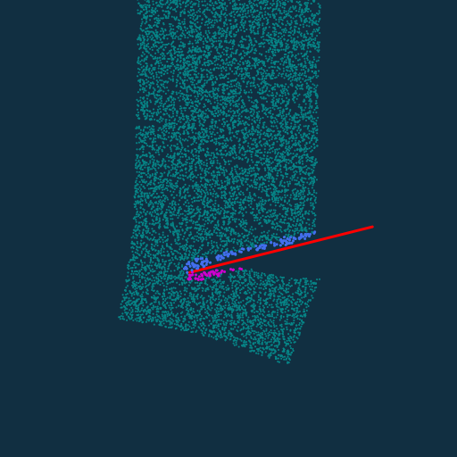


The following is a snapshot of a CPIC [program](mpm_cutting_rotation.py) about a rotating fan.
> :ghost: No penalty force is considered thus some particles can penetrate the blades.
> **Angular momentum theorem** is employed to simulate the rigid body rotation with the accumulated impulse from the particles to the closest rigid bodies. 


The rotation fan case in [MLS-MPM paper](2018_mlsmpm.pdf).


#### MPM-DEM Coupling


## High performance physical simulation
+ Performance from algorithmic improvement (do less work)
+ Performance from low-level programming (do work faster)

### Hardware Architecture
#### Background
CPU (=> Page Table & TLB) => L1 Cache(32K) => L2 Cache(256K) => L3 Cache(2M) => Pysical Memory
Latency(延迟)
Each CPU core has its own L1, L2 Cache while shares L3 Cache.
I/O of L1 is faster than L2 and L2 faster than L3.

#### Locality
+ Spatial locality: try to access spatially neighboring data in main memory
+ Temporal locality: reuse the data as much as you can
+ Shrink the working set, so the data resides in lower-level momory

Cachelines
Caches
CPU $\mu$Arch: Float-Point Units
+,-,* is faster than /.

CPU/GPU


### Advanced Taichi Programming
#### Structural Nodes (SNodes)

**Dense SNode**
```py
# i means x direction and j means y direction
x = ti.field(dtype = ti.i32)
ti.root.dense(ti.i,4).place(x)
ti.root.dense(ti.ij,(4,2)).place(x) <=> ti.root.dense(ti.i,4).dense(ti.j,2).place(x)
```

## THE END
Simplicity is good. Complexity is bad.

How to solve a problem is much harder than just used a given approach to solve something.

To make things simple is much harder than make it complex.

MGPCG(multigrid preconditioned conjugate gradient)
Solver for $Ax=b$

Learning for simulation?
Simulation for learning!

