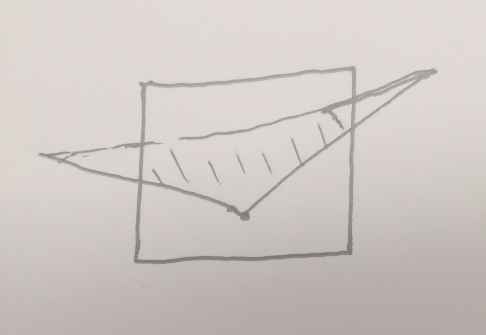
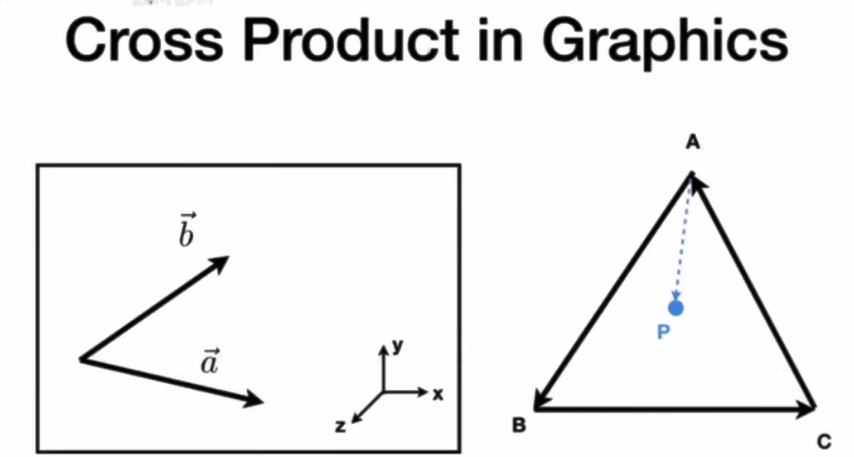
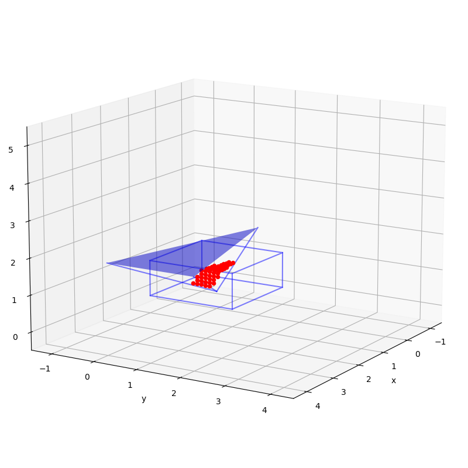

## 总体思路
三角形相对于原点，先假定各个面均无限大，计算其在5个面上各自的三个投影点，筛选出真实存在投影的面，利用三角形光栅化方法计算其覆盖的点，利用边界筛选出真实的投影点，组合计算辐射角系数。

该方法光栅化筛选范围很大，效率较低，如何优化？

## 投影点计算
假定各个面均无限大
+ 计算在各个面的投影点 （线面交点）
  空间中平面表示为$(\boldsymbol{p}-\boldsymbol{p_0})\cdot\boldsymbol{n}=0$
  其中$\boldsymbol{p}$为平面内任意一点，$\boldsymbol{p_0}$为平面内某已知点，$\boldsymbol{n}$为平面法向量。
  空间内直线表示为$\boldsymbol{p}=\boldsymbol{l_0}+\boldsymbol{l}t$
  其中$\boldsymbol{p}$为直线上任意一点，$\boldsymbol{l_0}$为直线所经过的已知点，$\boldsymbol{l}$为直线的方向向量，$t$为任意实数。
  联立两方程可得
  $$t = \frac{(\boldsymbol{p_0}-\boldsymbol{l_0})\cdot\boldsymbol{n}}{\boldsymbol{l}\cdot\boldsymbol{n}}$$

  若$\boldsymbol{l}\cdot\boldsymbol{n}=0$，则直线与平面平行，此时若$(\boldsymbol{p_0}-\boldsymbol{l_0})\cdot\boldsymbol{n}=0$，则直线在平面内，否则直线与平面没有交点。
  若$\boldsymbol{l}\cdot\boldsymbol{n}\neq0$，则直线与平面有唯一交点，表示为
  $$\boldsymbol{l_0}+\boldsymbol{l}t$$

+ 计算合法的投影面
  三角形各点与三角形连线，分别计算三条线与各个面的交点。平行于面即与面无交点或者交点z坐标为负值的情况对应的点为非法点，此时将该点向合法点方向移动一定距离再投影即可得合法交点。（移动投影所得交点一定要保证在矩形面外部以利于下一步光栅化）
  合法点为存在投影点且投影点z坐标非负的点。（即使三个交点均不在矩形面内也可能存在投影区域）。
  在做平移投影时，所得新投影点需要在矩形平面外且z坐标非负。（可能需要迭代，z坐标为负时需要增大alpha，在矩形内时需要减小alpha）
  为了避免投影三角形穿过矩形两条对边而导致包围区域不完全的情况（如图），对于侧面，应保证投影点z值大于1，对于顶面，alpha应取较小值（0.1）以规避该情况。对于投影面较小的情况无需此项考虑。

  分为无非法点，1个非法点，2个非法点，3个非法点4种情况。
  + 无非法点
    获得3个合法交点，直接进行光栅化。
  + 1个非法点
    该非法点向2个合法点方向分别平移求投影，得到4个交点
  + 2个非法点
    2个非法点均平移投影，得到3个交点
  + 3个非法点
    不计算投影
  
  存储各个交点坐标。（2个合法点对应4个交点，1个和3个均对应3个交点，0个合法点不存在投影）

## 光栅化
利用包围盒与判定点在三角形内方法筛选点，同时利用边界去掉多余点。
+ 包围盒计算
  需要求两个矩形的交集
  需要将坐标值转换为对应index（即求出给定坐标点位于哪个网格内）（可否优化减小包围盒面积？）
+ 光栅化
  遍历包围盒内所有点，根据外积的符号一致性判断点是否在投影区域内

$\overrightarrow{AB}\times\overrightarrow{AP}\qquad\overrightarrow{BC}\times\overrightarrow{BP}\qquad\overrightarrow{CA}\times\overrightarrow{CP}$
如果以上三项同号，说明点P同时在三条边的左侧/右侧，即点P在$\Delta ABC$内部，否则即在外部。该方法同样适用于凸多边形。
最终程序为[projection.py](projection.py),效果图为

