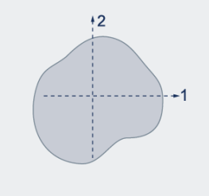
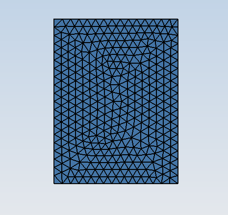
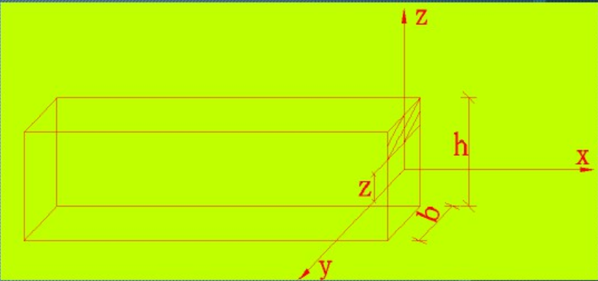

 
### 面积计算
将所画任意截面进行三角形网格剖分，所得网格文件包含各三角形定点坐标。计算各三角形面积之和即可。
其中单个三角形面积计算如下：
假设三角形三个顶点分别为$(x_1,y_1),(x_2,y_2),(x_3,y_3)$，则相邻两条边对应向量可以表示为：
$$
\begin{aligned}
  \boldsymbol{a}&=(x_1-x_2,y_1-y_2)=(x_a,y_a)\\
  \boldsymbol{b}&=(x_1-x_3,y_1-y_3)=(x_b,y_b)\\
\end{aligned}
$$

该三角形面积为：
$$
\begin{aligned}
    A&=\frac{1}{2}\|\boldsymbol{a}\times\boldsymbol{b}\|\\
    &=\frac{1}{2}|x_ay_b-x_by_a|
\end{aligned}
$$

> 实际也可以由Jocabbi行列式得到，对于三角形$|J|=2A$.

### 形心计算
任意截面形心在默认坐标系下的坐标为$(s_x,s_y)$,其对两坐标轴静矩为$S_x,S_y$，则有
$$
\begin{aligned}
    S_x &= \int_A y\, dA = \sum_{i=1}^n y_iA_i\\
    S_y &= \int_A x\, dA = \sum_{i=1}^n x_iA_i\\
\end{aligned}
$$

其中$n$为三角形数目，$(x_i,y_i)$为第$i$个三角形中心的坐标，$A_i$为其面积。
该截面的整体形心坐标$(x_c,y_c)$为
$$
\begin{aligned}
    x_c &= \frac{S_x}{A}\\
    y_c &= \frac{S_y}{A}\\
\end{aligned}
$$

其中$A$为截面总面积。
> 定义：过形心且与默认坐标系x轴平行的轴为**1轴**，过形心且与默认坐标系y轴平行的轴为**2轴**。

### 惯性矩计算
对于x,y轴的惯性矩为
$$
\begin{aligned}
    I_x &= \int_A y^2\, dA = \sum_{i=1}^n y_i^2A_i\\
    I_y &= \int_A x^2\, dA = \sum_{i=1}^n x_i^2A_i\\
\end{aligned}
$$

对于1轴，2轴的惯性矩为
$$
\begin{aligned}
    I_1 &= I_x + A*y_c^2\\
    I_2 &= I_y + A*x_c^2\\
\end{aligned}
$$

### 扭转惯性矩
$$J = \int_A \rho^2\,dA=\sum_{i=1}^n(x_i^2+y_i^2)A_i$$

(仅适用于圆形截面)

### 剪切面积计算
截面剪切形状系数$f_{s1}$ (对于1轴):
$$
\begin{aligned}
    f_{s1} &= \frac{A_{\rm total}}{A_{\rm shear}}\\
    &= \frac{A}{I_1^2}\int_A\frac{S(y)^2}{b(y-y_c)^2}\,dA\\
\end{aligned}
$$

此处坐标系x轴与1轴重合，$y$为相对于此坐标系的坐标，$b(y)$为$y$位置截面宽度，$S(y)$为$y$位置以上**部分截面**相对于x轴的静矩（面积*形心到x轴距离）。
$$S(y)=\int_{A'}(z-y_c)\,dA'$$

其中$A'$为从给定的$y$到顶部的部分截面的面积。若为宽度为$b$,高度为$h$的矩形截面，则可以写为
$$S(y)=b\int_{y-y_c}^{\frac{h}{2}}z\,dz$$
> 下图中y-z坐标系对应以上部分的x-y坐标系。

